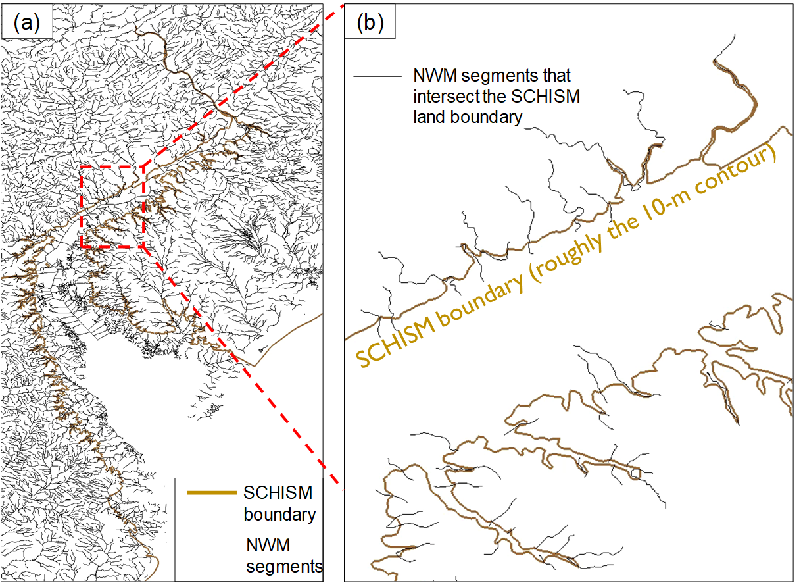
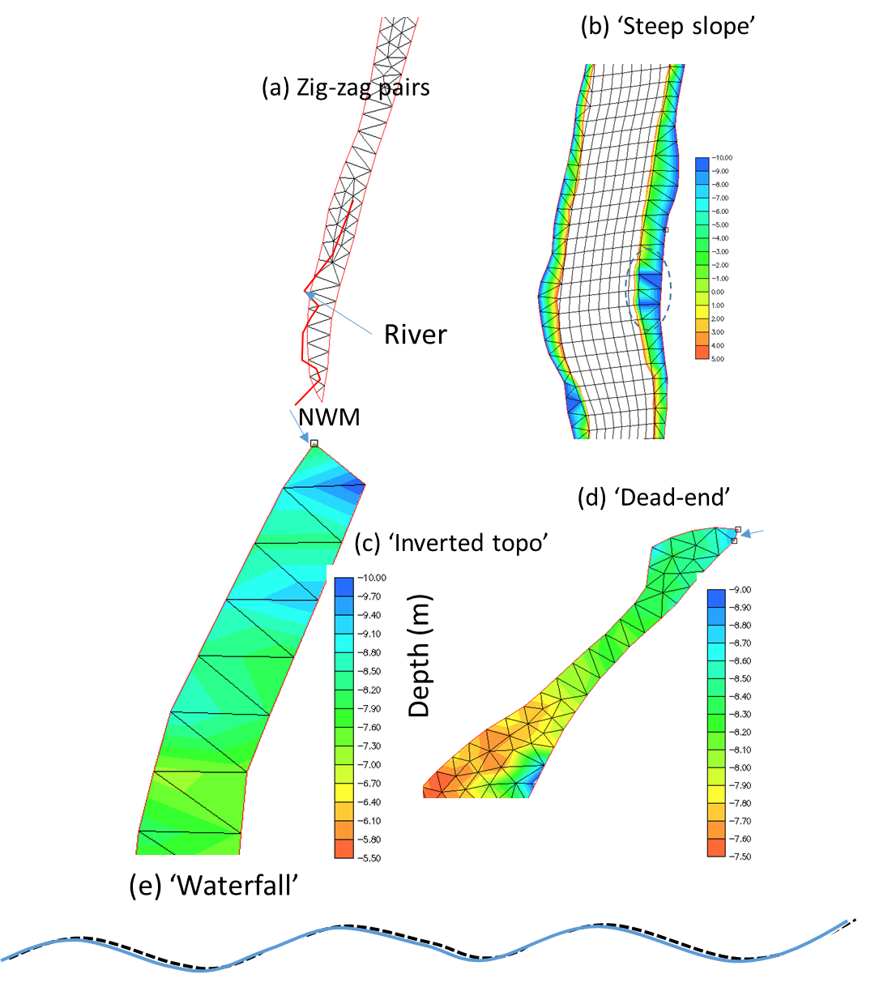

## Hydrologic flow
Simulation of hydrologic flow in watershed, with bottom elevation above sea level (thus strong wetting and drying) and with complex river channel network, is challenging. The discussions below are taken from a training course on compound flooding simulation.

A common, convenient method for introducing river flows into watershed in SCHISM mesh is via the point source/sinks as shown in Figure [8](#figure08). Together with proper parameter choices (e.g., a small minimum depth of 10-5m, a fully implicit scheme, a large bottom friction with proper vertical grid to allow for 2D representation in the watershed etc) this usually works fine for smaller rivers. For large rivers, the open-boundary approach (i.e., river channels as open boundary segments) is the preferred method. In general, the point source approach injects flow via the continuity equation alone without providing extra momentum (note that the volume sources/sinks are added to the RHS of Eqs. [2](schism/physical-formulation.md) and [3](schism/physical-formulation.md) but not in the momentum Eqs. [1](schism/physical-formulation.md), and thus it will take the system some time to adjust internally to set up the flow from the pressure gradient. Because of this drawback, large elevations may be found near the injection points, especially during initial ramp up or during high and rapidly varying flow periods. This symptom can be exacerbated by the following missteps:

1. Pairs of source and sink in close proximity (Figure [9](#figure09)a). Users should combine these pairs;
2. Steep slopes near boundary with coarse resolution (Figure [9](#figure09)b); 
3. Inverted bed slopes near the injection location (so the flow has to overcome gravity; Figure [9](#figure09)c);
4. Poorly ventilated ‘dead-end’ (Figure [9](#figure09)d);
5. Undulating channel (‘water fall’; Figure [9](#figure09)e).

The model is stable, but interpretation of results may be problematic in those cases. Besides more grid work in those spots, using open-boundary segments can help. Also one should really exclude transient responses during ramp-up period in computing the maximum elevation to allow the system time to adjust. Also don’t forget that sometimes the rainfall (which can also be introduced as sources) on high mountains should result in high surface elevations there, which are realistic.

<figure markdown id='figure08'>
{width=800}
<figcaption>Coupling of hydrologic model (National Water Model in this case) with SCHISM. The river network (lines) intersects SCHISM land boundary, and the river flow is introduced at the intersection points (sources for inflow and sinks for outflow).</figcaption>
</figure>

<figure markdown id='figure09'>
{width=800}
<figcaption>Pathologic cases for hydrologic flows.</figcaption>
</figure>

