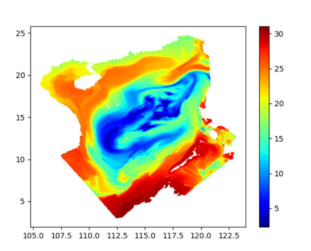
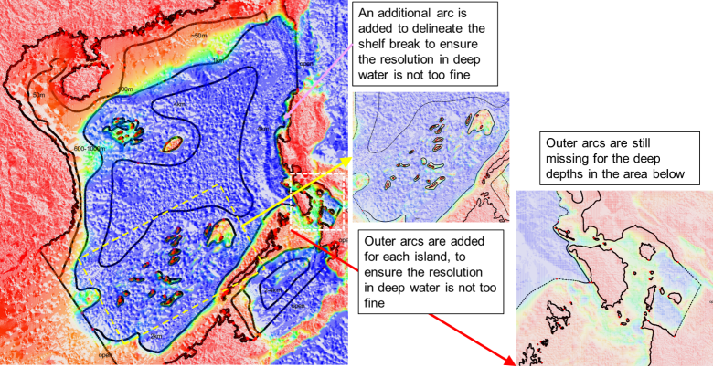

## Cross-scale applications that include eddying regime
To get a good SCHISM baroclinic setup for this type of applications, one needs to pay attention to 

1. Horizontal grid
2. Vertical grid: use $\text{LSC}^2$, and at least resolve the surface layer
3. Parameterization: especially important are parameters that control momentum dissipation (`indvel`, `ihorcon`, `ishapiro`, `dt`)

The case study on South China Sea (SCS) shown below illustrates some common mistakes made by users (Figure [1](#figure01)). A particularly severe challenge is a transitional regime (between eddying and non-eddying regimes) with steep slopes that tend to excite parasitic noises, and a common symptom for this manifests itself as spurious upwelling of cold water (Figure [2](#figure02)).

<figure markdown id='figure01'>
{width=800}
<figcaption>(a) ‘Wrong’ map for SCS, showing multiple issues with grid design. Steep slopes are prevalent in this region, near small islands and continental shelf breaks. (b) grid near Spratly, showing excessively high resolution in deep water (0.01 degree ~ 1 km).</figcaption>
</figure>

<figure markdown id='figure02'>
{width=600}
<figcaption>Surface temperature (SST) resulted from the grid generated from Figure 1, showing the excessive spurious upwelling of cold water.</figcaption>
</figure>

For gridgen, start with modest and quasi-uniform resolution for eddying regime. High resolution (<=2km) in deep water (h>=1km) should be avoided (Figure [1](#figure01)) (if this is absolutely required, one needs to reduce time step below 100 sec or apply some special parameterization such as `niter_shap` etc). At steep slopes, this means that an ‘outer arc’ (in SMS map) may need 3). With the corrected grid, the noise is greatly reduced: the remaining noise in southern Philippines can be rectified by adding outer arcs there (Figure [4](#figure04)).

<figure markdown id='figure03'>
{width=800}
<figcaption>A corrected SMS map file. Outer arcs are added near shelf break of west coast of Luzon and Spratly Islands, but are missing in the southern Philippines.</figcaption>
</figure>

<figure markdown id='figure04'>
{width=600}
<figcaption>SST calculated from the corrected grid. The remaining ‘upwelling’ in the circled area is due to the missing outer arcs in that area (cf. Figure 3).</figcaption>
</figure>

**Parameters** `dt=100s` (slightly larger values like 120 s should also work), `indvel=0`, `ihorcon=2`, `ishapiro= -1`. `shapiro.gr3` is then generated using `gen_slope_filter2.f90` by using larger filter strengths near steep slopes (and small elsewhere). Figure [5a](#figure05) shows the resultant input. In general, the momentum needs to be stabilized with larger viscosity near steep slopes, as bi-harmonic viscosity alone is not sufficient there. The I.C. and B.C. can be derived from HYCOM and FES 2014 (i.e. use type ‘5’ for both elevation and velocity B.C.). In addition, tracers are relaxed to HYCOM values near open boundaries (Figure [5b](#figure05)). Required pro-processing scripts can be found in `Utility/`.

Starting from v5.9, users can also try the new Smagorinsky–like filter option (`ishapiro=2`) with a proper `shapiro0`.

<figure markdown id='figure05'>
{width=600}
<figcaption>(a) Filter strength input (shapiro.gr3). Larger values are used near steep slopes. (b) Nudging strength input (TEM_nudge.gr3, SAL_nudge.gr3), generated from gen_slope_filter2.f90, with maximum time scale of 1 day.</figcaption>
</figure>

## Grid generation in cross-scale applications
Mesh generation is most challenging in applications that include eddying and transitional regimes (i.e. with open deep ocean water). This is because users often tend to over-refine in these regimes, thus violate the hydrostatic assumption (the horizontal scale >> vertical scale). For example, setting mesh resolution at 500m at 500m depth would likely lead to spurious upwelling discussed in the previous sub-section. If sub-mesoscale processes are of interest, users will need to apply some treatments such as reducing the time step and using iterative viscosity filter etc.

This challenge is particularly acute when one deals with islands sitting on top of steep slopes. Figure [6](#figure06) shows 3 attempts to add high resolution near Guam in the Pacific basin mesh. The mesh resolution in the surrounding deep ocean is about 5km, and we need to refine the mesh to about 30m around Guam. The Apra Harbor jetty that requires higher resolution happens to be located close to a steep slope. Combination of wet/dry and forced sharp transition in ‘new14’ and ‘new15’ led to spread of upwelled water there. Removing an inner arc in ‘new15’ helped smoother transition from the outer arc to the inner arc and thus alleviated the upwelling issue. In ‘new16’, we made more ‘room’ for transition by moving the inner arc away from the outer arc and coarsening it a little (to match the resolution of the outer arc), thus further reducing the upwelling. However, we had to add more internal arcs to provide adequate resolution nearshore (otherwise the nearshore area would be represented by a few skew elements that have side lengths of a few km’s on the outside and 30m on the inside). Figure [7](#figure07) shows the details of ‘new16’ and final mesh. Note that in all three maps, we used 500m isobaths for the outer arc (as representation of start of eddying regime) but the arc veered to 1km isobaths near the harbor as a way to make more room for transition there.

<figure markdown id='figure06'>
{width=800}
<figcaption>Three SMS maps (top) and corresponding results for SST.</figcaption>
</figure>

<figure markdown id='figure07'>
{width=800}
<figcaption>Details for map ‘new16’ and the final mesh around Apra Harbor. Skew elements nearshore are fine.</figcaption>
</figure>

## Hydrologic flow
Simulation of hydrologic flow in watershed, with bottom elevation above sea level (thus strong wetting and drying) and with complex river channel network, is challenging. The discussions below are taken from a training course on compound flooding simulation.

A common, convenient method for introducing river flows into watershed in SCHISM mesh is via the point source/sinks as shown in Figure [8](#figure08). Together with proper parameter choices (e.g., a small minimum depth of 10-5m, a fully implicit scheme, a large bottom friction with proper vertical grid to allow for 2D representation in the watershed etc) this usually works fine for smaller rivers. For large rivers, the open-boundary approach (i.e., river channels as open boundary segments) is the preferred method. In general, the point source approach injects flow via the continuity equation alone without providing extra momentum (note that the volume sources/sinks are added to the RHS of Eqs. [2](schism/physical-formulation.md) and [3](schism/physical-formulation.md) but not in the momentum Eqs. [1](schism/physical-formulation.md), and thus it will take the system some time to adjust internally to set up the flow from the pressure gradient. Because of this drawback, large elevations may be found near the injection points, especially during initial ramp up or during high and rapidly varying flow periods. This symptom can be exacerbated by the following missteps:

1. Pairs of source and sink in close proximity (Figure [9](#figure09)a). Users should combine these pairs;
2. Steep slopes near boundary with coarse resolution (Figure [9](#figure09)b); 
3. Inverted bed slopes near the injection location (so the flow has to overcome gravity; Figure [9](#figure09)c);
4. Poorly ventilated ‘dead-end’ (Figure [9](#figure09)d);
5. Undulating channel (‘water fall’; Figure [9](#figure09)e).

The model is stable, but interpretation of results may be problematic in those cases. Besides more grid work in those spots, using open-boundary segments can help. Also one should really exclude transient responses during ramp-up period in computing the maximum elevation to allow the system time to adjust. Also don’t forget that sometimes the rainfall (which can also be introduced as sources) on high mountains should result in high surface elevations there, which are realistic.

<figure markdown id='figure08'>
{width=800}
<figcaption>Coupling of hydrologic model (National Water Model in this case) with SCHISM. The river network (lines) intersects SCHISM land boundary, and the river flow is introduced at the intersection points (sources for inflow and sinks for outflow).</figcaption>
</figure>

<figure markdown id='figure09'>
{width=800}
<figcaption>Pathologic cases for hydrologic flows.</figcaption>
</figure>

## Known issues and work-around
### Freshwater injection stuck near injection place
  This can happen with the combined use of (1) point source/sink (`if_source`=1); (2) LSC2 with 1-2 layers near 
injection places; (3) baroclinic model. The main symptom is that the freshwater seemingly gets stuck near the 
 injection points and does not flow out as expected.
 
 The reason is that insufficient number of vertical layers cannot properly support exchange flow (that 
requires stratification), and as a result, the fresh/salt water interface oscillates instead of tilting as expects.
Some work-arounds are:

1. Use more vertical layers near injection (one way to do this is to deepen the local depths to allow more layers)
2. Nudge (inu_SAL=1 or 2) strongly in a region near injection
3. Change to open boundary condition approach
4. If the salt intrusion should never reach the injection place, change salinity initial condition by creating
   a freswater zone from injection to somewhere downstream near the max intrusion.
