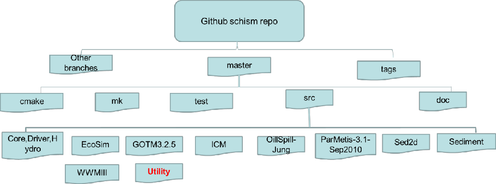
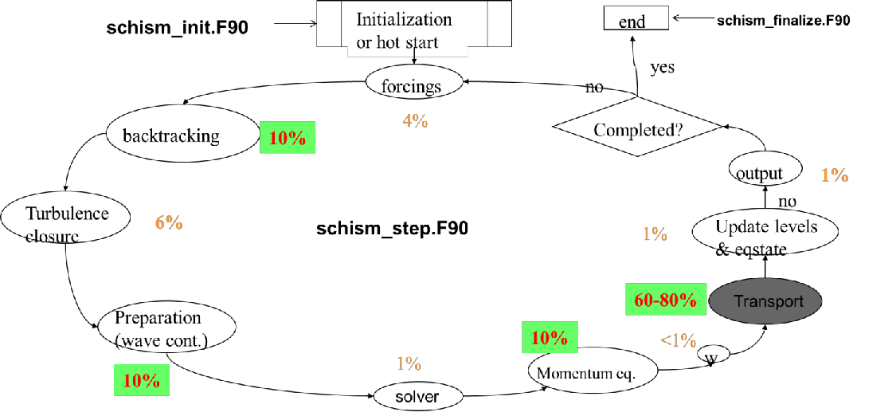
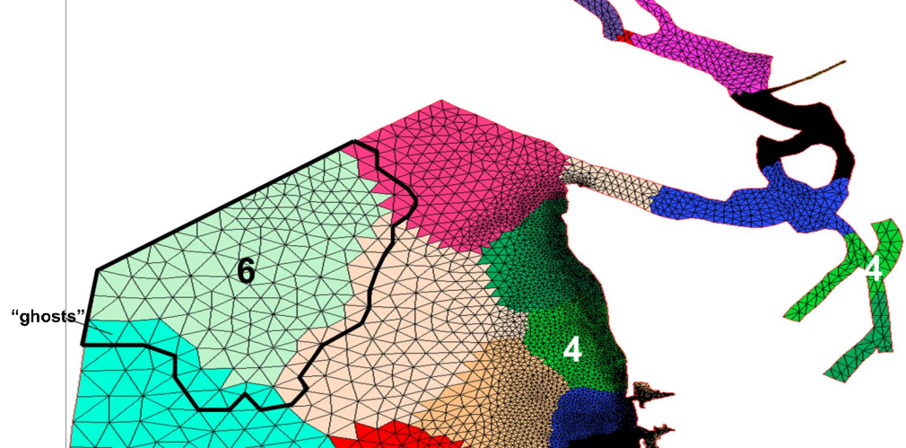
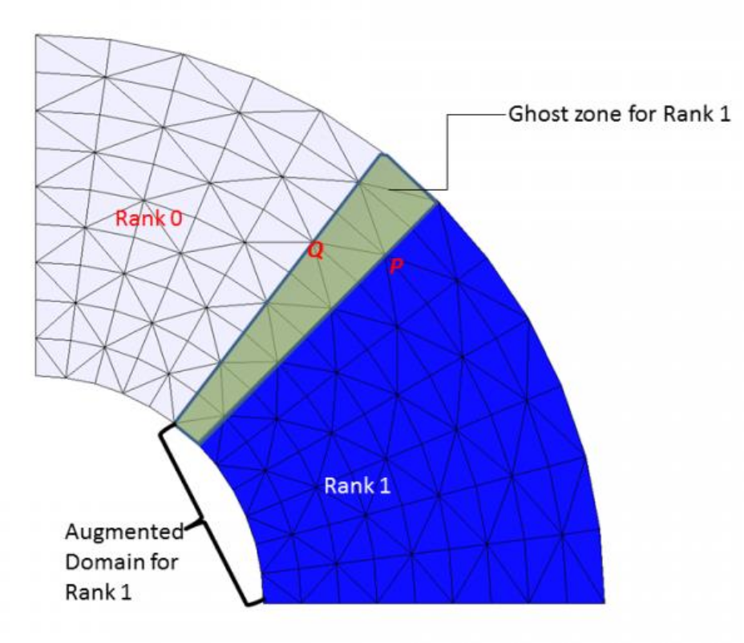

The information presented in this chapter is mostly intended for developers or anyone who wishes to work on the code. To know more about how to contribute your code see [CONTRIBUTING.md](https://github.com/schism-dev/schism/blob/master/CONTRIBUTING.md) on SCHISM github repo. 

## General info
SCHISM was written in MPI FORTRAN 90. After svn revision 5225, we have migrated to [github](https://github.com/schism-dev). Figure [1](#figure01) shows the directory structure of the SCHISM github repository schism. General public have access to all branches.

<figure markdown id="figure01">

<figcaption>SCHISM github repository.</figcaption>
</figure>

Figure [2](#figure02) shows its main work flow and major code blocks. Two files inside `src/` (`Hydro/schism_init.F90` and `Hydro/schism_step.F90`) represent bulk of the hydro code, and are driven by a master program (`Driver/schism_driver.F90`). The global variables are defined in `Core/schism_glbl.F90`, and the message passing routines are defined in `Core/schism_msgp.F90`.

<figure markdown id="figure02">

<figcaption>SCHISM code work flow. The percentages are estimates from a test case with an earlier version and may not be up to date.</figcaption>
</figure>

The domain decomposition is done using ParMETIS graph partitioning library (included in the `src/`). Figure [3](#figure03) shows an example of sub-domains generated by this lib.

<figure markdown id="figure03">

<figcaption>Domain decomposition. Each color represents a sub-domain (‘resident domain’) taken by a MPI process and the thick black polygon represents the ‘augmented’ (=resident+ghost) domain of process 6.</figcaption>
</figure>

The Utility dir has a lot of useful utility scripts for pre- and post-processing. The header of each program generally has info on its purpose and instructions on how to use it.

- `ACE`: source code and install notes for ACE tools; the manual can be found on the web site.
- `Combining_Scripts`: FORTRAN and perl scripts used to gather outputs from SCHISM (e.g., `outputs/schout_0*_[stack number].nc` etc) into one binary file (`schout_[stack_number].nc`).
- `Grid_Scripts`: FORTRAN codes to interpolate depths from DEM files in either structured grid (raster) or unstructured grid format. While ACE/xmgredit5 can do similar things, these scripts are mostly for interpolating from very large DEM files.
- `Gen_Hotstart`: scripts for preparing `hotstart.nc` from e.g., netcdf outputs from a structured-grid model.
- `Pre-Processing`: various scripts for pre-processing (checking, viz etc)
- `OneWayNestScripts`: scripts for 1-way nesting, by preparing `*[23]D.th.nc` (elevation, horizontal velocity, salinity and temperature boundary condition) that can be used for the 'small-domain' run.
- `Particle_Tracking`: particle tracking code that uses SCHISM's outputs for 3D tracking.
- `Post-Processing-Fortran`: FORTRAN codes for extracting time series at selected 3D points (including transects). You can modify these codes for your own purposes.
- `Sflux_nc`: matlab scripts useful for preparing your own .nc files for `sflux/`. `NARR_util/` has scripts to prepare .nc files from NCEP's NARR products.
- `SMS`: scripts to convert between `.2dm` of SMS and `.gr3`.
- `Vis_Matlab`: matlab scripts for viz. At the moment, these scripts have not been updated to handle $LSC^2$ grid.


## Domain partitioning
The domain is first portioned into non-overlapping sub-domains (in element sense; see Figure [3](#figure03)) using ParMETIS. Then each sub-domain is augmented with 1 layer of ghost elements. This is accomplished by the call `partition_hgrid()` early in the main program. After calling `aquire_hgrid(.true.)` immediately after that, the elements, nodes, sides in each augmented and non-augmented (i.e., without ghosts) domains are shown in Figure [3](#figure03). The corresponding variable denoting number of Elements, Nodes, and Sides are given in the following table. Intuition is typically followed although there are exceptions as will be described below.

| | Global | Local non-augmented | Ghost | Augmented |
|-|--------|---------------------|-------|-----------|
| Elements | `ne_global` | `ne` | `neg` | `nea=ne+neg` |
| Nodes | `np_global` | `np` | `npg` | `npa=np+npg` |
| Sides | `ns_global` | `ns` | `nsg` | `nsa=ns+nsg` |

The call to ParMETIS routine is as follows - 

```fortran
call ParMETIS_V3_PartGeomKway(vtxdist,xadj,adjncy,vwgt,adjwgt,wgtflag, &
    numflag,ndims,xyz,ncon,nproc,tpwgts,ubvec,options, &
    edgecut,part,comm)
```

- `p` : # of processors;
- `n` : total # of vertices (local) in graph sense;
- `m` : total # of neighboring vertices ("edges"); double counted between neighboring vertice u and v.
- `ncon`: # of weights for each vertex.
- `int(in) vtxdist(p+1)` : Processor `j` stores vertices `vtxdist(j):vtxdist(j+1)-1`
- `int (in) xadj(n+1), adjncy(m)` : locally, vertex `j`'s neighboring vertices are `adjncy(xadj(j):xadj(j+1)-1)`. adjncy points to global index;
- `int(in) vwgt(ncon*n), adjwgt(m)` : weights at vertices and "edges". Format of adjwgt follows adjncy;
- `int(in) wgtflag` : 
    - `0`: none (`vwgt` and `adjwgt` are NULL); 
    - `1`: edges (`vwgt` is `NULL`); 
    - `2`:vertices (`adjwgt` is `NULL`); 
    - `3`: both vertices & edges;
- `int(in) numflag` : 
    - `0`: C-style numbering from 0; 
    - `1`: FORTRAN style from 1;
- `int(in) ndims`: 2 or 3 (D);
- `float(in) xyz(ndims*n)` : coordinate for vertex `j` is `xyz(j*ndims:(j+1)*ndims-1)` (C style); `ndims*(j-1)+1: ndims*j` (FORTRAN style);
- `int(in) nparts`: # of desired sub-domains (usually `nproc`);
- `float(in) tpwgts(ncon*nparts)` : `=1/nparts` if sub-domains are to be of same size for each vertex weight;
- `float(in) ubvec(ncon)` : imbalance tolerance for each weight;
- `int(in) options` : additonal parameters for the routine (see above);
- `int(out) edgecut` : # of edges that are cut by the partitioning;
- `int(out) part()` : array size = # of local vertices. It stores indices of local vertices.

## Arrays and constant
1. `llsit_type :: iegl(iegb)` : `iegb` is a global element #. If the element is resident (not ghost), `iegl(iegb)%rank=myrank`, and `iegl(iegb)%id = local element index`, and `iegl%next=null`. If `iegb` is a ghost, then `iegl` list has two entries: `myrank` and the rank where `iegb` is resident. All processors have this info, but the lists are different (1st entry is usually myrank etc).
2. `llsit_type :: ipgl(ipgb)` : `ipgb` is a global node #. Use this list only when the node is resident (not ghost); it’s confusing when `ipgb` is ghost. If `ipgb` is resident, `ipgl(ipgb)%rank=myrank`, and `ipgl(ipgb)%id = local node index`. `ipgl%next%next%next....` is the linked list, with ranks in ascending order. Unless `ipgb` is an interface node (i.e., resident in more than 1 process), the list has only 1 entry. All processors have this info, but the lists are different (1st entry is usually myrank etc).
3. `llsit_type :: isgl(isgb)` : `isgb` is a global side #. Similar to `ipgl`, if the side is resident (not ghost), `isgl(isgb)%rank=myrank`, and `isgl(isgb)%id = local side index`. `isgl%next%next...` is the list, with ranks in ascending order. All processors have this info, but the lists are different (1st entry is usually myrank etc).
4. `int :: ielg(ie), iplg(ip), islg(isd)` : The global element index of local element ie in the augmented domain. Similar for the other two (nodes/sides).
5. `int :: iegrpv(iegb)` : The rank # for global element `iegb` (before augmenting the domain). Used mainly in partitioning the grid.
6. Arrays that have similar meaning between global and local aug. domains, i.e., they do not have problem of getting outside the aug. domain: `i34`, `elnode` (old name: `nm`), `elside` (`js`), `ssign`, `snx`, `sny`.
7. Arrays that need special attention in the aug. domain - 
    - `int :: ic3(1:i34(), ie)` – `positive` if the neighbor element is inside the aug. domain as well (and in this case it is the local index of the neighbor element); `0` if (global) boundary; `negative` if the neighbor element is outside the aug. domain and in this case, the absolute value is the global element index.
    - `int :: nne(ip)` – total # of neighbor elements around local node `ip`, including those outside the aug. domain (i.e., same as `nnegb()`).
    - `int :: indel(1: nne(ip),ip)` – surrounding element indices. If inside aug. domain, this is the local element index; if outside, this is the negative of the global element index.
    - `int :: iself(1: nne(ip),ip)` – same as global `iselfgb`, i.e., the elemental local index for node `ip` in neighbor element `indel()` (even if it is outside).
    - `int :: nnp(ip)` – total # of surrounding nodes for node `ip`, excluding all nodes outside the aug. domain. For SCHISM, include all nodes outside.
    - `int :: indnd(1: nnp(ip),ip)` – list of surrounding nodes, excluding all nodes outside the aug. domain. For SCHISM, all nodes outside will have negative global index returned.
    - `int :: isdel(1:2,isd)` & `isidenode(1:2,isd)` – order of the two adjacent elements follows global indices, and so the vector from node 1 to 2 in `isidenode(1:2,isd)` forms local y-axis while the vector from element 1 to 2 in isdel(1:2,isd) forms local x-axis. Therefore either of `isdel(1:2,isd)` can be negative. The element index is local (positive) if it is inside the aug. domain; otherwise the minus of global element index is returned. The local side `isd` is on the boundary if and only if `isdel(2,isd)=0`, and in this case, `isdel(1,isd)` must be inside the aug. domain (i.e., positive) (if `isd` is resident). If `isd` is resident and not ghost, `isdel()` has the same meaning as serial code, i.e., `is(1,isd)>0` (inside the aug. domain), and `isdel(2,isd)>=0`, and `isd` is on the boundary if and only if `isdel(2,isd)=0`.
    - `double :: delj(isd)` – meaningful only if isd is resident.
8. Boundary arrays : Most arrays point to global bnd segment #. Most B.C. arrays are global as well.
    - `nope_global` – total # of open bnd segements in the global domain.
    - `nope` – total # of open bnd segements in the aug. domain.
    - `iopelg(1:nope)` – returns global open bnd segment # for a local open bnd segment.
    - `iopegl(0,k)` - # of local fragmentations of global open bnd segment k.
    - `iopegl(j,k)` - local segment # of jth (`1<=j<=iopegl(0,k)`) fragmentation of global open bnd segment k.
    - `nond(1:nope)` – total # of open bnd nodes on each segment. The corresponding global array is `nond_global()`.
    - `iond(nope,1: nond(1:nope))` – list of local node indices on each open bnd segment. The corresponding global array is `iond_global()`.
    - `nland` - total # of land bnd segements in the aug. domain. `nland_global` is global.
    - `nlnd(1:nland)` - total # of land bnd nodes on each segment.
    - `ilnd(nland,1: nlnd(1:nland))` – list of local node indices on each land bnd segment.
    - `nosd(nope)` (ELCIRC) - # of open bnd sides on each segment.
    - `iosd(nope, 1: nosd(nope))` (ELCIRC) – list of open bnd side on each segment.
    - `noe(nope)` (ELCIRC) - # of open bnd elements on each segment.
    - `ioe(nope, 1: noe(nope))` (ELCIRC) – list of open bnd elements on each segment.
    - `isbe(2,1:nea)` (ELCIRC) – if the element is on the local open bnd, this returns the local segment # and element #. 0 otherwise.
    - `isbs()` (ELCIRC) – similar to `isbe`.
    - `isbnd(-2:2,ip)` (SCHISM) - If `ip` is on 1 open bnd only, `isbnd(1,ip)` points to the global segment # of that open bnd and `isbnd(2,ip)=0`; if `ip` is on 2 open bnds, `isbnd(1:2,ip)` point to the global segment #s for the 2 open bnds. If `ip` is on land bnd only (i.e., not on open bnd), `isbnd(1,ip)= 1` and `isbnd(2,ip)=0`. If `ip` is an internal node, `isbnd(1:2,ip)=0`. Therefore, `ip` is on open bnd if `isbnd(1,ip)>0` (and in this case `isbnd(2,ip)` may also be positive, even though `isbnd(2,ip)` may be outside the aug. domain), on land bnd (not on any open bnd) if `isbnd(1,ip)= 1`, and an internal node if `isbnd(1,ip)=0`. If on open bnd, `isbnd(-2:-1,ip)` are global index (i.e., `isbnd(-1,ip)`th node on the `isbnd(1,ip)`th open bnd);
    - `isbs(nsa)` - positive if a local side is on the global open bnd (in this case, `isbs()` is the global segment #); 1 if it is on land bnd; 0 if internal side.
    - `iettype`, `ifltype`, `itetype`, and `isatype` all take global bnd segment as argument; other b.c. arrays (`eth` etc) are also global.
    - `uth(nvrt,nsa)`,`vth(nvrt,nsa)` – local b.c. for `ifltype/=0` for a local side.
    - `uthnd(nvrt,mnond_global, nope_global)`, `vthnd()` – global arrays.
    - `elbc(ip)` – `ip` is a local node.
9. Arrays defined in `elfe_msgp.F90`
    - `nnbr` - # of neighbor processors (excluding `myrank`).
    - `nbrrank(nnbr)` – rank of each neighbor processor.
    - `int :: ranknbr(0:nproc-1)` – neighbor # for each processor (0 if not neighbor).
    - `nerecv(nnbr)` - # of elements to be received from each neighbor.
    - `ierecv(1: nerecv(nnbr),nnbr)` – list of element indices (ghost in `myrank`) to be received from each neighbor (where the elements are resident and not ghost).
    - `nesend(nnbr)` - # of elements to be sent to each neighbor.
    - `iesend(1: nesend(nnbr),nnbr)` – list of element indices (local resident in `myrank`) to be sent to each neighbor (where the elements are ghost). Similar for nodes/side (`nprecv`, `iprecv` etc).

!!! note "A note on ghost exchange"

    Since the message exchanges between processors have to wait for each other in order to communicate collectively, it's not necessary to synchronize the processes.

## Important MPI routines
- `MPI_Recv`

```fortran
int MPI_Recv(
    void *buf, 
    int count, 
    MPI_Datatype datatype, 
    int source, 
    int tag,
    MPI_Comm comm, 
    MPI_Status *status )
!Inputs:
!  count - maximum number of elements in receive buffer (integer);
!  datatype - datatype of each receive buffer element (handle);
!  source - rank of source (integer);
!  tag - message tag (integer);
!  comm - communicator (handle).
!Outputs:
!  buf - initial address of receive buffer (choice);
!  status - status object (Status).
```

- `MPI_Irecv` : nonblock receive.

```fortran
int MPI_Irecv( 
    void *buf, 
    int count, 
    MPI_Datatype datatype, 
    int source, 
    int tag, 
    MPI_Comm comm, 
    MPI_Request *request )
!Inputs:
!   buf - initial address of receive buffer (choice);
!   count - number of elements in receive buffer (integer);
!   datatype - datatype of each receive buffer element (handle);
!   source - rank of source (integer);
!   Tag - message tag (integer);
!   comm - communicator (handle).
!Output:
!   request - communication request (handle)
```

- `MPI_Send`

```fortran
int MPI_Send( 
    void *buf, 
    int count, 
    MPI_Datatype datatype, 
    int dest, 
    int tag,
    MPI_Comm comm )
!Inputs:
!   buf - initial address of send buffer (choice);
!   count - number of elements in send buffer (nonnegative integer);
!   datatype - datatype of each send buffer element (handle);
!   dest - rank of destination (integer);
!   tag - message tag (integer);
!   comm - communicator (handle).
```

- `MPI_Isend` : non-block send

```fortran
int MPI_Isend( 
    void *buf, 
    int count, 
    MPI_Datatype datatype, 
    int dest, 
    int tag,
    MPI_Comm comm, 
    MPI_Request *request )
! Inputs:
!   buf - initial address of send buffer (choice);
!   count - number of elements in send buffer (integer);
!   datatype - datatype of each send buffer element (handle);
!   dest - rank of destination (integer);
!   tag - message tag (integer);
!   comm - communicator (handle).
!Output:
!   request - communication request (handle).
```

- `MPI_Allreduce` : Combines values from all processes and distribute
the result back to all processes

```fortran
int MPI_Allreduce ( 
    void *sendbuf, 
    void *recvbuf, 
    int count, 
    MPI_Datatype datatype, 
    MPI_Op op, 
    MPI_Comm comm )
! Inputs:
!   sendbuf - starting address of send buffer (choice);
!   count - number of elements in send buffer (integer). Also the size of the output 
!           (i.e., ith elements from each processor are summed up and returned as ith element of output);
!   datatype - data type of elements of send buffer (handle);
!   op - operation (handle) (e.g., MPI_SUM, MPI_LOR);
!   comm - communicator (handle).
! Output:
!   recvbuf - starting address of receive buffer (choice).
```

- `MPI_Reduce`

```fortran
int MPI_Reduce ( 
    void *sendbuf, 
    void *recvbuf, 
    int count, 
    MPI_Datatype datatype, 
    MPI_Op op, 
    int root, 
    MPI_Comm comm )
! only difference from MPI_Allreduce is that the result is sent to rank "root".
```

- `MPI_Gather` : Gathers together values from a group of processes.

```fortran
int MPI_Gather ( 
    void *sendbuf, 
    int sendcnt, 
    MPI_Datatype sendtype, 
    void *recvbuf, 
    int recvcount, 
    MPI_Datatype recvtype, 
    int root, 
    MPI_Comm comm )
! Inputs:
!   sendbuf - starting address of send buffer (choice)
!   sendcount - number of elements in send buffer (integer)
!   sendtype - data type of send buffer elements (handle)
!   recvcount - number of elements for any single receive (integer, significant !  only at root)
!   recvtype - data type of recv buffer elements (significant only at root) (handle)
!   root - rank of receiving process (integer)
!   comm - communicator (handle)
! Output:
!   Recvbuf - address of receive buffer (choice, significant only at root). The received values
!   are stacked according to the rank number (i.e., first recvcount are from rank 0 etc).
```

- `MPI_Allgatherv` : Gathers data from all tasks and deliver it to all.

```fortran
int MPI_Allgatherv ( 
    void *sendbuf, 
    int sendcount, 
    MPI_Datatype sendtype, 
    void *recvbuf, 
    int *recvcounts, 
    int *displs, 
    MPI_Datatype recvtype, 
    MPI_Comm comm )

!Inputs:
!   sendbuf - starting address of send buffer (choice);
!   sendcount - number of elements in send buffer (integer)
!   sendtype - data type of send buffer elements (handle);
!   recvcounts - integer array (of length group size) containing the number of elements 
!       that are received from each process;
!   displs - integer array (of length group size). Entry i specifies the displacement
!       (relative to recvbuf) at which to place the incoming data from process i;
!   recvtype - data type of receive buffer elements (handle);
!   comm. - communicator (handle).
! Output:
!   recvbuf - address of receive buffer (choice).
```

- `MPI_Type_indexed` : Creates an indexed datatype; the corresponding routine in `MPI2 is mpi_type_create_indexed_block()`.

```fortran
int MPI_Type_indexed(
    int count,
    int blocklens[],
    int indices[],
    MPI_Datatype old_type,
    MPI_Datatype *newtype )
! Inputs:
!   count - number of blocks -- also number of entries in indices and blocklens;
!   blocklens - number of elements in each block (array of nonnegative integers);
!   indices - displacement of each block in multiples of old_type (array of integers);
!   old_type - old datatype (handle).
! Output:
!   newtype - new datatype (handle)
```

!!! note
    The new MPI type treats multi-dimensional arrays in FORTRAN as 1D array, expanding with 1st index varying before 2nd etc. So this routine can be used to grab discontiguous data blocks from multi- dimensional arrays.
    So if a 2D array is a(nvrt,nea) the corresponding 1D array is illustrated below:
    
    \begin{equation*}
    nea
    \stackrel{nvrt}{
    \begin{bmatrix}
    (1, 1) & (2, 1) & \cdots & (nvrt, 1)\\
    (1, 2) & (2, 2) & \cdots & (nvrt, 2)\\
    \vdots & \vdots & \vdots & \vdots\\
    (1, nea) & (2, nea) & \cdots & (nvrt, nea)
    \end{bmatrix}
    }
    \end{equation*}
    
    Now suppose we need to grab all ghost elements iesend(1:nesend), these will correspond to rows iesend(i) of the table. In this case the # of blocks is nesend, block length is nvrt, and displacement of ith block is (iesend(i)-1)*nvrt.

- `MPI_Barrier` : Blocks until all process have reached this routine.

```fortran
int MPI_Barrier (MPI_Comm comm )
! Input: comm. - communicator (handle)
```

- `MPI_Type_struct` : Creates a struct datatype.

```fortran
int MPI_Type_struct(
    int count,
    int blocklens[],
    MPI_Aint indices[],
    MPI_Datatype old_types[],
    MPI_Datatype *newtype )

! Inputs:
!   count - number of blocks (integer)
!       also number of entries in arrays array_of_types, array_of_displacements and array_of_blocklengths;
!   blocklens - number of elements in each block (array);
!   indices – byte displacement of each block relative to the start of the type (array);
!   old_types - type of elements in each block (array of handles to datatype objects).
! Output:
!   newtype - new datatype (handle)
```

- `MPI_Alltoall` : Sends data from all to all processes.

```fortran
int MPI_Alltoall( 
    void *sendbuf, 
    int sendcount, 
    MPI_Datatype sendtype, 
    void *recvbuf, 
    int recvcnt, 
    MPI_Datatype recvtype, 
    MPI_Comm comm )
! Inputs:
!   sendbuf - starting address of send buffer (choice);
!   sendcount - number of elements to send to each process (integer);
!   sendtype - data type of send buffer elements (handle);
!   recvcount- number of elements received from any process (integer);
!   recvtype - data type of receive buffer elements (handle);
!   comm. - communicator (handle).
! Outputs
!   recvbuf - address of receive buffer (choice)
```

## I/O channels in SCHISM
You need to exercise caution when dealing with parallel I/O especially for writing. For writing outputs, you’d generally let only 1 process do the job, e.g. 

```fortran
if(myrank==0) write(10,*)
```

If you do need to have all processes write e.g. debug messages, you’d consider using channel `12` which has been pre-set to point to multiple files from each MPI process (see below).

Here are all I/O channel numbers currently used in different sub-models of SCHISM (and so you’d avoid using them). A good way to find out if a channel is available is to issue the following cmd from `src/` -

```bash
grep "(61" */*.F90 # Looks for '(61'
```

Please contact lead developer after you have selected a channel number to use in your module.

1. `Hydro/` : Channels between 8 and 200 are used by various codes for I/O. In particular - 
    - 101 to 100+noutputs (inclusive of both): reserved for global outputs (including from tracers like sediment, EcoSim, ICM, as well as WWM);
    - 201-250: non-standard outputs (e.g. at sidecenters, prism centers);
    - 251 to 259: reserved for station outputs;
    - 16: this channel points to mirror.out (on rank 0), the main message output about the run. You should use it with `if(myrank==0)`.

2. `WWM`
    -  1100 to 1200: handles for inputs/outputs etc

3. `EcoSim`
    - 600: outputting some messages

4. `ICM`
    - 301 to 323: reading channels for non-point source inputs for ICM

5. `Sediment (SED and SED2D)`
    - 26, 2626

Following are some generic channels - 

1. `10, 31, 32`: used for one-off I/O – can be used by other sub-models as long as you close them immediately after use;
2. `12`: this channel is initialized by different processes to point to files `outputs/nonfatal_xxxx`, where “xxxx” are the process IDs. Therefore it’s very useful for debugging purpose; you can use it anywhere in your part of the code to dump messages to these files.

## Example code
If you are working on the code you may be confused about the exchanges inside SCHISM. When should you use these?

The first thing you need to remember when writing MPI code with domain decomposition is that a rank (or MPI 'process') only has info in its 'augmented' (=resident + ghost) domain, and knows absolutely nothing outside this region.

<figure markdown id="figure04">
{width=500px}
<figcaption> Domain decomposition for code example.</figcaption>
</figure>

Consider Figure [4](#figure04). For example, you want to do averaging at each node of the sub-domain around its ball of elements.

```fortran
do i=1,np !not 'npa'
    sum1=0
    sum_a=0
    
    do j=1,nne(i)
        ie=indel(j,i)
        sum1=sum1+stokes(ie)*area(ie)
        sum_a=sum_a+area(ie)
    enddo !j

    stokes_nd(i)=sum1/sum_a
enddo !i

call exchange_p2d(stokes_nd)

```

Notice that you'd use `np` instead of `npa` (`=np+npg`; augmented domain) here. For any resident node `P`, `indel()` is well defined (because again, Rank 1 has info in its augmented domain including the ghost zone), and so the loops make sense. As long as all ranks have same info in each others' ghost zones (which is the purpose of exchange routines), `stokes_nd` at an interface
node (e.g. `P`) will be same across ranks. However, for a ghost node `Q`, some surrounding elements are located outside the augmented domain (and in this case, `indel()` are actually negative!), and so if you use the same operation, erroneous values at ghost nodes would be generated. Therefore you cannot use npa in the outer loop.

Now, after this loop is executed, what happens to the ghost nodes like `Q`? Since they are excluded on Rank 1, the `stokes_nd` will be wrong there. Fortunately, some neighboring ranks have the correct values for these nodes, which are resident nodes in those neighboring ranks; e.g., `Q` is a resident node of Rank 0. So now different ranks will have different values at some overlapping nodes, and this needs to be avoided. In order to make sure each rank has correct (and up-to-date) values in its augmented domain, you need to follow this loop with an exchange routine. Remember that for the exchange routines to work, you need to define the exchanged array in the augmented domain - 

```fortran
allocate(stokes_nd(npa)) !not 'np'
```

in order to allow each rank to receive info in the ghost zone. Description of all exchange routines used in SCHISM can be found in `schism_msgp.F90`.

The above is just one example of when exchanges are needed. Usually this involves some kind of queries into a neighborhood, but beware that there are other circumstances where exchanges are necessary. 

!!! note "The most important thing to remember"
    - **A rank only has info in its 'augmented' domain, and knows absolutely nothing outside this region.**
    - **In MPI code, it's crucial to make sure all ranks have identical values in overlapping zone.**

Now let's consider an example where no exchanges are needed. Say you want to simply go through all elements and update some arrays defined at elements:

```fortran
do i=1,nea !not 'ne'
    qdl_e(i)=cde(i)*dte/area(i)
enddo !i
```

Since all ranks have info of `cde` and `area` locally available, `qdl_e` will be correctly calculated even inside the ghost zones, and its values are the same cross ranks there (since `cde` and `area` are same cross ranks in the overlapping zones). So in this case you'd use `nea` instead of `ne` in the loop. Of course, there is nothing wrong with using `ne` in the loop followed by an exchange routine, but doing so would be less efficient and incur unnecessary communication cost.

## General code guide
Here are some house rules for preparing your own code - 

1. No spaces between `#` (pre-processor) and `if/else/end` for CPP flag;
2. Try to use the I/O channel number directly, e.g., `read(61, etc)` instead of assigning a number to a variable (e.g. `read(ich,)`. This'd facilitate others searching for conflicts;
3. Avoid using tabs in editor as they mess up with the appearance. Use space instead and strictly align code blocks for easy read.
4. Do not use automatic arrays of ≥2 dimensions. It’s often tempting to grab dimensions directly from the module `schism_glbl` and use them to define arrays in a routine; e.g. `vel_sd(nvrt,nsa)`. This causes trouble with some compilers and may result in segfault. Use either of the following 2 approaches instead: 
    1.  allocatable arrays (and always remember to deallocate them at the end of the routine);
    2. pass on the dimensions explicitly as dummy arguments (e.g. `subroutine routine1(nvrt2,nsa2, vel_sd..)`, where `nvrt2=nvrt` and `nsa2=nsa`, and then use these to define: `vel_sd (nvrt2,nsa2)`).
