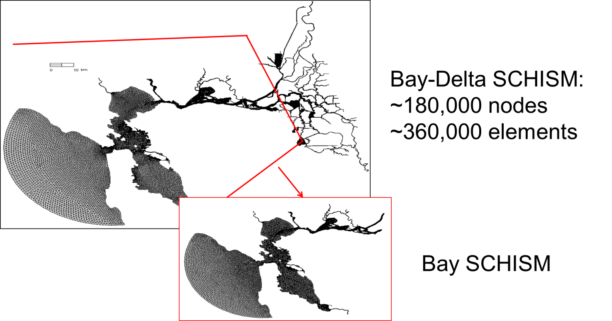
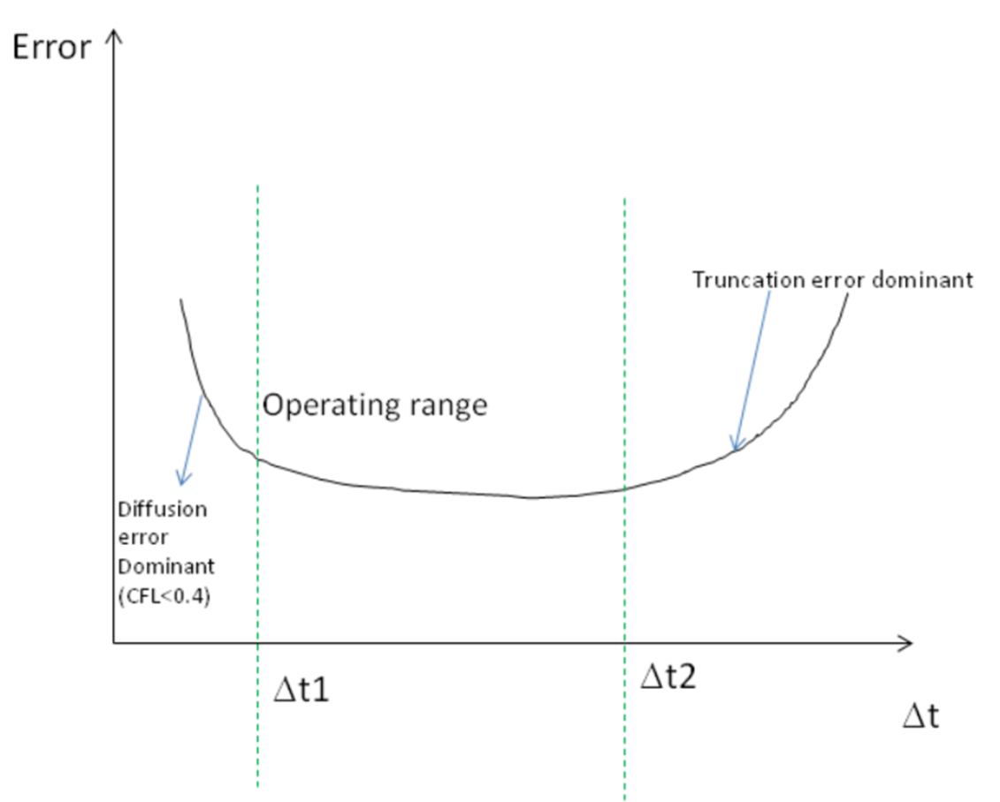
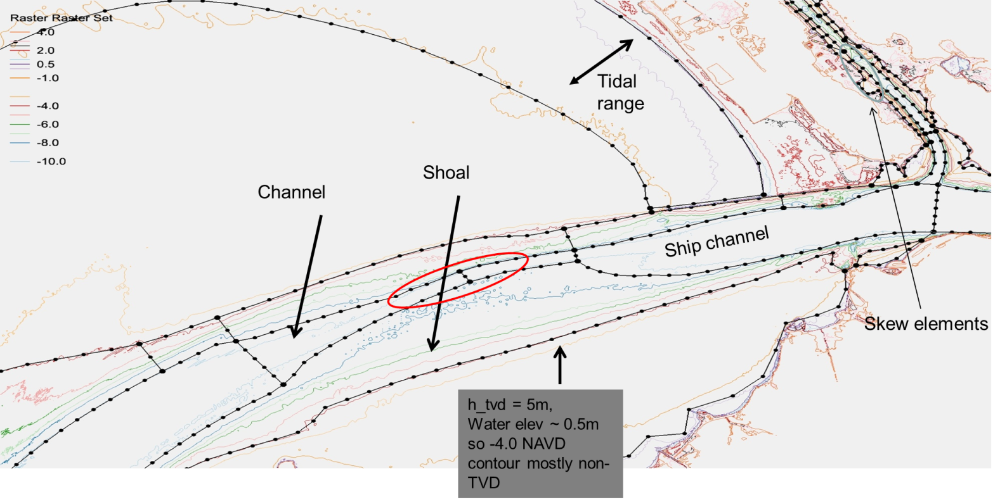
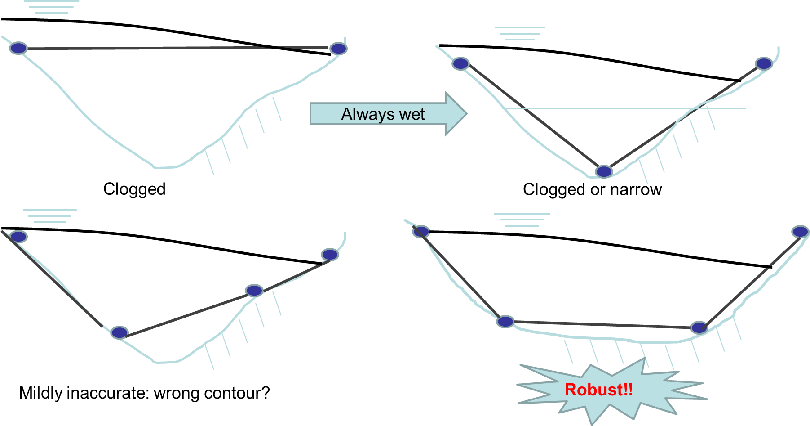
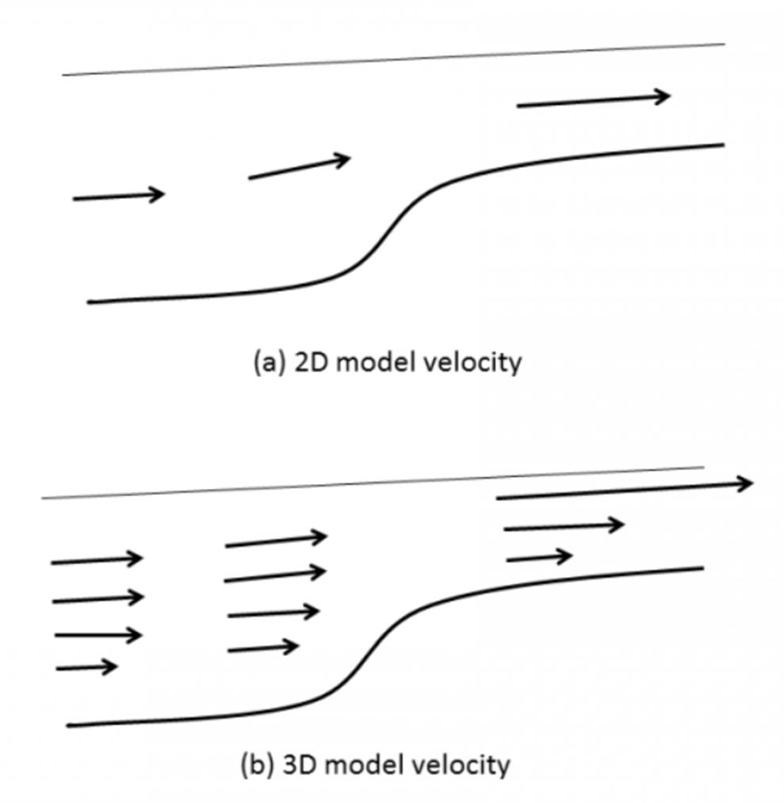
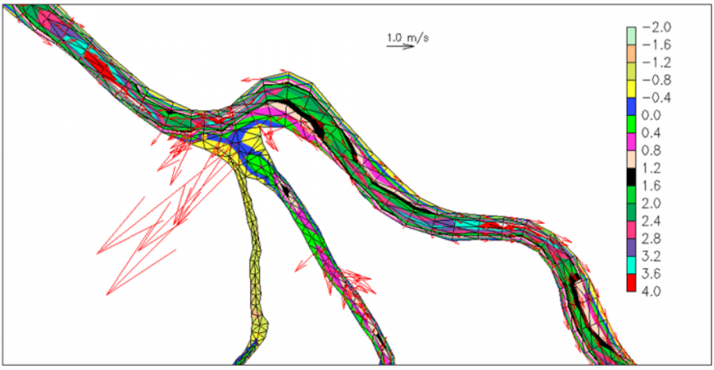

UG (unstructured grid or 'mesh') modelling starts with mesh generation, and the latter is often an **iterative** process. Here lies
 the greatest strength and challenges of using an UG model like SCHISM. Fortunately the meshgen tools have come 
a long way since 2000s and at the moment we are routinely generating large UGs with millions of nodes and ever 
higher resolution, all within a few hours (after the Digital Elevation Model (DEM) has been assembled).

!!!note
    We will only cover SCHISM specific aspects of gridgen using [SMS](https://aquaveo.com) in this chapter; you are referred to schism.wiki for other info related to DEM preparation etc. Please also refer to [Dr. Wood’s thesis](http://ccrm.vims.edu/yinglong/wiki_files/Wood_MScThesis_2012-SMS-WMS-Chesapeake&DelawareBays-Grid.pdf) for some insight info on using SMS.

!!!important
    One important point to remember is that mesh generation for SCHISM always starts from raw high-quality DEMs; do NOT use computational grids from another model as DEM because most hydrodynamic models smooth the bathymetry.

With some practice and care, you can generate complex UG like Figure [1](#figure01). A few important things to note
 before we dive into details of mesh generation.

1. SCHISM is an implicit model 
2. It can tolerate bad mesh quality (at least it won’t blow up easily)
3. High resolution is and should be used to faithfully capture the main features of DEMs
4. Since we do not smooth or manipulate bathymetry in the model mesh, the model results are sensitive/responsive to
   DEM quality. Therefore, make sure the DEM quality is sufficiently good.
5. Establish your workflow starting from mesh generation to model setup so you can easily repeat/iterate.

<figure markdown id='figure01'>
{width=1000}
<figcaption>San Francisco Bay & Delta grid (c/o CAL-Department of Water Resource (DWR)).</figcaption>
</figure>

## Beware of CFL number
You may be familiar with the CFL restriction associated with explicit (mode-splitting) models $\text{CFL} \lt 1$, where the CFL number is defined as -

\begin{equation}
\label{eq01}
\text{CFL} = \frac{\left( \left| \pmb{u} \right| + \sqrt{gh} \right) \Delta t}{\Delta x}
\end{equation}

where $h$ is the local water depth, and $\pmb{u}$ is the flow velocity. Note that the surface wave celerity term is undefined when $h \lt 0$, and in the shallow area it’s best to drop this term and assume $\left| \pmb{u} \right| \sim 1$, and therefore $\text{CFL} \approx \frac{\Delta t}{\Delta x}$ when $h \lt 0.1$m.

Being an implicit model using ELM, SCHISM has a somewhat opposite requirement:

\begin{equation}
\label{eq02}
\text{CFL} \gt 0.4
\end{equation}

You may be able to get away with $\text{CFL}\gt 0.2$ in some applications like tsunami. Therefore care must be taken in the mesh generation process; otherwise numerical diffusion in ELM would ruin your results, which may manifest itself in the form of either noise or dissipation. For a given mesh, the errors changes with $\Delta t$ in a nonlinear manner, as shown in Figure [2](#figure02).

<figure markdown id='figure02'>
{width=800}
<figcaption>Operational range for time step for a given mesh size.</figcaption>
</figure>

The meshgen process for SCHISM therefore starts with a range of time step for your application, We found the
 following ranges work for field applications: 100-400s step for barotropic applications, and 100-200s for
 baroclinic applications. Eqn. $\ref{eq02}$ is then used to calculate the $coarsest$ mesh size at each depth 
(in anticipation of the smallest possible $\Delta t = 100s$). Table [1](#table01) shows some examples. 
You can see that the inverse CFL restriction is not restrictive.

**Table 1. Coarsest mesh resolution at sample depths, assuming a ‘worse case’ scenario of $\Delta t=100s$.**

| h(m)   | $\Delta x_{max}$ (m)|
|--------|---------------------|
| 1      | 790                 |
| 10     | 2500                |
| 50     | 5.5e3               |
| 100    | 7.9e3               |
| 500    | 1.7e4               |
| 1000   | 2.5e4               |
| 4000   | 5e4                 |

Three immediate consequences of Eqs. $\ref{eq02}$ are that - 

1. you do not need to reduce $\Delta t$ if you refine mesh (yay!)
2. if you have to coarsen mesh, you will have to recheck Eq. $\ref{eq02}$
3. if you have to reduce the time step for some reason, you may have to refine mesh

The first consequence embodies the greatest strength (efficiency) of SCHISM as an implicit model. (However, if you 
are doing a convergence study, you need to keep the $\text{CFL}$ number fixed while reducing 
 the time step (which means you have to reduce the mesh spacing), as is done with explicit models.) 
 Therefore both explicit and implicit models converge (and are consistent) as $\Delta x, \Delta t \rightarrow 0$ and $\frac{\Delta x}{\Delta t} = \text{constant}$.

!!!notes "Check CFL number in xmgredit5"
    With xmgredit5, you can very easily visualize CFL for the entire grid.

    - `xmgredit5 -belel -1.e-10 hgrid.gr3`. `-belel -1.e-10` is used mainly to increase precision for lat/lon grid. **if your hgrid.gr3 is in lat/lon, you need to first project it, as the grid size dx in lat/lon is not in meters)**
    - Since the CFL inside ACE is calculated without $\pmb{u}$, and a different form is used for CFL in the shallow $h \lt 0.1m$, we should impose a min depth of 0.1m, so that $\sqrt{gh} = 1m/s$. You can do this by - 
      - Edit $\rightarrow$ Edit over grid/regions $\rightarrow$ Evaluate.
      - In the dialogue box, type `depth=max(depth,0.1)`
      - The Evaluate function is also very useful for generation of other .gr3 files needed by SCHISM
    - Special $\rightarrow$ Dimensionless numbers.
      - In the right half of the dialogue box, type in 100s ($\Delta t$), Warning value (say 0.8), Unacceptable value (say 0.4), press Display filled.
    - The color will appear in the main window, with red indicating good CFL, and green for bad CFL, and orange somewhere in between. You may also 'Display Courant number' but this may take a while to refresh, and so you may want to zoom into a small region first.
    - Small patches of ‘green’ are OK with SCHISM, especially if they are in shallow area. However, avoid large patches of green in deeper area.
    - Revise your grid accordingly if necessary.

!!!notes "Tsunami simulations"
    In tsunami simulations, $\Delta t$ has to be small (~1s) due to small wavelength, and you can bypass the CFL condition by turning off advection in deeper depths as the advection is negligible there. You also need to make sure that each wavelength is resolved by at least 20 grid points.

## Mesh quality
SCHISM’s superior stability means the model is very forgiving in mesh quality; skewness of triangles (defined 
as the ratio between the max. side and the equivalent radius) >15 can be used without problem 
(the skewness can be easily checked with xmgredit5: Evaluate $\rightarrow$ Acceptable skewness). However, 
for baroclinic applications, mesh quality may be important in critical regions. Also note that 
quality quads are required; always use the pre-processing script `fix_bad_quads.f90` to split bad quads. 
(You can check quad quality in xmgredit5 $\rightarrow$ Edit $\rightarrow$ Edit over region $\rightarrow$ 
 Quality check for quadrangles, and input 0.5 (which is the ratio between the min and max interior angles) for cutoff and ‘Accept’. All violating elements will be highlighted.)

Unlike explicit models, you’ll find meshgen for SCHISM is more ‘intuitive’ and ‘freer’. 
Implicit model allows you to focus on physics instead of numerics. You are freer to resolve important features
 (e.g. jetties) without worrying about cost/instability. SCHISM is not picky about mesh quality 
(except for quads). While the physics generally suggests that coarser resolution be used in deeper
 depths, this is not always the best practice. E.g., you should resolve the channel to 
more accurately represent the salt intrusion process.

!!!note "Barotropic simulation"
    Mesh quality requirement is relatively lax for barotropic simulations. Besides the considerations above, you mainly need to use appropriate resolution based on physics (e.g., generally coarser resolution in deeper depths and finer resolution for shallow depths but make sure channels are resolved/unblocked).  Most important task is to accurately capture the water volume for tide propagation. Remember: you are on implicit UG territory, and so you are free to resolve features as you wish!

!!!note "Baroclinic simulation"
    The transport process is influenced by your choice of mesh, and so the meshgen for baroclinic simulations needs some attention. The mesh quality may need to be better in some critical areas (otherwise you may see noise). Quasi-uniform grid needs to be used in the eddying regime, not for stability but to avoid distortion of eddies (Zhang et al. 2016); gradual transition in resolution should be used as much as possible for eddying regime. Avoiding excessive resolution in high-flow area would speed up the transport TVD solver. Mesh generation process for baroclinic applications requires more effort and is often an iterative process, and so it’s important to establish a good work flow from the start. In a [later chapter](../mesh-generation/overview.md) we will cover some advanced topics on meshing eddying and transitional regimes.

!!!notes "Conceptual maps in SMS"
    While there are many methods for creating conceptual maps in SMS, we typically extract representative isobaths (e.g., isobath at the highest gradient that represents slope) first as shapefiles using e.g. GIS tools, and then import the shapefiles into SMS as feature arcs, and specify resolution along each arc based on Table [1](#table01). An exmample map is given below. The key is to faithfully capture the main features of DEMs. There are two main types of meshing options in SMS: paving (triangles) and patch (quads) that can be effetively utilized for our purpose.

    <figure markdown id='figure03'>
    {width=800}
    <figcaption>SMS map in a stretch of San Francisco Bay.</figcaption>
    </figure>

## Channels, channels, channels
Channels serve as the main conduit for fresh and ocean water flow, and thus are very 
 important features for gravitational circulation. When meshing channels, try to use ‘patch’ method 
 to generate quads as much as possible for better efficiency and precise control on cross-channel resolution 
 (and do not round corners (Figure [3](#figure03))). Use arcs to follow the thalweg and the 
 steep slopes (highest gradient zone for isobaths). Avoid artificial blocking of channels 
 (Figure [4](#figure04)), which may lead to noisy flow field, but try to represent the channel 
 cross section as faithfully as possible to capture the water volume. 
 There is no need for bathymetry smoothing or other manipulation (and implicitness 
  allows high resolution on steep slope and skew elements). A good mesh together with 
  SCHISM’s flexible vertical gridding system $LSC^2$ one can accurately capture the 3D processes. 

<figure markdown id='figure04'>
{width=800}
<figcaption>Side view of channel representation. Remember SCHISM does not allow partial wet/dry.</figcaption>
</figure>

!!!notes "Patch method"
   It is well known that channelized flow is better simulated using flow-aligned quads.  Therefore we recommend using patch in SMS to mesh channels. This approach allows precise control on the cross-channel resolution which is important for 3D processes. Paving, on the other hand, can lead to either excessively large mesh size or inadequate cross-channel resolution.

## Meshing near wetting and drying
You may want to have an arc follow the initial shoreline (but there is no need to be exactly following the shoreline). 
 Reasonable mesh transition should be done from shoreline to dryland. Use comparable or finer mesh resolution 
 in the dryland that is expected to be wetted, and then transition to coarser resolution beyond (to account for rare inundation).

Simulating wetting and drying well with SCHISM requires some care. A critical parameter in shallow area is the bottom friction. Note that the bottom friction parameterizations are very different between 2D and 3D prisms.

From a physical point of view, the 2D and 3D models behave very differently. 
 Consider a straight channel with variable depths, with flow coming from deeper part and going into shallower part. Figure [5](#figure05) shows the side views of 2D and 3D velocities.

<figure markdown id='figure05'>
{width=600}
<figcaption>Side view of channel flow for (a) 2D and (b) 3D cases. Volume conservation dictates larger velocities in shallow areas. Note that strong shear is possible in 3D model.</figcaption>
</figure>

In 2D model, the velocity is depth-averaged and vertical shear is not represented. 
 Strong friction directly translates into reduced velocity. In 3D model however, 
 a large bottom friction will lead to strong shear, although the depth integrated 
 velocity value matches that from the 2D model. This problem is exacerbated by the 
 exaggeration of $C_d$ in the shallow if the roughness formula is used (since the bottom 
cell thickness is very small). A classical pathological velocity field obtained with SCHISM is seen in Figure [6](#figure06).

<figure markdown id='figure06'>
{width=800}
<figcaption>Noisy velocity field in shallow areas in SCHISM 3D.</figcaption>
</figure>

There are a few approaches to resolve this issue. First, make sure the channel is not blocked. Second, 
try to use 2D prisms in shallows (so you can use large friction) with SCHISM $LSC^2$ system. 
Using a larger `thetai` would also stabilize the wetting and drying fronts. 
 As a last resort if you have to use 3D configuration in shallows,
 reduce friction (or even set it to 0).

!!!important "Dredging open boundary"
    A very common crash is related to the wet/dry near the open boundary. SCHISM does NOT allow an **entire** open boundary segment to become dry at ANY time (while drying at individual nodes is fine).  Therefore you need to make sure the depths there are deep enough compared to expected tidal range.  An easy way is to impose a minimum depth near those segments (which can be done using xmgredit5) if the accuracy near the boundary is not of importance.

   Since the wet/dry rule inside SCHISM is element-based, a node becomes dry if all of its surrounding 
 elements become dry. As a result, you may need to impose a minimum depth a couple of rows of elements 
 into the domain, not just at open boundary nodes. This ensures that water can come into the 
 domain without being blocked at the open boundary. Note that wet/dry is allowed to occur at 
 land/island boundaries or interior nodes.

!!!note "Alternative options"
    If you care about wetting and drying near the open boundary location, one option is to relocate the open boundary elsewhere. Also for upstream rivers where depths become negative and you do not want to dredge depths there, you can use the bed deformation option (`imm=1`): start with a dredged boundary, and then gradually move the bed back to its original location.  The most robust option, however, is to use point sources (`if_source=1`): in this case no open boundary is required there so wet/dry can happen without crashing the code. However, the open boundary approach is usually more accurate.

## Periodic boundary condition
Implementing this type of B.C. in SCHISM introduces some challenges in the barotropic solver because it’d destroy the symmetry of the matrix and cause blowup if the conditioning is sufficiently bad. A workaround is to ‘drape’ the hgrid onto a sphere to avoid the corresponding open boundary segments altogether. A simple script to guide this process can be found in `Utility/Pre-Processing/periodic_grid.f90`.

!!!note "DWR tools"
    In the git directory of BayDeltaSCHISM you will find a number of useful python tools for DEM preparation and for aiding the gridgen.
