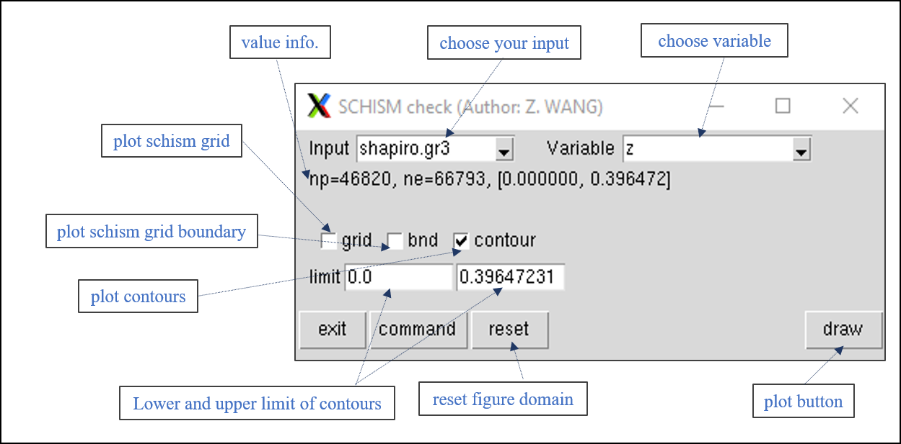
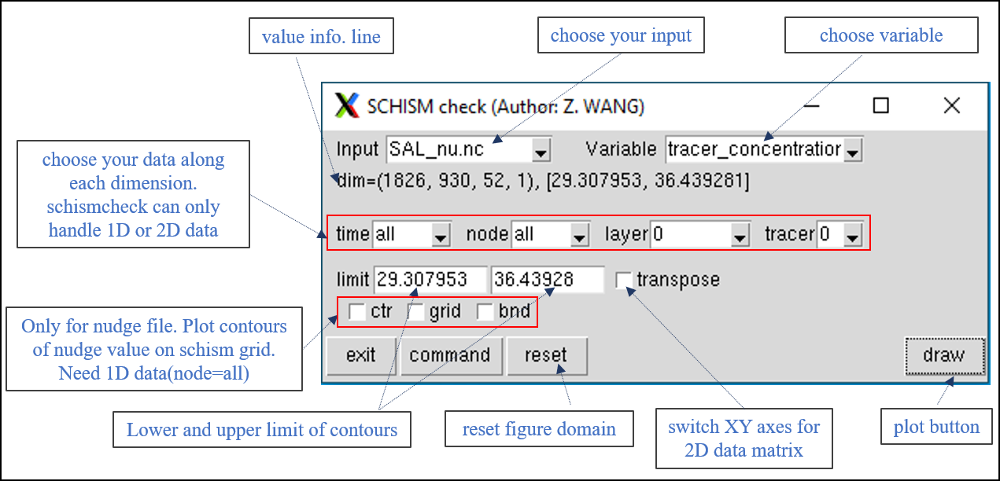
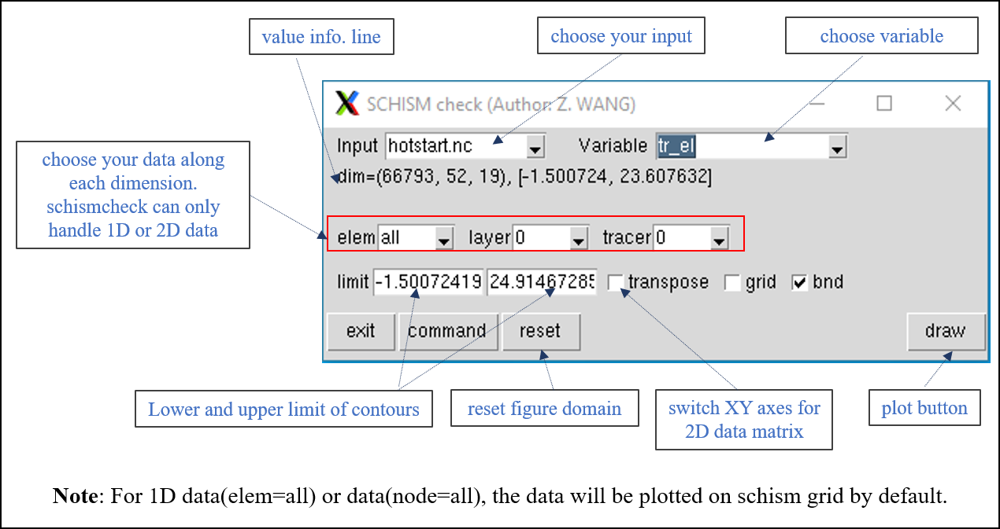
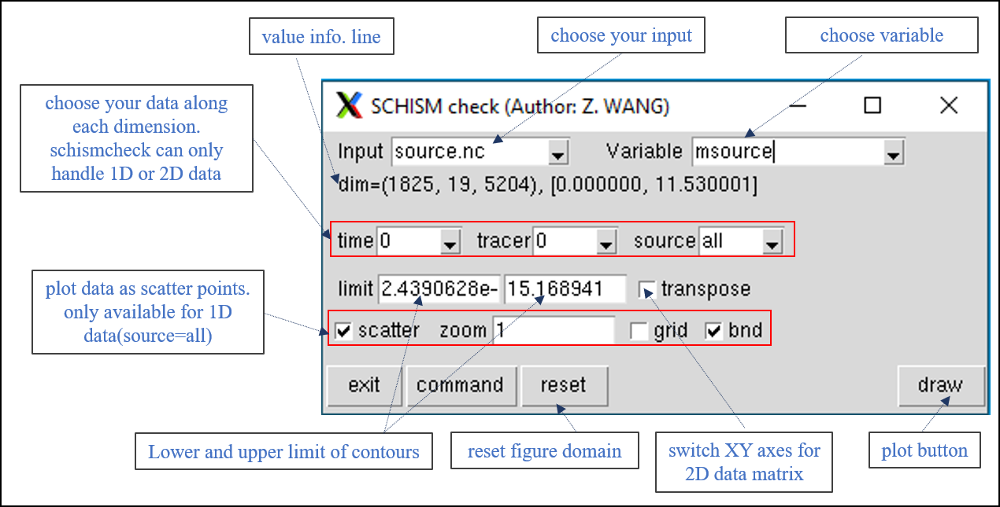
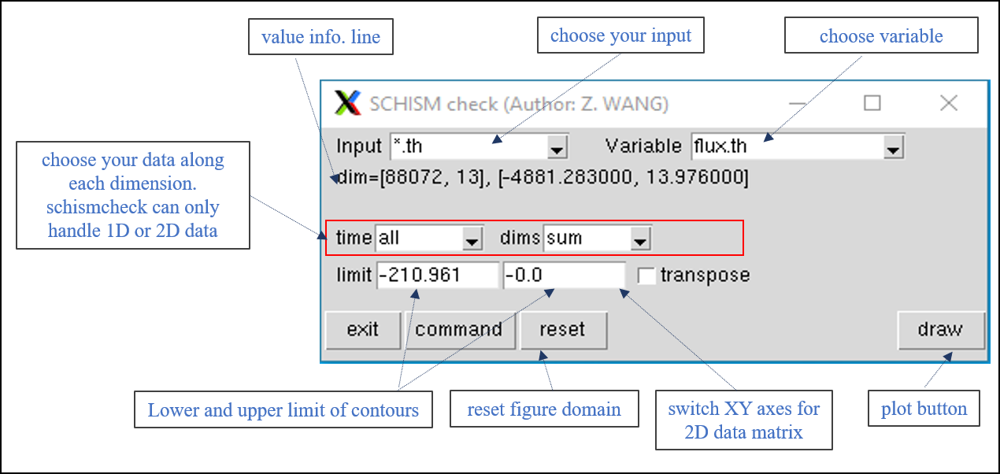

* one can find the location of `schismcheck` by executing the following code. Then, running it in your schism run directory  
`python -c "from pylib import *; print(mylib.__file__[:-16]+'Scripts/schismcheck')"`

* `schismcheck` is still under development/testing mode (please report bugs either on SCHISM maillist or to wzhengui@gmail.com), but it is now able to view most of SCHISM inputs in different ways. It is a good way of sanity check for your model inputs. So far, 5 types of inputs are supported (see figures below). 

* dimension operations  
the following dimension opertations are provided for the data. `schismcheck` can only plot 1D or 2D data, which will plot as time series, 2D contour plot, or scatter plot.  

      1. `all`:   extract all data along dimension
      1. `mean`:  compute mean value along dimension
      1. `min`:   compute minimum value along dimension
      1. `max`:   compute maximum value along dimension
      1. `sum`:   compute sum of value along dimension
      1. `number (0-n)`: extract data slice along dimension 
**note**: `all` operation will add an one dimension to your data to be plotted. 

1. `*.gr3, hgrid.ll, *.ic, *.prop`: Plot value as contour. SCHISM grid and boundary can be superposed.
       <figure markdown id='check_1'>
       {width=500}

2. `*_nu.nc, *_th.nc`: After data (1D or 2D) is extracted, it will be plotted as time series or 2D contour. For nudge 1D data, it can also be plotted on schism grid.
       <figure markdown id='check_2'>
       {width=500}

3. `hotstart.nc`: data will be plotted as time series or 2D contour; For 1D data with dimension=node or elem, it will be plotted as contours on schism grid.
       <figure markdown id='check_3'>
       {width=500}

4. `source.nc or source_input (source_sink.in, vsource, msource, vsink)`: data will be plotted as time series or 2D contour; For 1D data with dimension=source_number, it can be plotted as scatter points on schsim grid.
       <figure markdown id='check_4'>
       {width=500}

5. `*.th`: data will be plotted as time series (1D data) or 2D contour (2D data) 
       <figure markdown id='check_5'>
       {width=500}
