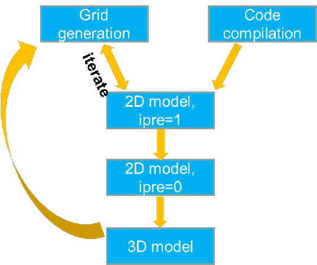

<figure markdown>

<figcaption>Typical workflow with SCHISM modeling.</figcaption>
</figure>

## Grid generation
1. Generate grids in map projection, not lon/lat; this gives flexibility of setting element size. Distortion due
   to projection can be rectified later by projecting back to lon/lat;
2. Make sure major channels are resolved with at least 1 row of ‘always wet’ elements – no blockage of major channel flow
3. Always keep the map file and DEM sources and be willing to edit the grid, as often the model results (and sometimes performance) depend on the grid
4. Being an implicit model with ELM treatment of momentum advection, SCHISM has an `operating range` for the time step. For field applications, the range is 100-400 sec for barotropic cases, 100-200 sec for baroclinic cases. If you have to reduce the time step, make sure you recheck the inverse CFL criterion as show below.
5. First estimate the smallest $\Delta t$ you’d anticipate (e.g., 100s for field applications), and then estimate the coarsest $\Delta t$ at sample depths to make sure $CFL>0.4$ (cf. Table 5.1).
6. Resolving features is much easier with SCHISM – be game! Bathymetry smoothing is not necessary.
7. Make sure open boundaries do not become completely dry during simulation (from v5.8 onward)
8. Implicit $TVD^2$ transport is very efficient, but horizontal transport is still explicit (and is the main bottleneck). Therefore beware of grid resolution in critical regions to avoid excessive sub-cycling; use upwind in areas of no stratification. Another way to speed up is to use hybrid ELM and FV by setting `ielm_transport=1`.
9. Check the following things immediately after a grid is generated (via ACE/xmgredit5 and scripts)
    - Minimum area: make sure there are no negative elements (under Status).
    - $CFL>0.4$ (at least in ‘wet’ areas). Note that you need to do this check in map projection (meters), not in lon/lat!
    - Maximum skewness for triangle: use a generous threshold of 17, mainly to find excessive "collapsed" elements.
    - Quad quality: fix all bad-quality quads using `fix_bad_quads.f90`; use 0.5 (ratio of min and max internal angles) as threshold.

## 2D model: pre-processing
1. Check additional grid issues with a 2D barotropic model with `ipre=1`, `ibc=1`, `ibtp=0`
    - You can cheat without any open boundary segments during this step
    - Remember to `mkdir outputs` in the run directory
2. Iterate with Grid generation step to fix any grid issues.
3. If your goal is to set up 3D baroclinic model later, it's advisable to do the following test. Set a minimum
  depth of say 5m in the entire mesh, and set up a simple baroclinic model (cold start with `salt.ic` and `temp.ic`; vertical
  grid use simple SZ).
  Run SCHISM to see if there are additional mesh issues.

## 2D model: calibration
1. Start from simple and then build up complexity. Simplest may be a tidal run with a constant Manning’s $n$.
2. Remember most outputs are on a per-core basis if you use OLDIO and need to be combined using the 
 utility scripts; e.g., for global outputs (schout*.nc), use `combine_output11.f90` to get global 
  netcdf outputs that can be visualized by VisIT; for hotstart, use `combine_hotstart7.f90`. If you use new
  scribe I/O, you don't need to combine global outputs, but still need to combine hotstart outputs.
3. Examine surface velocity in animation mode to find potential issues (e.g. blockage of channels)
4. Negative river flow values for inflow
5. Check all inputs: ‘junk in, junk out’. There are several pre-processing scripts for this purpose. Xmgredit5 or SMS is very useful also. 

## 3D model
1. The model needs velocity boundary condition at ocean boundary. There are two alternative approaches for this:
    - Use FES2014 tide package to generate tidal velocity, and use a global ocean model (e.g. HYCOM) to get sub-tidal velocity. Then use type ‘5’ in `bctides.in`.
    - Use the one-way nesting capability to generate velocity boundary condition at the ocean boundary. You may use the 2D barotropic tidal model for this purpose, and then augment the tidal velocity with baroclinic velocity from a large-scale model like HYCOM.
2. Avoid large bottom friction in shallow areas in 3D regions
3. Examine surface velocity in animation mode to find potential issues
4. Control the balance between numerical diffusion and dispersion (`indvel`, `ihorcon`)
5. Transport solver efficiency may require some experience.
6. $LSC^2$ grid requires some learning/experience, but is a very powerful tool (resembling unstructured grid in the vertical)
7. See [Case studies](../case-study.md) commonly encountered issues in 3D setup.

!!!note A Beginners guide
    Another good resource for beginners is a mini live [manual](https://www.overleaf.com/project/6122fe048b59c97d57109608) written on Overleaf by Ms. Christelle Auguste (U. of Tasmania).
