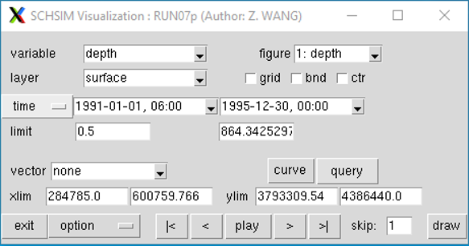

## Visualization with Matlab
The directory Utility/Vis_Matlab/ has matlab scripts that can visualize outputs along a horizontal slab (at a fixed
 z level or at a sigma level) or vertical transects. In particular, `SCHISM_SLAB2.m`  and `SCHISM_TRANSECT2.m` for for 
 the new scribed outputs, while `SCHISM_SLAB.m` and `SCHISM_TRANSECT.m` are for the old outputs (schout*.nc).

## Visualization with pylib
pylib provides `schismview` to visualize outputs (scribed outputs, OLDIO not supported yet). `schismview` will collect all the available variables from your outputs. For each variable, you can do 1). contour plot, 2). animation, 3). extract time series, and 4) query, etc. This is a lightweight app, and please report bug to SCHISM maillist or wzhengui@gmail.com.

### **[Installation of pylib](./pre-processing-with-pylib/installation.md)**

By running the following code, you can locate the executable of `schismview`  
`python -c "from pylib import *; print(mylib.__file__[:-16]+'Scripts/schismview')"`

### **How to use `schismview`**
* To lauch `schismview`, you can run the executable either under your run directory, or pass the run directory as a argument to the executable, which will give you an `schismview` window below.
    <figure markdown id='view_1'>
    {width=500}

* **variable**: All availalbe SCHISM output variables are collected, and you can choose the variable you want to view from the list window.

* **figure**:  list of figures. You can have multiple figures for different variables. You can close it if you want. Later on, you can retrieve previous figures from the list. If you want to add a new figure, choose add. 

* **layer**: For 3D variable, you can specify which layer you want to view. For 2D variable, this option is not needed.

* **grid** or **bnd**: If clicked, schism grid/boundary will plotted out along with the contour plot. If you only want to view the grid/boundary, choose `none` from the variable list.

* **ctr**: By default, `schismview` will use `tripcolor` to plot contours, which is element-based. If `ctr` is clicked, `schismview` will use `tricontourf` to plot, which can be faster for very large grid.

* **time**: There are three available time options (calendar time, SCHISM stack number, or Julian date). You can set the Start and End dates for viewing variables in the textbox. This may be needed for animation if you only want to view for a specific period of time.

* **limit**: It sets the lower and upper limits of contours. The values beyond are extended.

* **vector**: You can choose vector you want to view from the list. vector shown will be limitted to the current domain specified by `xlim` and `ylim`.

* **curve**: By `right double click`, you can add location points for extractng times for the active variable. `middle double click` will remove the points. Then, click `curve`, `schismview` will extract time series in background and the button will display `wait`. Once `wait` becomes `curve` again, clicking on it will show the time series. Note, extracting time series can be very slow for 3D variables depending on how the netcdf outputs are stored (chuncking the files can help, but it is a separate topic beyond `schismview`). It is better to specify short time range. 

* **query**: You can query the value of variable. By clicking query (becomes sunken once chosen), you can use `middle single click` to query the value. By clicking query again, it will exit query mode.

* **xlim**/**ylim**: Sspecify the X/Y axis range.

* **animation**
     * **`|<`**: go to start time
     * **`<`**:  go to previous time
     * **`play`**:  play animation for the current variable. The button will display `stop`, and click `stop` will stop the animation. Note `doulbe right click` will have the same effect of `play` buttion
     * **`>`**:  go to next time
     * **`>|`**: go to end time
     * **skip**: specify the animation interval

* **draw**: draw plot or refresh the plot.

* **option**: Advaned features
    * **command window**: type commands to interact with the plot, which can be used to generate desired high-quality figures.
    * **save animation**
    * **show node/element number**

## Visualization with VisIt
The most comprehensive way to visualize SCHISM nc4 outputs is via VisIt.

Shortly after v5.9.0, we have successfully implemented a new mode of efficient I/O using dedicated 'scribes'.
 At runtime, the user needs to specify number of scribe cores (= # of 3D outputs variables 
(vectors counted as 2) plus 1), and the code, compiled without `OLDIO`, will output 
 combined netcdf outputs for each 3D variable and also all 2D variables in `out2d*.nc`. 
Sample 3D outputs are: `salinity_*.nc`, `horizontalVelX_*.nc` etc - note that vectors variable names end with `X,Y`. You can find sample outputs [here](http://ccrm.vims.edu/yinglong/SVN_large_files/Scribe_IO_outputs/).
Sample outputs using OLDIO (schout*.nc) can be found [here](http://ccrm.vims.edu/yinglong/SVN_large_files/SCHISM_v5.6.1_sample_outputs/).

You can download newer versions of VisIt plugins c/o Jon Shu, DWR by following these steps:

**On Windows 7 or 10**

1. First download VisIt from [LLNL](https://wci.llnl.gov/simulation/computer-codes/visit/downloads) site and install. Note the location, which will be in your Windows profile directory if you install for the current user or in `Program Files` if you install for all users. Note the location.
2. Make sure MS visualc++ 2012 x64 is installed. If not, google it and install and restart (this is required for using multi-core VisIt). If you are using VisIt 3.3.1, you need MS visualc++ 2013 x64 also.
3. Download pre-built plug-in, developed at California Dept of Water Resource
    * [For VisIt v2.13.3](https://github.com/schism-dev/schism_visit_plugin/releases/download/1.1.0/schism_plugin_visit2.13.3_win64_vs2012_tag_1.1.0.zip)
    * [For VisIt v3.1.4](https://github.com/schism-dev/schism_visit_plugin/releases/download/1.1.0/schism_plugin_visit3.1.4_win64_vs2017_tag_1.1.0.zip)
    * [For VisIt v3.3.1](https://github.com/schism-dev/schism_visit_plugin/releases/download/1.1.0/schism_plugin_visit3.3.1_win64_vs2017_tag_1.1.0.zip)
    
    You need to put the plugin dlls in: `%USERPROFILE%\Documents\VisIt\databases` (create new folders if necessary), except `netcdf_c++.dll`. The NetCDF DLL needs to be copied to the VisIt installation directory, which may be `%USERPROFILE%\LLNL\VisIt 3.3.1` if you installed for yourself or the system install directory `C:Program Files\LLNL\VisIt3.3.1.` if you installed for all users.

4. After these steps, you should be able to read in SCHISM outputs in ViSIt; look for `SCHISM`, `gr3` format from the dropdown list. To load in vectors, select only the `X` file.

**On Linux Systems**

Newer versions can be found at the master branch of [github](https://github.com/schism-dev/schism_visit_plugin).

!!!note
    Note that the new plugins also work with the old I/O (combined `schout*.nc`) or even the older binary outputs. To visualize any variables under new I/O with VisIt, you'll always need corresponding `out2d*.nc`; additionally for any 3D variables, VisIt also needs corresponding `zCoordinates*.nc`. 
