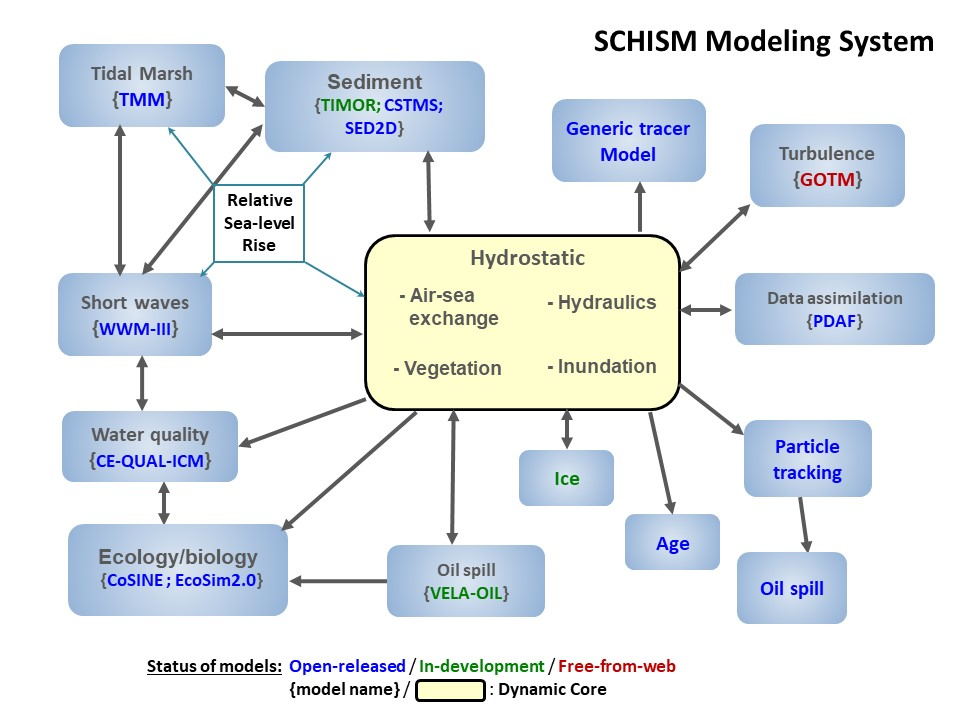

# Semi-implicit Cross-scale Hydroscience Integrated System Model (SCHISM)
SCHISM modeling system is a derivative work from the original SELFE model (v3.1dc as of Dec. 13 , 2014). SCHISM has been implemented by Dr. Joseph Zhang (College of William & Mary) and other developers around the world, and licensed under Apache. SELFE was developed at the Oregon Health Sciences University. However, there are now significant differences between the two models.

SCHISM (Semi-implicit Cross-scale Hydroscience Integrated System Model) is an open-source community-supported modeling system based on unstructured grids, designed for seamless simulation of 3D baroclinic circulation across creek-lake-river-estuary-shelf-ocean scales. It uses a highly efficient and accurate semi-implicit finite-element/finite-volume method with Eulerian-Lagrangian algorithm to solve the Navier-Stokes equations (in hydrostatic form), in order to addresses a wide range of physical and biological processes. The numerical algorithm judiciously mixes higher-order with lower-order methods, to obtain stable and accurate results in an efficient way. Mass conservation is enforced with the finite-volume transport algorithm. It also naturally incorporates wetting and drying of tidal flats.

<figure>

<figcaption>SCHISM modelling framework.</figcaption>
</figure>

The SCHISM system has been extensively tested against standard ocean/coastal benchmarks and applied to a number of regional seas/bays/estuaries around the world (see 'Case study') in the context of general circulation, tsunami and storm-surge inundation, water quality, oil spill, sediment transport, coastal ecology, and wave-current interaction. SCHISM now includes many upgrades of the original SELFE code (v3.1dc); the major differences are summarized in Zhang et al. (Seamless cross-scale modeling with SCHISM, Ocean Modelling, 2016; see Publications).

The source code and user manual can be downloaded from this web site. The plot to the right shows a snapshot of various modules inside SCHISM.

## Major Characteristics of SCHISM
- Finite element/volume formulation
- Unstructured mixed triangular/quadrangular grid in the horizontal dimension
- Hybrid SZ coordinates or new $LSC^2$ in the vertical dimension
- Polymorphism: a single grid can mimic 1D/2DV/2DH/3D configurations
- Semi-implicit time stepping (no mode splitting): no CFL stability constraints → numerical efficiency
- Robust matrix solver
- Higher-order Eulerian-Lagrangian treatment of momentum advection (with ELAD filter)
- Natural treatment of wetting and drying suitable for inundation studies
- Mass conservative, monotone, higher-order transport solver: TVD2; WENO
- No bathymetry smoothing necessary
- Very tolerant of bad-quality meshes in the non-eddying regime

## Modeling system & application areas
- 3D baroclinic cross-scale lake-river-estuary-plume-shelf-ocean circulations
- Tsunami hazards
- Storm surge
- Sediment transport
- Biogeochemistry/ecology/water quality
- Oil spill
- Short wave-current interaction

## Citation
We suggest the following language for citing the model:

SCHISM (Semi-implicit Cross-scale Hydroscience Integrated System Model) is a derivative product built from the original SELFE (v3.1dc; Zhang and Baptista 2008) and distributed with an open-source Apache v2 license, with many enhancements and upgrades including new extension to large-scale eddying regime and a seamless cross-scale capability from creek to ocean (Zhang et al. 2016).

- Zhang, Y. and Baptista, A.M. (2008) SELFE: A semi-implicit Eulerian-Lagrangian finite-element model for cross-scale ocean circulation", Ocean Modelling, 21(3-4), 71-96.
- Zhang, Y., Ye, F., Stanev, E.V., Grashorn, S. (2016) Seamless cross-scale modeling with SCHISM, Ocean Modelling, 102, 64-81.

## How to read this manual
This manual contains detailed information on physical and numerical formulations, as well as usage for SCHISM. 
For beginners, we suggest you familiarize yourself with the basic notations in Chapters 2 and 3 but skip some 
details in those two chapters; there is also a ‘cheat sheet’ near the end of this chapter. 
Chapters 4&5 describe how to set up the model, including grid generation, and so should be read carefully, 
in consultation with appropriate sections in the previous 2 chapters. Since SCHISM is quite a sophisticated package, 
we strongly recommend you start from the simple test cases in Chapter 5.5 and gradually progress toward more 
complex 3D baroclinic or coupled applications. 

##Notations used in this manual 
We will use bold characters to denote vectors and matrices, and unbold characters to denote scalars in mathematical equations.
 In addition, superscripts usually denote time step and subscripts denote spatial locations. 
E.g., $𝑇i_{𝑖,𝑘}^{𝑛+1}$ may mean the temperature at step $n+1$ (i.e., new time step) and prism $(i,k)$, where $i$ is 
the element number and $k$ is the (whole) vertical index. 
Below are some notations used in this manual: 

- $N_p$: # (number) of nodes 
- $N_s$: # of sides 
- $N_e$: # of elements 
- $N_z$: maximum # of vertical levels 
- $i34(j)$: type of an element _j_ (3: triangle; 4: quad) 
- $N_b(i)$: # of surrounding elements of a node _i_ 
- $kbp(i)$: bottom index as seen by a node _i_ 
- $kbs(i)$: bottom index as seen by a side _i_ 
- $kbe(i)$: bottom index as seen by an element _i_ 
- $A$: area of an element 
- $\Delta z$: layer thickness (at a node, side or elem.) 
- $\delta_{ij}$: Dirac’s Delta function (=1 when $i=j$; 0 otherwise) 
