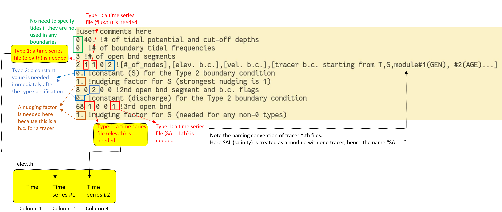

Please refer to sample [bctides.in](https://github.com/schism-dev/schism/blob/master/sample_inputs/bctides.in) in the source code directory when you read this. The following table summarizes all horizontal B.C. and nudging options supported by SCHISM. The format for other necessary input files are decribed in the [Optional inputs](optional-inputs.md) section.

| Variable | Type 1 (`*.th`) | Type 2 | Type 3 | Type 4 (`*[23]D.th`) | Type 5 | Type -1 | Type -4, -5 (`uv3D.th`); Nudging | Nudging/Sponge layer near bnd |
|----------|---------------|--------|--------|--------------------|--------|---------|--------------------------------|-------------------------------|
| $\eta$ | `elev.th`; Time history; uniform along bnd | constant | Tidal amp/phases | `elev2D.th.nc`: time- and space- varying along bnd | `elev2D.th.nc`: sum of 3 and 4 | Must = 0 | N\/A | `inu_elev=1`|
| S&T, Tracers | `[MOD]_[ID].th`: relax to time history (uniform along bnd for inflow) | Relax to specified value for inflow | Relax to i.c. for inflow | `[MOD]_3D.th.nc`: relax to time- and space- varying values along bnd during inflow | N/A | N/A | N/A | `inu_[MOD]=1 or 2`|
| u,v | `flux.th`: via discharge ( <0 for inflow!) | Via dischage (<0 for inflow) | Tidal amp/phases for u and v components | `uv3D.th.nc`: time- and space- varying along bnd (in lon/lat for `ics=2`) | `uv3D.th.nc`: sum of 3 and 4 | Flather (0 for $\eta$) | Relax to `uv3D.th.nc` (2 separate relaxations for in and outflow) | `inu_uv=1` |

Following is a psudo code to explain the structure of `bctides.in` for different types of boundary conditions listed above. Spaces between lines are added for clarity.

```fortran
<you notes> !Not used in code; write your own comments

ntip tip_dp !# of constituents used in earth tidal potential; cut-off depth for applying tidal potential (i.e., it is not calculated when depth < tip_dp).

for k=1, ntip
    talpha(k) !tidal constituent name
    jspc(k), tamp(k), tfreq(k), tnf(k), tear(k) !tidal species # (0: declinational; 1: diurnal; 2: semi-diurnal), amplitude constants, angular frequency, nodal factor, earth equilibrium argument (in degrees);
end for

nbfr !total # of tidal boundary forcing frequencies

for k=1, nbfr
    alpha(k) !tidal constituent name
    amig(k), ff(k), face(k) !angular frequency (rad/s), nodal factor, earth equilibrium argument (in degrees) for constituent
end for

nope !# of open boundary segments
for j=1, nope
    neta(j), iettype(j), ifltype(j), itetype(j), isatype(j), (optional) itrtype(j) !# of nodes on the open boundary segment j (corresponding to hgrid.gr3), B.C. flags for elevation, velocity, temperature, and salinity, and (optionally) for each tracer module invoked (in the order of GEN, AGE, SED3D, EcoSim, ICM, CoSiNE, FIB, and TIMOR)

    ! Elevation B.C. section
    if (iettype(j) == 1) !time history of elevation on this boundary
        !no input in bctides.in; time history of elevation is read in from elev.th (ASCII);
    else if (iettype(j) == 2) !this boundary is forced by a constant elevation
        ethconst !constant elevation value for this segment
    else if (iettype(j) == 3) !this boundary is forced by tides
        for k=1, nbfr
            alpha(k) !tidal constituent name
            for i=1, nond(j) !loop over all open boundary nodes on this segment
                emo((j,i,k) efa (j,i,k) !amplitude and phase for each node on this open boundary
            end for i
        end for k
    else if (iettype(j) == 4) !space- and time-varying input
        !no input in this file; time history of elevation is read in from elev2D.th.nc (netcdf);
    else if (iettype(j) == 5) !combination of ‘3’ and ‘4’
        !time history of elevation is read in from elev2D.th.nc, and then added to tidal B.C. specified below
        for k=1, nbfr
            alpha(k) !tidal constituent name
            for i=1, nond(j) !loop over all open boundary nodes on this segment
                emo((j,i,k) efa(j,i,k) !amplitude and phase for each node on this open boundary
            end for i
        end for k
    else if (iettype(j) == 0)
        !elevations are not specified for this boundary (in this case the velocity must be specified).
    end if

    ! Velocity B.C. section
    if (ifltype(j) == 0) !vel. not specified
        ! no input needed
    else if (ifltype(j) == 1) !time history of discharge on this boundary
        ! no input in this file; time history of discharge is read in from flux.th (ASCII)
    else if (ifltype(j) == 2) !this boundary is forced by a constant discharge
        vthconst !constant discharge (note that a negative number means inflow)
    else if (ifltype(j) == 3) !vel. (not discharge!) is forced in frequency domain
        for k=1, nbfr
            alpha(k) !tidal constituent name
            for i=1, nond(j) !loop over all open boundary nodes on this segment
                umo(j,i,k) ufa(j,i,k) vmo(j,i,k) vfa(j,i,k) !amplitude and phase for (u,v) at each node on this open boundary
            end for i
        end for k
    else if (ifltype(j) == 4 or -4) !3D input
        !time history of velocity (not discharge!) is read in from uv3D.th.nc (netcdf)
        if ifltype(j)==-4)
            rel1 rel2 !relaxation constants for inflow and outflow (between 0 and 1 with 1 being strongest nudging)
        end if
    else if (ifltype(j) == 5) !combination of ‘4’ and ‘3’
        ! time history of velocity (not discharge!) is read in from uv3D.th.nc (netcdf) and then added to tidal velocity specified below
        for k=1, nbfr
            alpha(k) !tidal constituent name
            for i=1, nond(j) !loop over all open boundary nodes on this segment
                umo(j,i,k) ufa(j,i,k) vmo(j,i,k) vfa(j,i,k) !amplitude and phase for (u,v) at each node on this open boundary
            end for i
        end for k
    else if (ifltype(j) == -1) !Flather type radiation b.c. (iettype must be 0 in this case)
        'eta_mean' !comment only - mean elevation below
        for i=1,nond(j) !loop over all nodes
            eta_m0(i) !mean elev at each node
        end for i
        'vn_mean'!comment only - mean normal velocity below
        for i=1,nond(j)
            qthcon(1:Nz,i,j) !mean normal velocity at the node (at all levels)
        end for i
    end if

    ! Temperature B.C. section
    if (itetype(j) == 0) !temperature not specified
        ! no input needed
    else if (itetype(j) == 1) !time history of temperature on this boundary
        tobc !nudging factor (between 0 and 1 with 1 being strongest nudging) for inflow; time history of temperature will be read in from TEM_1.th (ASCII)
    else if (itetype(j) == 2) !this boundary is forced by a constant temperature
        tthconst !constant temperature on this segment
        tobc !nudging factor (between 0 and 1) for inflow
    else if (itetype(j) == 3) !initial temperature profile for inflow
        tobc !nudging factor (between 0 and 1) for inflow
    else if(itetype(j) == 4) !3D input
        tobc !nudging factor (between 0 and 1); time history of temperature is read in from TEM_3D.th.nc (netcdf)
    end if

    ! Salinity B.C. section
    ! Similar to temperature above
    if (isatype(j) == 0) !salinity not specified
        .........
    endif

    ! If any tracer module is invoked, you also need the corresponding B.C. part for each tracer module, and the structure is similar to temperature. 
    !However, if the tracer module has multiple classes (which is the case for most modules; e.g.,  AGE, SED etc), 
    !you need to specify the concentration constants (under `2` etc) for all classes in 1 row. In later sections 
    !we will give examples for `.nc` inputs.

end for !j: open boundary segment
```
<br/>

The following two samples provide more direct views on the structure of bctides.in.
<br/>

Sample 1 illustrates how to set Type 1 (Time history; uniform along bnd) and Type 2 (Constant) boundaries:
    
<br/>

Sample 2 illustrates how to set a Type 3 (tidal) boundary:
    
<br/>

!!!caution "Note on AGE module"
    The number of tracers inside this module (`ntracer_age`) must be an even number, and usually you only specify the first `ntracer_age/2` tracers on some open boundaries. For example, suppose `ntracer_age=4`, you can set the B.C. flags as:

    ```
    3 !nope
    88 3 0 0 0 0 !ocean – no age tracer b.c. here
    ....
    5 0 1 1 3 2 !Columbia River
    1. !relax for T
    1. !relax for S
    1. 0. 0. 0. !inject age tracer #1 here
    1. !relax for AGE
    3 0 2 3 3 2 !Fraser River
    1. !relax for T
    1. !relax for S
    0. 1. 0. 0. !inject age tracer #2 here
    1. !relax for AGE
    ```

!!!note 
    `bctides.in` is one of the most error prone inputs for users due to its rigid formatting requirements. One useful trick to quickly find out the  error location is to deliberately crash the code by placing illegal choices along this input to help isolate the errors (think of bi-section method). For example, you can intentionally set an illegal B.C. flag of `6` at a segment to see if the code crashes before or after this point.

!!!note 
    The tidal amplitudes and phases can be generated using utility scripts in the `Tides`.
