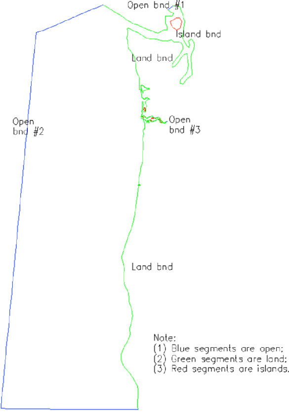

The format of this file is shown below. It has 4 part.

First part of the file is the information - 
```
hgrid.gr3 ! alphanumeric description; ignored by code
60356 31082 ! # of elements and nodes in the horizontal grid
```

Second part is the node info.
```
1 402672.000000 282928.000000 2.0000000e+01 ! node #, x,y, depth
2 402416.000000 283385.000000 2.0000000e+01
3 402289.443000 282708.750000 2.0000000e+01
4 402014.597000 283185.897000 2.0000000e+01
.............................................
31082 331118.598253 112401.547031 2.3000000e-01 !last node
```

Third part is the connectivity table.
```
1 4 1 2 3 101 ! element #, element type (triangle or quad), nodes 1-4
2 3 2 4 3
3 3 4 5 3
...........................................
60356 3 26914 30943 26804 !last element
```

The last part is the list of open and land boundary segments. This part is needed for hgrid.gr3 only; not needed
for other .gr3 files.

```
3 = Number of open boundaries
95 = Total number of open boundary nodes
3 = Number of nodes for open boundary 1
29835 ! first node on this segment
29834 ! 2nd node on this segment
.
.
.
30001 !last node on this segment
90 = Number of nodes for open boundary 2
.
.
.
16 = number of land boundaries (including islands)
1743 = Total number of land boundary nodes
753 0 = Number of nodes for land boundary 1 ('0' means the exterior land boundary)
30381 ! first node on this segment
.......................................
1 !last node on this segment
741 0 ! Number of nodes for land boundary 2 ('0' means the exterior boundary)
.
.
.
10 1 = Number of nodes for island boundary 1 ('1' means island)
29448 ! first node on this island
.
.
.
29449 !last node on this island (note this is different from the first node ‘29448’ above)
```

<figure markdown>
{width=400}
<figcaption>Horizontal grid and boundary segments..</figcaption>
</figure>

!!! note
    1. Land and Ocean boundary sagment can be generated with xmgredit5 $\rightarrow$ GridDEM $\rightarrow$ Create open/land boundaries; it can also be generated with SMS;
    2. If you have no open boundary, you can create two land boundary segments that are linked to each other. Likewise, if you have no land boundary, you should create two open boundary segments that are connected to each other;
    3. Although not required, we recommend you follow the following convention when generating the boundary segments. For the exterior boundary (open+land), go in counter-clockwise direction. With xmgredit5, the island boundaries are automatically created once you have finished designating all open and land segments on the exterior boundary. At the moment xmgredit5 cannot generate open boundary segments on islands. You cna use SMS or some python tools for this;
    4. Note that this format is the same as fort.14 of ADCIRC; keep an eye on the land boundary sagment, where instead of **741 0** in the above example SMS will produce `741 10`. At the moment, the flags for land/island boundaries are not used in SCHISM system except for WWM (see below);
    5. If WWM is used, the land boundary flags (cf. bold texts above) are required, and also there must not be any open boundary segments on any island. Therefore if you use WWM, make sure the exterior land boundary flags are `0` and island boundary flags are non-zero;
    6. Since WWM can only handle triangles, the mixed grid needs to be converted to a pure triangular grid for WWM using a pre-processing script `Pre-Processing/split_quads_wwm.f90`.
