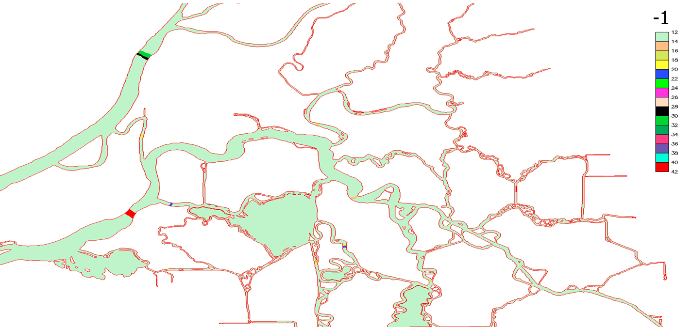

This section explains the details of some options inputs triggered by `param.nml`. The list is non-exhaustive as there
 are many such inputs. You can also find some example in [test suite](../getting-started/test_suite.md).


## hgrid.ll
The format is the same as hgrid.gr3, except that the B.C. part is not necessary. The x,y of each node are replaced by lon/lat coordinates. If your model is already prepared in lon-lat, then, this file can be provided by simply making a soft-link to the hgrid.gr3 file.

## .gr3
The format is the same as `hgrid.gr3`, except that the B.C. part is not necessary. The only difference between .gr3 files is that the ‘depth’ means different variables. We show some examples below. Some such inputs are generated by scripts (e.g. `shapiro.gr3`, `SAL_nudge.gr3`).

**diffmin.gr3 and diffmax.gr3**: the ‘depth’ specifies the min/max of the viscosity or diffusivity. Needed if `itur=3 or 4`. Suggested value: $1.e-6 m^2/s$ for diffmin and $1 m^2/s$ (or larger) for diffmax.

**albedo.gr3 and watertype.gr3**: required if `ihconsv=1`, specifying the albedo (e.g. 0.1) and water type for attenuation rate of solar radiation. E.g., '1' is Jerlov type I (clean water), '5' is Jerlov type III etc. Consult `schism_step.F90` for more details. '7' has largest attenuation rate (muddy water).

**adv.gr3**: Required if `nadv=0`. The ‘depth’ is either `0`, `1` or `2` in this case, corresponding to where the momentum advection is turned off, using backward Euler, or using 2nd-order Runge-Kutta method at a node.

**krvel.gr3**: Required if `inter_mom=-1`. The ‘depth’ is either `0`, `1`, corresponding to kriging ELM bring turned off/on. The generalized covariance function is specified by `kr_co`.

**bdef.gr3**: Required if `imm=1`. The ‘depth’ specifies the amount of bed deformation (in meters) during time step 1 to `ibdef`, with positive values being uplift.

## .th (ASCII)
This includes `elev.th`, `flux.th`, `TEM_1.th`, `SAL_1.th` etc, which share same ASCII structure. Below is a sample flux.th (note that negative values mean inflow!)

```
0. -1613.005 -6186.0 !time (in sec), discharge at the 1st boundary segment that has ifltype=1 (in bctides.in), discharge at the 2nd boundary segment with ifltype=1, etc
300. -1613.05005 -6186.60156
600. -1611.37854 -6208.62549
900. -1609.39612 -6232.22314
```

!!!notes
    - Note that the time must start from 0, and the step can be anything `≥dt`.
    - The '1' in `TEM_1.th` refers to the 1 (and only) tracer class in the temperature module;
    - In the case of wind.th (with `nws=1 or 4`), the time step specified inside must also match `wtiminc` in `param.nml`. If `nws=4`, the format of `wind.th` is different: each line specifies the wind u,v, and atmospheric pressure (in Pa) at all nodes.
    - In the case of `msource.th` (invoked with `if_source=1`), the values after time stamp are tracer values at each source element (specified in `source_sink.in`), and the order of tracers is: T,S, followed by each tracer module invoked. No vertical level info is needed here as the tracers are injected at a level or all levels. If you do not have good values for some tracers, use -9999. instead and the code will inject ambient concentration values for you.
    - See examples of `vsource.th`, `vsink.th` and `msource.th` in `sample_inputs/` of source code bundle.

## .th.nc (netcdf4)
These include `elev2D.th.nc`, `uv3D.th.nc`, `TEM_3D.th.nc`, `SAL_3D.th.nc`, and `[MOD]_3D.th.nc` (where MOD is the tracer module name like ‘COS’). The format can be found below (also in test suite (e.g. schism_verification_tests/Test_ICM_UB/)).

!!!notes
    1. the time always starts from 0, and the time step can be anything `≥dt`. Note that the time stamp series in `time` is not needed by the code; only `time_step` (in sec) is needed;
    2. `time_series` contains the main data at all relevant nodes;
    3. ‘nOpenBndNodes’ should be total number of nodes on all open boundary segments that require this input, and the values appear in same order as in bctides.in inside ‘time_series’;
    4. `nLevels` specifies the vertical structure, and `nComponents` specifies either scalar/vector, or # of classes in the tracer module;
    5. Most netcdf4 libraries allow float and double to be interchangeable but it's better to be strict about data type.

!!!notes "elev2D.th.nc"
    ```
    netcdf elev2D.th {
    dimensions:
        time = UNLIMITED ; // (73 currently)
        nOpenBndNodes = 748 ;
        nLevels = 1 ;
        nComponents = 1 ;
        one = 1 ;
    variables:
        double time_series(time, nOpenBndNodes, nLevels, nComponents) ;
        float time_step(one) ;
        double time(time) ;
    }
    ```

!!!notes "uv3D.th.nc"
    ```
    netcdf uv3D.th {
    dimensions:
        nOpenBndNodes = 748 ;
        one = 1 ;
        time = UNLIMITED ; // (73 currently)
        nLevels = 44 ;
        nComponents = 2 ;
    variables:
        float time_step(one) ;
        double time(time) ;
        float time_series(time, nOpenBndNodes, nLevels, nComponents) ;
    }
    ```

!!!notes "TEM_3D.th.nc"
    ```
    netcdf TEM_3D.th {
    dimensions:
        nOpenBndNodes = 30 ;
        nLevels = 35 ;
        nComponents = 1 ;
        one = 1 ;
        time = UNLIMITED ; // (371 currently)
    variables:
        float time_step(one) ;
        time_step:long_name = "time step in seconds" ;
        double time(time) ;
        time:long_name = "simulation time in seconds" ;
        float time_series(time, nOpenBndNodes, nLevels, nComponents) ;
    ```

## .prop
The element-centered inputs color each element with a ‘property’, which can be visualized with xmgredit5 (Special $\rightarrow$ properties). xmgredit5 also allows editing of this file. The format follows xmgredit5 element property format: 

```
1 -1 !element number, element property
2 0
3 2
4 5
....
```

Currently there are 3 .prop files:

**tvd.prop**: user needs to explicitly specify horizontal regions where upwind or higher-order solver (TVD or WENO) is used, based on the element property values (`0`: upwind; `1`: TVD or WENO) in `tvd.prop`.

**partition.prop**: this input is required if you use static domain decomposition (NO_PARMETIS). The element property simple specifies the MPI process that owns each element. This can be generated e.g. by METIS.

**fluxflag.prop** The element property flags (integers from -1,0,1,…) specify the 'region number' for each element. The code will only compute the flow across a side if (1) the flags at its 2 adjacent elements differ by 1, and (2) neither flag is -1 (cf. Fig. 4.2). The output `flux.out` is a simple ASCII file with the format:

```
0.001389 0.1004E-01 0.1934E-01 !time (days), flow [m3/s] from region ‘1’ to ‘0’, flow from region ‘2’ to ‘1’,…
0.002778 0.8852E-02 0.2285E-01
...
```

<figure markdown id='figure01'>
{width=800}
<figcaption>Example of `fluxflag.prop`</figcaption>
</figure>

## .ic
The I.C. inputs include the initial condition for elevation or tracers (`salt.ic`, `temp.ic`, and `ts.ic`). For most generic form of I.C. (variable in space and time), use `hotstart.nc`. 

`elev.ic` is a `.gr3` file that specifies the initial elevation at each node. Depending on the values of `flag_ic(1:2)`, T,S I.C. inputs have different format.

- If `flag_ic(1:2)= 1`, `salt.ic` and `temp.ic` take the `.gr3` format;
- If `flag_ic(1:2)= 2`, `ts.ic` takes the following simple format:

```
43 !total # of vertical levels
1 -2000. 4. 34. !level #, z-coordinates, temperature, salinity
2 -1000. 5. 34.
...
```

!!!caution "Notes on ts.ic"
    The code will extrapolate above surface or below bottom for you if your z-coordinates do not cover the full depth. Since it uses cubic spline interpolate, make sure your vertical profiles are well resolved to avoid unexpected min/max due to the cubic spline method.

Similar format is used for other tracers; e.g., `ICM_vvar_[1,2..].ic` has a similar format to `ts.ic`.

## .nc
Beside the time series inputs, we have the other types of netcdf4 input files as follows. Some sample files can be found in the test suite (e.g. schism_verification_tests/Test_ICM_UB/).

**hotstart.nc** This input basically contains all major state variables defined at node/side/element.

**source.nc**  Required if `if_source=-1`, this input combines all info needed for source/sink.
!!!notes "source.nc"
    ```
    netcdf source {
    dimensions:
        nsources = 1268 ;
        nsinks = UNLIMITED ; // (0 currently)
        ntracers = 23 ;
        time_msource = 732 ;
        time_vsource = 732 ;
        time_vsink = UNLIMITED ; // (0 currently)
        one = 1 ;
    variables:
        int64 source_elem(nsources) ;
        double vsource(time_vsource, nsources) ;
        double msource(time_msource, ntracers, nsources) ;
        double time_msource(time_msource) ;
        double time_vsource(time_vsource) ;
        double time_step_vsource(one) ;
        double time_step_msource(one) ;
        double time_step_vsink(one) ;

    // global attributes:
                :file_format = "NETCDF4" ;
                :_NCProperties = "version=2,netcdf=4.8.1,hdf5=1.12.1" ;
    }
    ```

!!!notes
    1. # of records for sources and sinks can be different;
    2. `source_elem` and `sink_elem` specify the element indices for source/sinks;
    3. The time stamps in `time_msource` etc are not needed by the code; only `time_step_*` (in sec) are required;
    4. `ntracers` specifies the **total** # of classes in **all** tracer modules (including T,S,..). The example above used ICM module (which has 21 classes), so together with T,S there are 23 'tracers'.

***_nu.nc** This input is used for tracer nudging (`inu_tr=2`). You only need to specify values in the nudging zone and may use junk values -9999 inside (in this case the code will not nudge to the junk value). The mapping array ‘map_to_global_node’ is used to map the array indices to the global node indices.

!!!notes "ICM_nu.nc"
    ```
    netcdf ICM_nu {
    dimensions:
        node = 27023 ;
        nLevels = 40 ;
        ntracers = 21 ;
        time = UNLIMITED ; // (367 currently)
    variables:
        float time(time) ;
        int map_to_global_node(node) ;
        float tracer_concentration(time, node, nLevels, ntracers) ;
    }
    ```
!!!notes
    1. `node` specifies total # of nodes in the nudging zone (i.e. with non-zero depths in `*_nudge.gr3`);
    2. `ntracers` is the # of tracer classes in this module (1 for T,S);
    3. `map_to_global_node` maps the local node indices to global nodes;
    4. The time stamps in `time` are not needed by the code, as `step_inu_tr` already specified the time step in nudging inputs.
    5. `tracer_concentration` specifies the tarcer concentrations to nudge toward.

## .in
### station.in (.bp format)
This file is needed if `iout_sta=1` and is in a build point format (essentially.gr3 without the connectivity table):

```
1 1 1 1 1 1 1 1 1 !on (1)|off(0) flags for elev, air pressure, windx, windy, T, S, u, v, w
nsta !# of stations
do i=1,np
    i,xsta(i),ysta(i),zsta(i) !zsta(i) is z-coordinates (from vertical datum; <0 is below)
enddo    
```

Also see [station.in.sample](https://raw.githubusercontent.com/schism-dev/schism/master/sample_inputs/station.in) in the source bundle.

### source_sink.in
This input is invoked if `if_source=1`, and specifies the element #’s for each (volume and mass) source and sink. The format is:

```
2   ! total # of elements with sources
100 ! element # of 1st source
101 ! element # of 2nd source
    !A blank line for readability; below are sinks
3   ! total # of elements with sinks
99  ! element # of 1st sink
100
105 ! element # of 3rd sink
```

### hydraulics.in
This input is invoked if `ihydraulics=1`, and is the main input for the hydraulics module. See hydraulics module manual for details.

### harm.in
This file is needed if `iharind=1`. Harmonic analysis capabilities were introduced in SCHISM by Andre Fortunato, using the routines of ADCIRC. These routines were developed by R.A. Luettich and J.J. Westerink, who are hereby acknowledged, and were used with written permission by R.A. Luettich. Note that only analysis on elevations at all nodes can be done at the moment.

The file has the following format (text adapted from the ADCIRC user's manual):

```
NFREQ = number of frequencies included in harmonic analysis of model results.
for k=1 to NFREQ
    NAMEFR(k) = an alphanumeric descriptor (i.e. the constituent name) whose length must be <=16 characters
    HAFREQ(k), HAFF(k), HAFACE(k) = frequency (rad/s), nodal factor, equilibrium argument (degrees)
end k loop
THAS, THAF, NHAINC, FMV = See detail in the notes below
NHAGE, NHAGV = flags that indicate whether or not harmonic analysis is performed, see notes below
```

!!!notes
    - THAS: the number of days after which data starts to be harmonically analyzed
    - THAF: the number of days after which data ceases to be harmonically analyzed
    - NHAINC: the number of time steps at which information is harmonically analyzed (information every NHAINC time steps after THAS is used in harmonic analysis)
    - FMV: fraction of the harmonic analysis period (extending back from the end of the harmonic analysis period) to use for comparing the water elevation and velocity means and variances from the raw model time series with corresponding means and variances of a time series resynthesized from the harmonic constituents. This comparison is helpful for identifying numerical instabilities and for determining how complete the harmonic analysis was. Examples: FMV = 0. - do not compute any means and vars. FMV = 0.1 - compute means and vars. over final 10% of period used in harmonic analysis FMV = 1.0 - compute means and vars. over entire period used in harmonic analysis.
    - NHAGE: NHAGE= 0 no harmonic analysis is performed for global elevations; NHAGE =1 harmonic analysis is performed for global elevations (output on harme.53);
    - NHAGV: NHAGV is for velocity which is not active right now.
