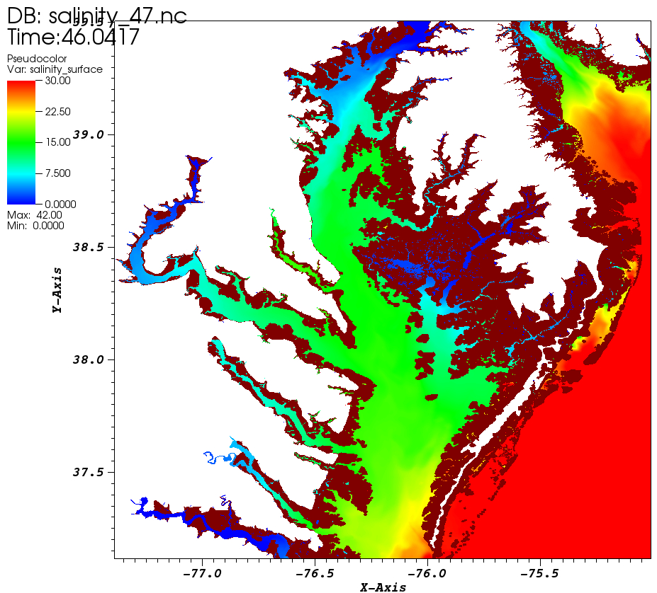

## Freshwater injection stuck near injection place
  This can happen with the combined use of (1) point source/sink (`if_source`=1); (2) LSC2 with 1-2 layers near 
injection places; (3) baroclinic model. The main symptom is that the freshwater seemingly gets stuck near the 
 injection points and does not flow out as expected.
 
 The reason is that insufficient number of vertical layers cannot properly set up an exchange flow (that 
requires stratification), and as a result, the fresh/salt water interface oscillates instead of tilting as expects.
Some work-arounds are:

1. Change to open boundary condition approach
2. Better salinity initial condition. If the salt intrusion should never reach the injection place, create
   a freswater zone near the injection in the I.C.
3. Use more vertical layers near injection (one way to do this is to deepen the local depths to allow more layers)
4. Nudge (inu_SAL=1 or 2) strongly in a region near injection

## Numerical dispersion with WENO

  The 3rd-order WENO scheme has numerical dispersion that needs to be controlled, usually by adjusting `epsilon[12]` 
 in `param.nml`. This approach usually works well. Under some circumstances, e.g. watershed in the compound flooding cases, this
 adjustment is not enough, especially if hybrization with ELM transport is used (`ielm_transport=1`). This is 
 because ELM tracer results may introduce 'shocks' to the local WENO stencil, which in turn generate disperision. 
In those cases, the users need to adjust `tvd.prop` to make some areas upwind as well to ensure monotonicity, because
 upwind scheme is able to handle chocks well.

Figure [1](#figure_weno1) shows the result of disperion symptom from WENO, in the form of high salinity in some upriver
 regions of Chesapeake Bay. Higher-order WENO, 1st-order upwind and ELM solvers are applied in adjacent
 elements in close proximity in those upriver regions
 (note that `h_tvd`=5m in this case). Making those upriver elements upwind via `tvd.prop` resolves this issue; cf. Fig. [2](#figure_weno2).

 <figure markdown id='figure_weno1'>
 
<figcaption>Numerical dispersion in WENO led to high surface salinity in Chesapeake Bay (circled area).</figcaption>
</figure>

 <figure markdown id='figure_weno2'>

<figcaption>Making upstream rivers upwind resolved the high surface salinity issue in Chesapeake Bay.</figcaption>
</figure>

