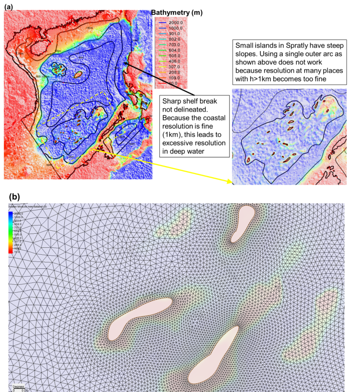
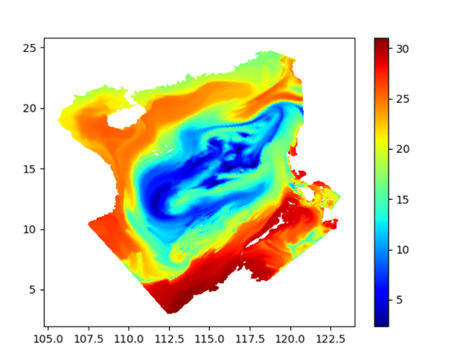
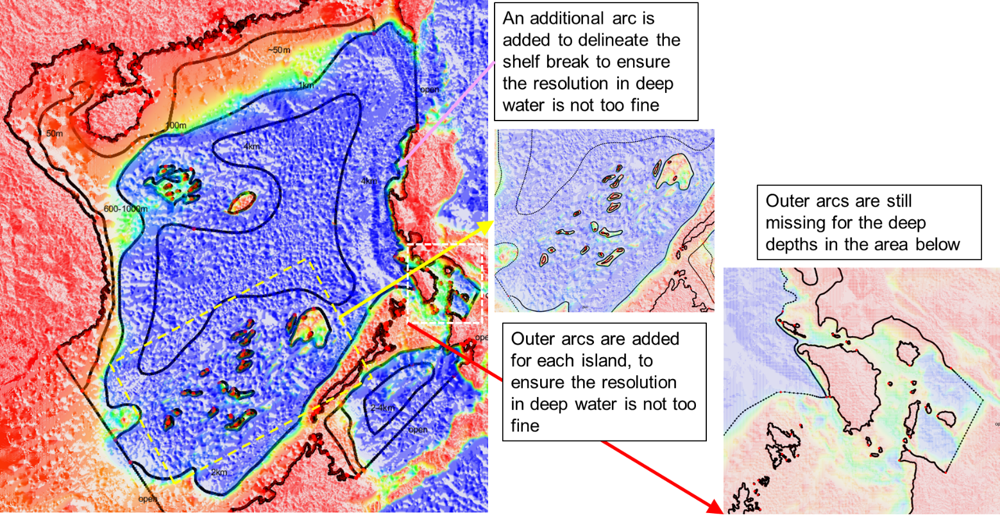
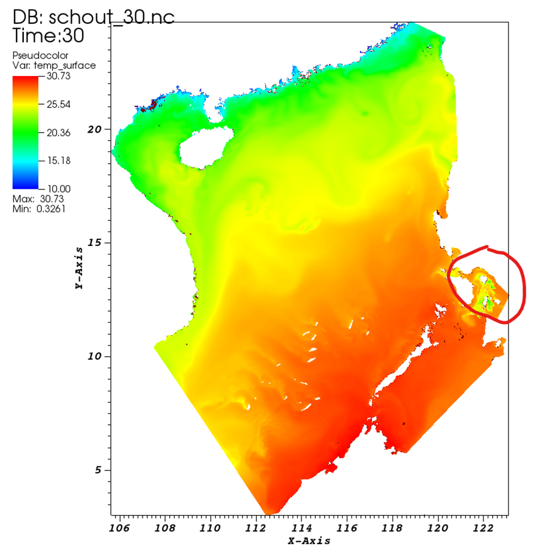
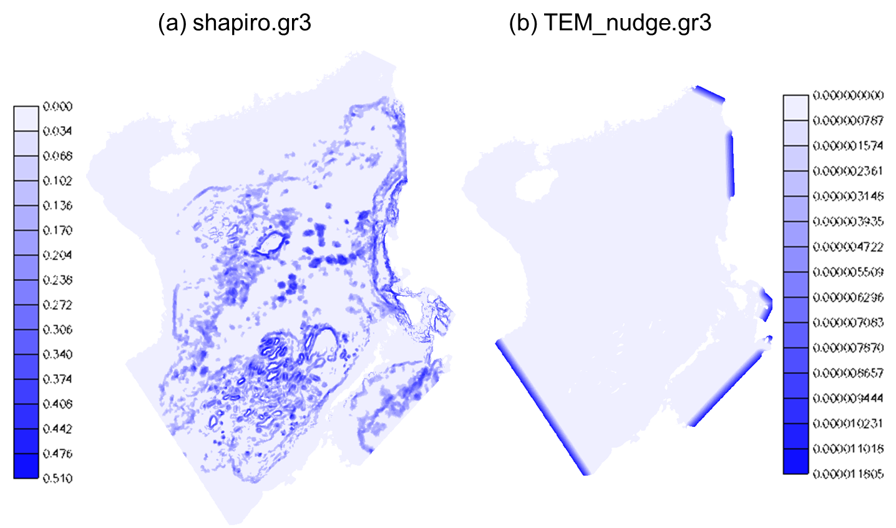
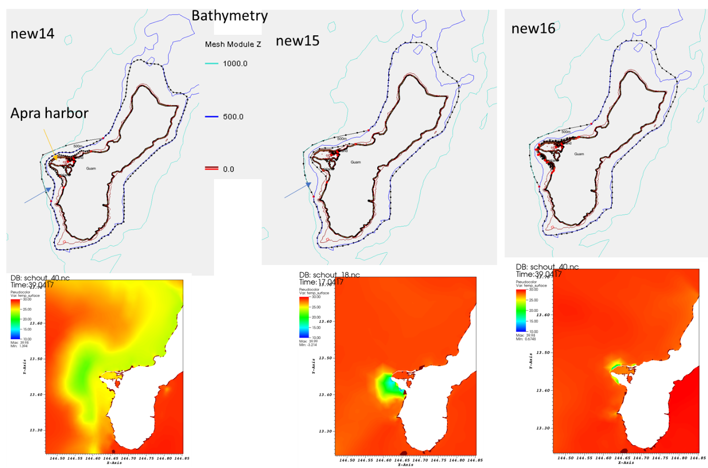
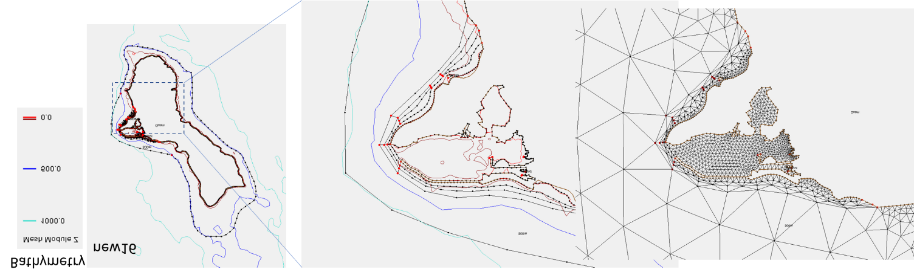

Mesh generation is most challenging in applications that include eddying (open deep ocean), non-eddying, 
 and the transitional regimes between the previous two regimes. The challenge here is mostly related to
   the different physics requirements rather than numerics between eddying and non-eddying regimes. Danilov & Wang (2015)
  demonstrated that the mesh in the eddying regime should vary smoothly to not distort eddying processes. This
 is understandable also because the bathymetric variations in the deep ocean do not play as an important role
 as in non-eddying regime, so there is no compelling reason to drastically vary mesh resolution there. 

One common mistake users make is to over-refine in eddying and transitional regimes. This actually 
violate the hydrostatic assumption (the horizontal scale >> vertical scale). For example, 
 setting mesh resolution at 500m at 500m depth would likely lead to spurious 'upwelling' (Figure [2](#figure02)). 

To get a good SCHISM baroclinic setup for this type of applications, one needs to pay attention to 

1. Horizontal mesh
2. Vertical grid: use $\text{LSC}^2$, and at least resolve the surface layer
3. Parameterization: especially important are parameters that control momentum dissipation (`indvel`, `ihorcon`, `ishapiro`, `dt`)

The example of South China Sea (SCS) shown below illustrates this type of mistakes made by users (Figure [1](#figure01)). A particularly severe challenge is a transitional regime (between eddying and non-eddying regimes) with steep slopes that tend to excite parasitic noises (if the mesh resolution is too fine), and a common symptom for this manifests itself as spurious upwelling of cold water (Figure [2](#figure02)).

<figure markdown id='figure01'>
{width=800}
<figcaption>(a) ‘Wrong’ map for SCS, showing multiple issues with grid design. Steep slopes are prevalent in this region, near small islands and continental shelf breaks. (b) grid near Spratly, showing excessively high resolution in deep water (0.01 degree ~ 1 km).</figcaption>
</figure>

<figure markdown id='figure02'>
{width=600}
<figcaption>Surface temperature (SST) resulted from the grid generated from Figure 1, showing the excessive spurious upwelling of cold water.</figcaption>
</figure>

For meshgen, always start with modest and quasi-uniform resolution for eddying regime. In SMS,
 this can be achieved with fewer constraints in the form of arcs. High resolution (<=2km) in deep water (h>=1km) should be avoided (Figure [1](#figure01)). At steep slopes, this means that an ‘outer arc’ (in SMS map) may be needed. With the corrected mesh, the noise is greatly reduced: the remaining noise in southern Philippines can be rectified by adding outer arcs there (Figure [4](#figure04)).

<figure markdown id='figure03'>
{width=800}
<figcaption>A corrected SMS map file. Outer arcs are added near shelf break of west coast of Luzon and Spratly Islands, but are missing in the southern Philippines.</figcaption>
</figure>

<figure markdown id='figure04'>
{width=600}
<figcaption>SST calculated from the corrected grid. The remaining ‘upwelling’ in the circled area is due to the missing outer arcs in that area (cf. Figure 3).</figcaption>
</figure>

**Parameters** `dt=100s` (slightly larger values like 120 s should also work), `indvel=0`, `ihorcon=2`, `ishapiro= -1`. `shapiro.gr3` is then generated using `gen_slope_filter2.f90` by using larger filter strengths near steep slopes (and small elsewhere). Figure [5a](#figure05) shows the resultant input. In general, the momentum needs to be stabilized with larger viscosity near steep slopes, as bi-harmonic viscosity alone is not sufficient there. Other pre-processing is same as before: the I.C. and B.C. can be derived from HYCOM and FES 2014 (i.e. use type ‘5’ for both elevation and velocity B.C.). In addition, tracers are relaxed to HYCOM values near open boundaries (Figure [5b](#figure05)). Required pro-processing scripts can be found in `Utility/`.

Starting from v5.9, users can also try the new Smagorinsky–like filter option (`ishapiro=2`) with a proper `shapiro0`.

<figure markdown id='figure05'>
{width=600}
<figcaption>(a) Filter strength input (shapiro.gr3). Larger values are used near steep slopes. (b) Nudging strength input (TEM_nudge.gr3, SAL_nudge.gr3), generated from gen_slope_filter2.f90, with maximum time scale of 1 day.</figcaption>
</figure>

The meshing challenge is particularly acute when one deals with islands sitting on top of steep slopes. Figure [6](#figure06) shows 3 attempts to add high resolution near Guam in the Pacific basin mesh. The mesh resolution in the surrounding deep ocean is about 5km, and we need to refine the mesh to about 30m around Guam. The Apra Harbor jetty that requires higher resolution happens to be located close to a steep slope. Combination of wet/dry and forced sharp transition in ‘new14’ and ‘new15’ led to spread of upwelled water there. Removing an inner arc in ‘new15’ helped smoother transition from the outer arc to the inner arc and thus alleviated the upwelling issue. In ‘new16’, we made more ‘room’ for transition by moving the inner arc away from the outer arc and coarsening it a little (to match the resolution of the outer arc), thus further reducing the upwelling. However, we had to add more internal arcs to provide adequate resolution nearshore (otherwise the nearshore area would be represented by a few skew elements that have side lengths of a few km’s on the outside and 30m on the inside). Figure [7](#figure07) shows the details of ‘new16’ and final mesh. Note that in all three maps, we used 500m isobaths for the outer arc (as representation of start of eddying regime) but the arc veered to 1km isobaths near the harbor as a way to make more room for transition there.

<figure markdown id='figure06'>
{width=800}
<figcaption>Three SMS maps (top) and corresponding results for SST.</figcaption>
</figure>

<figure markdown id='figure07'>
{width=800}
<figcaption>Details for map ‘new16’ and the final mesh around Apra Harbor. Skew elements nearshore are fine.</figcaption>
</figure>

!!!note "Sub-mesoscale"
If sub-mesoscale processes are of interest, one may need to reduce time step below 100 sec or apply some special parameterization such as `niter_shap` etc.

##References
Danilov, Sergey & Wang, Qiang. (2015). Resolving eddies by local mesh refinement. Ocean Modelling. 93. 10.1016/j.ocemod.2015.07.006. 
