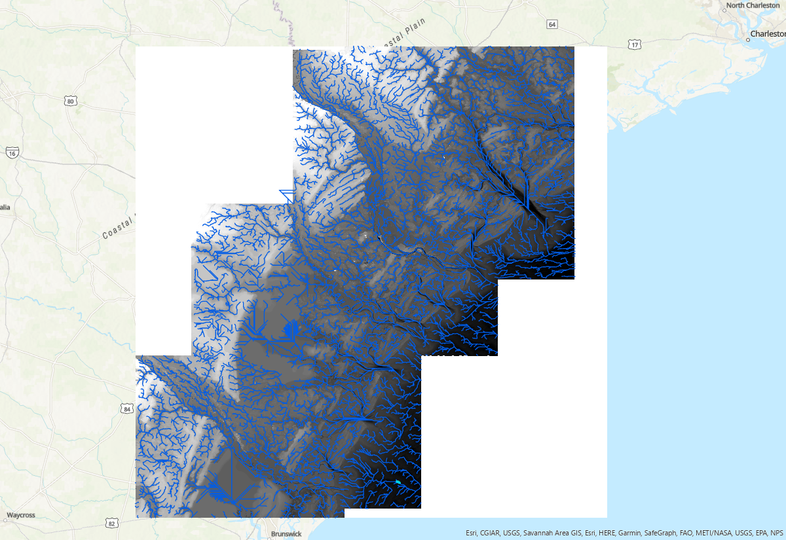
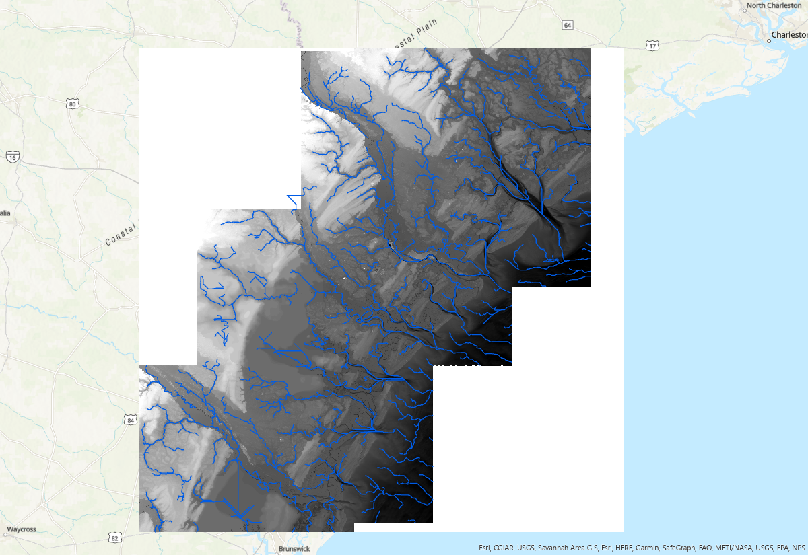
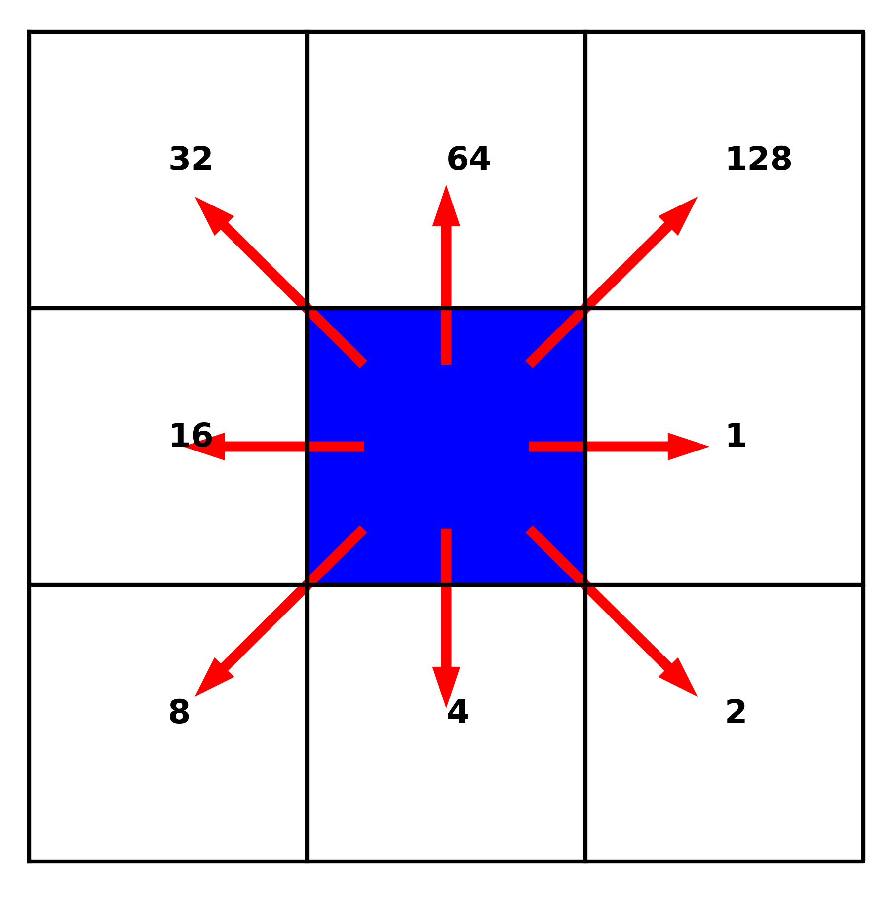

## Background
Extracting channel networks from grid digital elevation models (DEMs) follows these precedures: (1) fill depressions/sinks in the original DEM; (2) calcuate flow direction and flow accumulation based on eight-direciton method (D8); (3) determine the flow accumulation threshold to derive a digital stream network.

Flow accumulation threshold is a parameter that identifies grids with flow accumulation greater than the threshold as a stream network. It varies with DEM resolution, raster size and geomorphic complexity. The optimal threshold is a trial and error based on user's goal. The smaller threhold will generate denser network. Below are river network extracted with three different threshold: 1e5, 1e6, and 1e7, respectively:  





## Scripts
[pyDEM](https://github.com/schism-dev/RiverMeshTools/tree/main/pyDEM) 
can be downloaded from the [RiverMeshTools repository](https://github.com/schism-dev/rivermeshtools).

### Dependencies
numpy  
GDAL  
geopandas  
shapely  
[richdem](#barnes2016)  

## Workflow

1. Pre-processing DEM (optional)  
1.1 Split large files   
Sometimes, it is necessary to split large tif files into smaller ones to avoid memory issues. Script split2tiles.py serves for this purpose:  
```python
import os, sys
from osgeo import gdal

dset = gdal.Open(sys.argv[1])

width = dset.RasterXSize
height = dset.RasterYSize

tilesize = 8100

for i in range(0, width, tilesize):
    for j in range(0, height, tilesize):
        w = min(i+tilesize, width) - i
        h = min(j+tilesize, height) - j
        gdaltranString = "gdal_translate -ot Float32 -of GTIFF -srcwin "+str(i)+", "+str(j)+", "+str(w)+", " \
            +str(h)+" " + sys.argv[1] + " " + sys.argv[2] + "_"+str(i)+"_"+str(j)+".tif"
        os.system(gdaltranString)
```
Run the script with this command:
```code
python split2tiles.py japan_dem_with_ocean.tif tiles/japan_tile
```  
Create tileindex shapefile, which will be used in the next step:
```code
gdaltindex tileindex_japan_dem.shp tiles/*.tif
```  
1.2 Merge tiles  
This process is needed when Each tile and its 8-connected rasters are mereged into one raster file, which will be used in the next step. 
```python
import subprocess
import multiprocessing as mp

import numpy as np
import geopandas as gpd
from osgeo import gdal

def merge_tiles(itile, df, maps, locations):
    dx = [-8100, 0,     8100,  -8100,  0, 8100, -8100, 0,    8100]
    dy = [-8100, -8100, -8100, 0,      0, 0,    8100,  8100, 8100]

    ullon, ullat = int(df.location.split('_')[2]), int(df.location.split('_')[3].split('.')[0])

    tiles = []
    for j in np.arange(9):
        try:
            ilon = ullon + dx[j]
            ilat = ullat + dy[j]

            key2 = f'{ilon}_{ilat}'
            tile_idx = tilemaps[key2]
            tiles.append(locations[tile_idx])
        except:
            print(f'No tile')

    cmd = f'gdal_merge.py -n -9999 -o Merged/JAPAN_merged_{str(itile).zfill(3)}.tif'
    subprocess.call(cmd.split()+tiles)

if __name__ == '__main__':

    gdf = gpd.read_file('tileindex_japan_dem.shp')
    tilemaps = dict()
    for i, p in enumerate(gdf['location']):
        x = gdf.iloc[i].location.split('_')[2]
        y = gdf.iloc[i].location.split('_')[3].split('.')[0]
        key = f'{x}_{y}'
        tilemaps[key] = i

    npool = 15
    pool = mp.Pool(npool)
    pool.starmap(merge_tiles, [(i, gdf.iloc[i], tilemaps, gdf['location']) for i in np.arange(len(gdf))])
    pool.close()
    del pool
```  

2. Extract channel networks  

  Extracting channel networks consists of three steps:  

  * Fill or breach depressions  

    Algorithm "Priority-Flood + $\epsilon$" ([Barnes et al., 2014](#barnes2014a)) is used to fill depressions. 

* Calculate flow directions based on the given flow coordinate system. In pyDEM, flow directions use a D8 flow coordinate system that appears as follow: 

<figure>

<figcaption>D8 flow coordinate system consisted of 9 raster cells. The numbers are local indices that correpond to each neighbor of the center cell.
</figcaption>
</figure>


* Calculate flow accumulation  

    Flow accumulation is the total number of cells passing through each (raster) cell. With flow accumulations, we can apply a presccribed 
threshold to determine which cells should be included in the final digital stream network. 

  The details of the algorithm can be found in [Ye et al. (2023)](#ye2023).

## Sample applications 

Two example applications can be found under subdirectories from [pyDEM_Samples.tar](https://ccrm.vims.edu/yinglong/feiye/Public/pyDEM_Samples.tar).
The subdirectory "Serial" contains a Python script `run_serial.py` and an input file `tiff/Savannah_river.tif`. This can be used for a small domain. 
The script reads: 

```python
import glob
import time
from pylib import *
from pyDEM.dem import *
import numpy as np

np.seterr(all='raise')

if __name__ == '__main__':
    #input tiff files
    files = glob.glob('tiff/Savannah_river.tif')
    files.sort()

    acc_limit = 1e7
    t0 = time.time()

    for fname in files:
        names = [fname]

        #output filename
        sname = f"./{fname.split('.')[0].split('/')[-1]}_{acc_limit}"
        print(sname)

        #declare a dem object
        S=dem()

        #read data
        if not os.path.exists('{}.npz'.format(sname)):
            S.proc_demfile(names,sname=sname,depth_limit=[-100,1000],subdomain_size=2e10)
        S.read_data('{}.npz'.format(sname))

        #compuate watershed information
        S.compute_watershed()

        #extract river network (area_limit: catchment area)
        S.compute_river(acc_limit=acc_limit)

        #write shapefile for river network
        gdf = S.write_shapefile(npt_smooth=None)
        gdf.to_file(f'{sname}.shp')
        print(f'It took {(time.time() - t0)/60} mins!')

```
For a large domain, a parallel dirver is preferred to speed up the process. A sample script is under Parallel/, named `run_mpi_vortex.py`, 
which can run with multiple nodes/cpus with `mpi4py`.


**References**

<span id="barnes2014a">C. Barnes, R., Lehman, C., Mulla (2014). Priority-flood: An optimal depression-filling and watershed-labeling algorithm for digital elevation models. Computers & Geosciences 62, 117–127. doi:10.1016/j.cageo.2013.04.024.</span>

<span id="barnes2016">Barnes, Richard. 2016. RichDEM: Terrain Analysis Software. http://github.com/r-barnes/richdem. </span>

<span id="ye2023"> Ye, F., Cui, L., Zhang, Y., Wang, Z., Moghimi, S., Myers, E., Seroka, G., Zundel, A., Mani, S., Kelley, J.G.W. 
A parallel Python-based tool for meshing watershed rivers at continental scale, Environmental Modelling & Software, 166. https://doi.org/10.1016/j.envsoft.2023.105731.</span>
