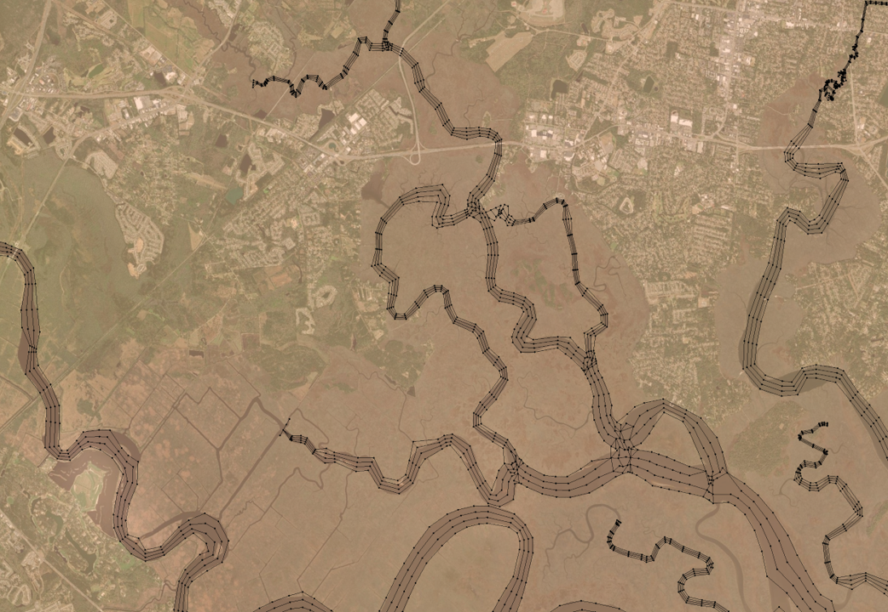
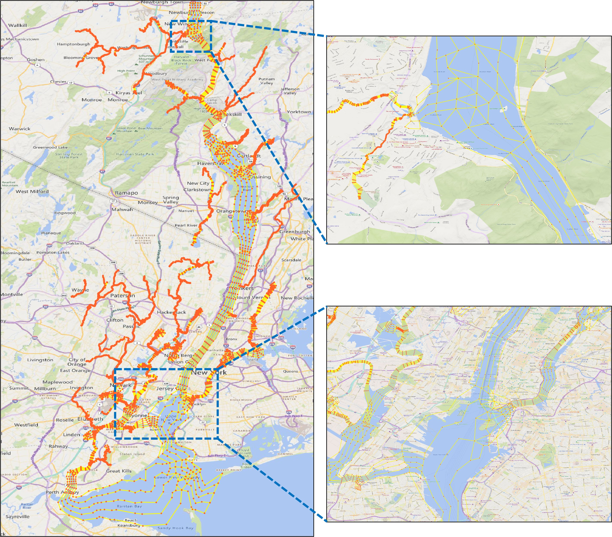
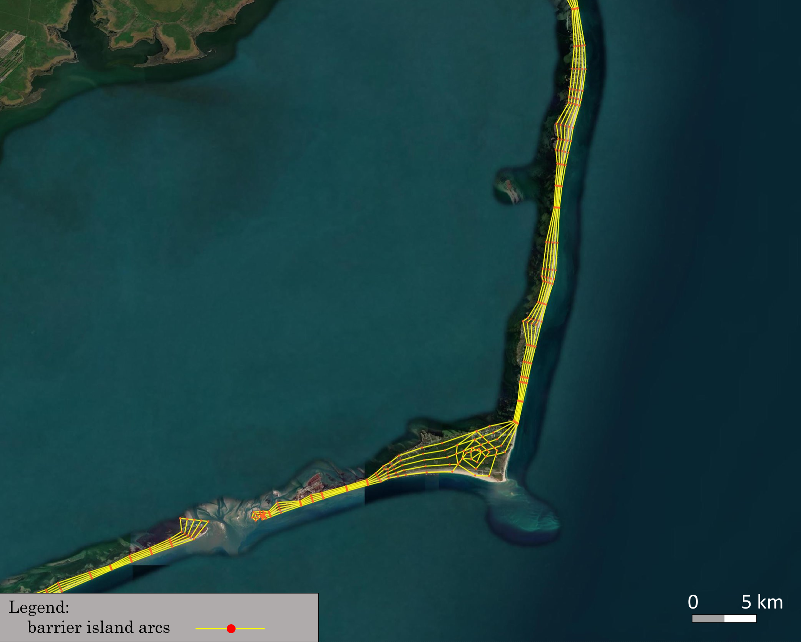
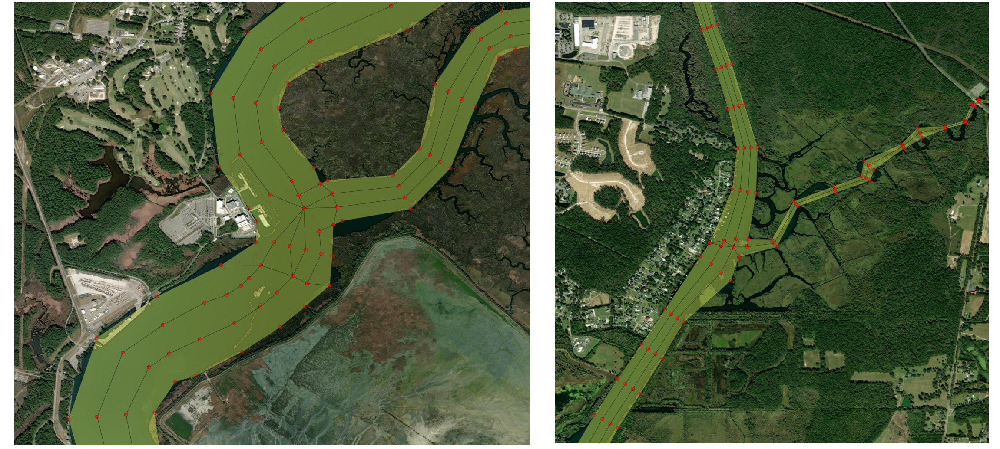

## Scripts
[RiverMapper](https://github.com/schism-dev/RiverMeshTools/tree/main/RiverMapper) is available in the [RiverMeshTools repository](https://github.com/schism-dev/RiverMeshTools) maintained by schism-dev.

## Usage
RiverMapper requires two inputs:

1. \*.tif files — DEM tiles in lon/lat coordinates, from one or more sources.

2. A shapefile of 'LineString' type, representing a 1D river network.

!!!Note
    The 1D river network can be any reasonable approximation of the thalwegs. It may be:
    <ul>
        <li>Extracted from DEMs using the method described in the [previous section](./extract-thalweg.md)</li>
        <li>Copied from the river network of a hydrological model, such as the National Water Model</li>
        <li>Manually drawn for [quick local touch-ups]()</li>
    </ul>

The outputs include:

- `total_river_arcs.map` — river arcs used for final meshing in SMS.

- Additional \*.map files for diagnostic purposes.

A sample output looks like this:




## Sample applications
To test the RiverMapper tool, begin by extracting the "RiverMapper_Samples/" directory from [RiverMapper_Samples.tar](http://ccrm.vims.edu/yinglong/feiye/Public/RiverMapper_Samples.tar).

Inside, you’ll find two subdirectories: "Serial" and "Parallel", which demonstrate sample applications for meshing watershed rivers in small and large domains, respectively.  
Each subdirectory contains a sample Python script along with the required input files.

These two samples use default settings tailored for small watershed rivers typically narrower than a few hundred meters.  
Similar configurations are employed in the latest version of NOAA's operational forecast system, [STOFS3D Atlantic](https://nauticalcharts.noaa.gov/updates/introducing-the-inland-coastal-flooding-operational-guidance-system-icogs/).

If you're interested in meshing rivers with a broader range of widths, see additional parameterized examples [below](#more-parameterization).


### Meshing watershed rivers in a small domain (Serial mode)
For a small domain (covering one or two states), a direct function call to the serial "make_river_map" suffices.
See the sample script:
```
RiverMapper_Samples/Serial/sample_serial.py
```
, which reads:
```python
from RiverMapper.make_river_map import make_river_map


if __name__ == "__main__":
    '''
    A sample serial application of RiverMapper
    '''
    make_river_map(
        tif_fnames = ['./Inputs/DEMs/GA_dem_merged_ll.tif'],
        thalweg_shp_fname = './Inputs/Shapefiles/GA_local.shp',
        output_dir = './Outputs/',
    )
```

Under the  directory "RiverMapper_Samples/Serial/", execute the serial script like this:
```
./sample_serial.py
```

!!!Note
    * Although only one DEM tile is used in this example, but multiple DEM tiles are allowed.
    * If the tiles are from different DEM sources, they should be arranged from high to low priority in the list.
        Tiles from the high priority DEM source should have high fidelity and high resolution.
    * The script allows DEM tiles of different sizes and shapes.


### Meshing rivers in a large domain (Parallel mode)
For a large domain such as [STOFS3D Atlantic](https://nauticalcharts.noaa.gov/updates/introducing-the-inland-coastal-flooding-operational-guidance-system-icogs/),
a parallel driver is provided to automatically group thalwegs based on their parent tiles, then distribute the groups to parallel processors.

The sample parallel script is:
```
RiverMapper_Samples/Parallel/sample_parallel.py
```
, which reads:
```python
from mpi4py import MPI
import os
from RiverMapper.river_map_mpi_driver import river_map_mpi_driver

if __name__ == "__main__":
    comm=MPI.COMM_WORLD
    # ------------------------- sample input ---------------------------
    dems_json_file = './Inputs/DEMs/dems.json'  # specifying files for all DEM tiles
    thalweg_shp_fname='./Inputs/Shapefiles/LA_local.shp'
    output_dir = './Outputs/' +  f'{os.path.basename(thalweg_shp_fname).split(".")[0]}_{comm.Get_size()}-core/'
    # ------------------------- end input section ---------------------------
    river_map_mpi_driver(
        dems_json_file=dems_json_file,
        thalweg_shp_fname=thalweg_shp_fname,
        output_dir=output_dir,
        comm=comm
    )
```

In stead of specifying a file list for the DEM tiles as in the serial example,
the first argument takes a \*.json file that specifies multiple sets of DEMs, for example:
```json
{
    "CuDEM": {
        "name": "CuDEM",
        "glob_pattern": "./Inputs/DEMs/CuDEM/*.tif",
        "file_list": [],
        "boxes": []
    },
    "CRM": {
        "name": "CRM",
        "glob_pattern": "./Inputs/DEMs/CRM/*.tif",
        "file_list": [],
        "boxes": []
    }
}
```


!!!Note
    * For each DEM source, specify a glob pattern and/or a list of file names;
    if both are specified, the script will pool all files together and take the unique files.

    * No need to manually specify the bounding "boxes", just leave them empty.

    * Different DEM products should be arranged from high priority to low priority.
    The order of the dictionary key ("CuDEM" and "CRM") is preserved as long as you are using Python 3.7 or a later version.
    We may replace the regular dictionary to OrderedDict if there is a need.

Under the directory "RiverMapper_Samples/Parallel/", execute the parallel script like this:

```
mpirun -n 20 ./sample_parallel.py
```

The exact mpi command may vary based on your system.


## Advanced Parameterization

### Mandatory input parameters

In the "Serial" and "Parallel" examples above, you may have noticed there are 3 mandatory Inputs:

| parameter | explanation |
| ----------- | ----------- |
| tif_fnames (or a \*.json file if there are many tiles) | a list of TIF file names. These TIFs should cover the area of interest and be arranged by priority (higher priority ones in front) |
| thalweg_shp_fname | name of a polyline shapefile containing the thalwegs |
| output_dir | must specify one. |

### Optional input parameters

In addition to the mandatory inpouts, RiverMapper provides a few parameters to fine tune the output polylines or generate special features like levees or pseudo-channels.

| parameter | type | explanation |
| ----------- | ----------- | ----------- |
| selected_thalweg | integer numpy array | Indices of a subset of thalwegs for which the river arcs will be sought; mainly used by the parallel driver |
| output_prefix | string | a prefix of the output files, mainly used by the caller of this script; can be empty |
| mpi_print_prefix | string | a prefix string to identify the calling mpi processe in the output messages; can be empty |
| river_threshold | float | minimum and maximum river widths (in meters) to be resolved |
| min_arcs | integer | minimum number of arcs to resolve a channel (including bank arcs, inner arcs and outer arcs) |
| width2narcs_option | string or callable | pre-defined options ('regular', 'sensitive', 'insensitve') or  'custom' if a user-defined function is specified |
| custom_width2narcs | a user-defined function | a function that takes one parameter 'width' and returns 'narcs', i.e., the number of arcs in the cross-channel direction |
| elev_scale | float | scaling factor for elevations; a number of -1 (invert elevations) is useful for finding ridges (e.g., of a barrier island) |
| outer_arc_positions | a tuple of floats | relative position of outer arcs, e.g., (0.1, 0.2) will add 2 outer arcs on each side of the river (4 in total), 0.1 \* riverwidth and 0.2 \* riverwidth from the banks. |
| R_coef | float | coef controlling the along-channel resolutions at river bends (with a radius of R), a larger number leads to coarser resolutions (R*R_coef) |
| length_width_ratio | float |  the ratio between along-channel resolution and cross-channel resolution |
| along_channel_reso_thres | a tuple of 2 floats | the minimum and maximum along-channel resolution (in meters) |
| snap_point_reso_ratio | float | scaling the threshold of the point snapping; a negtive number means absolute distance value |
| snap_arc_reso_ratio | float | scaling the threshold of the arc snapping; a negtive number means absolute distance value |
| n_clean_iter | int | number of iterations for cleaning; more iterations produce cleaner intersections and better channel connectivity |
| i_close_poly | bool | whether to add cross-channel arcs to enclose river arcs into a polygon |
| i_smooth_banks | bool | whether to smooth the river banks at abrupt changes of the curvature |
| i_DEM_cache  | bool | Whether or not to read DEM info from cache.  Reading from original \*.tif files can be slow, so the default option is True |
| i_OCSMesh | bool | Whether or not to generate polygon-based outputs to be used as inputs to OCSMesh |
| i_DiagnosticsOutput | bool | whether to output diagnostic information |
| i_pseudo_channel | int | 0:  default, no pseudo channel, nrow_pseudo_channel and pseudo_channel_width are ignored; 1: fixed-width channel with nrow elements in the cross-channel direction, it can also be used to generate a fixed-width levee for a given levee centerline; 2: implement a pseudo channel when the river is poorly defined in DEM
| pseudo_channel_width | float | width of the pseudo channel (in meters) |
| nrow_pseudo_channel |int| number of rows of elements in the cross-channel direction in the pseudo channel |

You can change the values of these parameters so that the output river map better fits your application (otherwise default values are used).
For example, if you want to add two pairs of outer arcs that flank the main river channel, you can do:
```python
    make_river_map(
        tif_fnames = ['./Inputs/DEMs/GA_dem_merged_ll.tif'],
        thalweg_shp_fname = './Inputs/Shapefiles/GA_local.shp',
        output_dir = './Outputs/',
        outer_arc_positions = (0.1, 0.2),
    )
```
, where the last argument specifies the relative distances of the outer arcs to the main channel.
In this case two outer arcs will be placed to the left of the channel at distances of "$0.1 \times$ channel width" and "$0.2 \times$ channel width" from the left bank;
the same goes for the right bank, so 4 outer arcs in total.

## Parameter presets
Tuning the parameters may not be easy at first because there are many of them.
To simplify the parameter configuration, RiverMapper offers a class called "ConfigRiverMap",
which provides commonly used parameter presets.
These presets are "class methods" in [config_river_map.py](https://github.com/schism-dev/RiverMeshTools/blob/main/RiverMapper/RiverMapper/config_river_map.py),
and each preset (class method, or factory method) comes with a short description in the code.

For example, the preset "LooselyFollowRivers" means that "Small-scale river curvatures may not be exactly followed, but channel connectivity is still preserved",
and this is the sample code:
```python
    from RiverMapper.config_river_map import ConfigRiverMap

    river_map_config = ConfigRiverMap.LooselyFollowRivers()
    make_river_map(
        tif_fnames = ['./Inputs/DEMs/GA_dem_merged_ll.tif'],
        thalweg_shp_fname = './Inputs/Shapefiles/GA_local.shp',
        output_dir = './Outputs/',
        **river_map_config.optional,
    )

```
and the operator "\*\*" unpacks the optional parameters from the configuration.


Another utility of the "ConfigRiverMap" class is to facilitate the parameter transfer from the parallel driver to the core routine.
The stardard way of setting the parameters in the parallel mode is as follows:

```python
from mpi4py import MPI
import os
from RiverMapper.river_map_mpi_driver import river_map_mpi_driver
from RiverMapper.config_river_map import ConfigRiverMap

if __name__ == "__main__":
    comm=MPI.COMM_WORLD
# ------------------------- sample input ---------------------------
    dems_json_file = '/sciclone/schism10/Hgrid_projects/STOFS3D-V6/v16/Inputs/dems.json'  # specifying files for all DEM tiles
    thalweg_shp_fname='/sciclone/schism10/Hgrid_projects/STOFS3D-V6/v16/Shapefiles/CUDEM_Merged_for_v16.shp'
    output_dir = './Outputs/' +  f'{os.path.basename(thalweg_shp_fname).split(".")[0]}_{comm.Get_size()}-core/'
    river_map_config = ConfigRiverMap()
# ------------------------- end input section ---------------------------
    river_map_mpi_driver(
        dems_json_file=dems_json_file,
        thalweg_shp_fname=thalweg_shp_fname,
        output_dir=output_dir,
        river_map_config=river_map_config,
        comm=comm
    )
```

Comparing with the parallel [example](#parallel-mode) in the previous section, the above example adds a few lines of code that does the following:

* importing the "ConfigRiverMap" class
* creating a default configuration "river_map_config",
* passing the configration to the parallel driver.

Since the default configuration is used, this example is essentially the same as the previous parallel example.
But it facilitates further parameter tweaking, e.g.:
```python
    river_map_config = ConfigRiverMap.LooselyFollowRivers()
    river_map_config.optional['outer_arc_positions'] = (0.1, 0.2)
    river_map_config.optional['i_real_clean'] = True
```
, without changing other parts of the code.


## More parameterization
By tweaking the parameters, RiverMapper can also aid in the meshing of a wider range of river sizes or other channel-like features.

### Hudson River and tributaries
This example shows how to customize cross-channel divisions for a main channel that is a few kilometers wide and
smaller tributaries.

```python
from mpi4py import MPI
import os
from RiverMapper.river_map_mpi_driver import river_map_mpi_driver
from RiverMapper.config_river_map import ConfigRiverMap

if __name__ == "__main__":
    comm=MPI.COMM_WORLD
    # ------------------------- sample input ---------------------------
    dems_json_file = '/sciclone/schism10/Hgrid_projects/Shared_with_KM/Inputs/dems.json'  # specifying files for all DEM tiles
    thalweg_shp_fname='/sciclone/schism10/Hgrid_projects/Shared_with_KM/Inputs/Thalwegs/thalweg_v16_subset_Hudson2.shp'
    output_dir = './Outputs/' +  f'{os.path.basename(thalweg_shp_fname).split(".")[0]}_{comm.Get_size()}-core/'

    river_map_config = ConfigRiverMap()  # initialize a default configuration
    river_map_config.optional['river_threshold'] = (2, 5000)  # change the search range of river banks to accomodate for Hudson River
    river_map_config.optional['along_channel_reso_thres'] = (5, 1200)  # change the maximum element length from 300 (default for small rivers) to 1200
    river_map_config.optional['length_width_ratio'] = 4.0  # set element aspect ratio as needed

    # Customize a width-to-narcs function and pass it to the configuration.
    def width2narcs(width):  # do not change this line even if width is not used
        narcs = 5  # you can specify more sophisticated configurations here as needed
        return narcs  # narcs is the number of rows in the cross-channel direction.
    # pass the customized function to the configuration
    river_map_config.optional['custom_width2narcs'] = width2narcs
    # ------------------------- end input section ---------------------------

    river_map_mpi_driver(
        dems_json_file=dems_json_file,
        thalweg_shp_fname=thalweg_shp_fname,
        output_dir=output_dir,
        river_map_config=river_map_config,
        comm=comm
    )
```

The above code adds more customization to the parallel example.
Please read the comments which explain each piece of customization.
In particular, note how to pass a customized width-to-narcs function to the configuration.
This function takes the width of a river and returns the number of rows in the cross-channel directions.

!!!Note
    The option 'river_threshold' specifies the min and max river width to be resolved, which affects the search range of river banks.
    A large value like 5000 m used here can slow down the execution compared to the default value (600 m, for small watershed rivers).
    In the future, we will allow users to select rivers and specify different values for this option.

Here, a simplest function is used that specifies five rows of arcs regardless of river width,
and the result is shown below:



Of course you can specify  more sophisticated functions depending on your needs, e.g.,

```python
nrow = int(min_arcs + np.ceil(width / 100))  # add one arc for every increase of 100 m
```

or

```python
nrow = int(min_arcs + np.floor(0.35*width**0.25))  # add one arc for every increase of one order of magnitude
```

or even make a master plan (similar to the master grid for SCHISM's [vgrid](https://feiye-vims.github.io/schism-tut/docs/compound-flood/vgrid_3d)) of how many arcs should be used for a given river width.


### Levees
In the STOFS-3D-Atlantic domain, levees are important features to be incorporated in the model mesh.
Instead of parameterizing them as hydraulic structures, the levees are explicitly represented by meter-scale elements,
with two rows of nodes resolving the feet of the levee and another two rows resolving the top of the levee:

 

With the levee centerlines available from National Levee Database,
the levee map can be easily made by invoking the pseudo channel option of RiverMapper:

```python
river_map_config = ConfigRiverMap.Levees()
```

Notice that the along-channel (in this case along-levee) resolution also adapts for bends,
just like for rivers.

### Barrier islands
Barrier islands are long and narrow topographical features similar to river channels.
In fact, the map of a barrier island can be made in the same way as river channels
if the sign of the DEM's elevation values is inverted.

 

This can be done by setting the optional parameter "elev_scale" to "-1",
or directly invoking the preset "BarrierIsland":

```python
river_map_config = ConfigRiverMap.BarrierIsland()
```

!!!Note
    The above two sample applications can also be found in 
    [RiverMapper_Samples.tar](http://ccrm.vims.edu/yinglong/feiye/Public/RiverMapper_Samples.tar)

## Experimental Features
### Global arc cleaning
The experimental option "i_real_clean" has been removed from the parameter list,
because it has superseded all other options for river confluence cleaning.
It is the only cleaning option in the latest code and enabled by default.

The idea is simple: arc vertices that are too close to any vertex or arc segment are snapped to the closest vertices.

A critical step is defining how close is close.
Setting a global threshold value would not work well because a larger value tends to over-simplify small rivers thus not ensuring channel connectivity
and a smaller value causes insufficient cleaning for larger rivers.
As a result, a spatially varying threshold is specified for each vertex based on the cross-channel resolution at that location.
This ensures a sufficent level of cleaning while maintaining channel connectivity.
For example, the resolution around a confluence is largely determined by the smallest branch:
 

For a continental application like STOFS-3D-Atlantic that includes about 30,000 rivers, the cleaning takes about 10 minutes.
Since the algorithm is fairly efficient, several iterations of cleaning are implemented allowing the threshold gradually increasing from a small value to the target value;
in other words, the most close-by vertices are snapped first, which prevents overly aggressive snapping and slightly improve the quality of the end product.

### Outputs for OCSMesh
The "i_OCSMesh" option leads to an extra shapefile output containing river polygons,
which serves as an input to [OCSMesh](https://github.com/noaa-ocs-modeling/OCSMesh).
The option is enabled by default because the polygon-based output may be useful for other mesh generators too.

### Outputting river mesh elements
It may be desirable in some circumstances to directly discretize river polygons into elements (quadrangles and triangles).
However, this is not the intended function of the tool at least by its original design but rather a task for mesh generators.  
In addition, the accuracy and efficiency of SCHISM are not sensitive to how mesh generators decide to form the elements (as quads or triangles), as long as they adhere to the given river arcs or polygons.
We can implement this option if there is a need.

