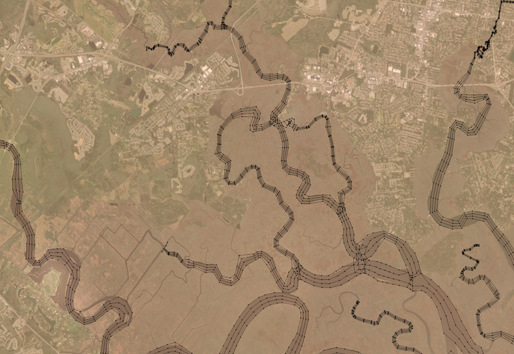
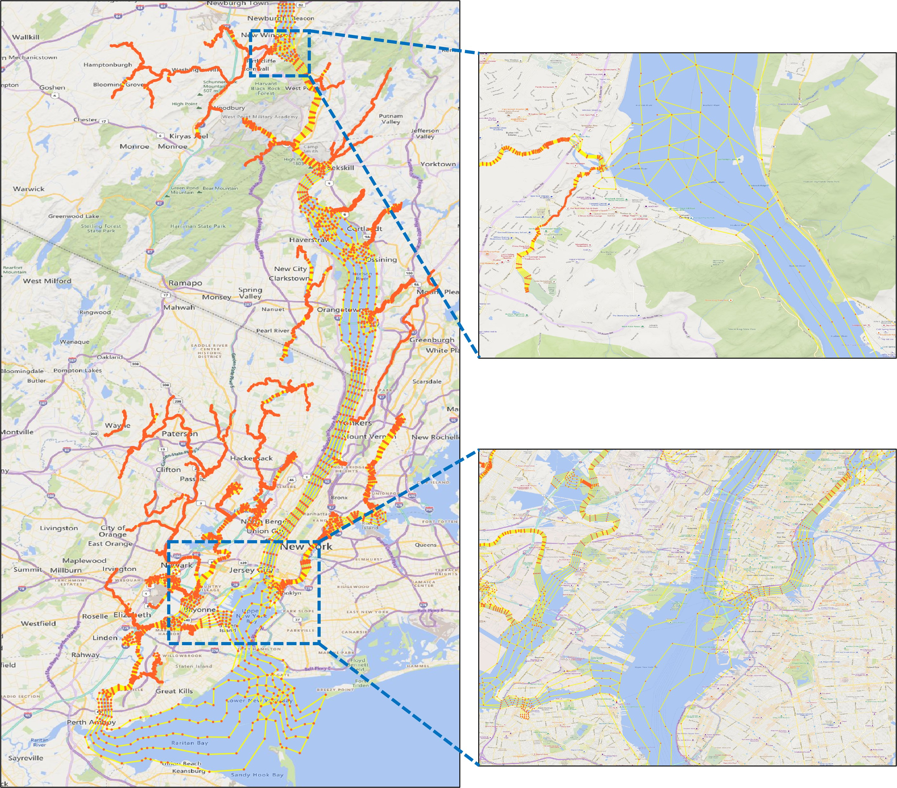
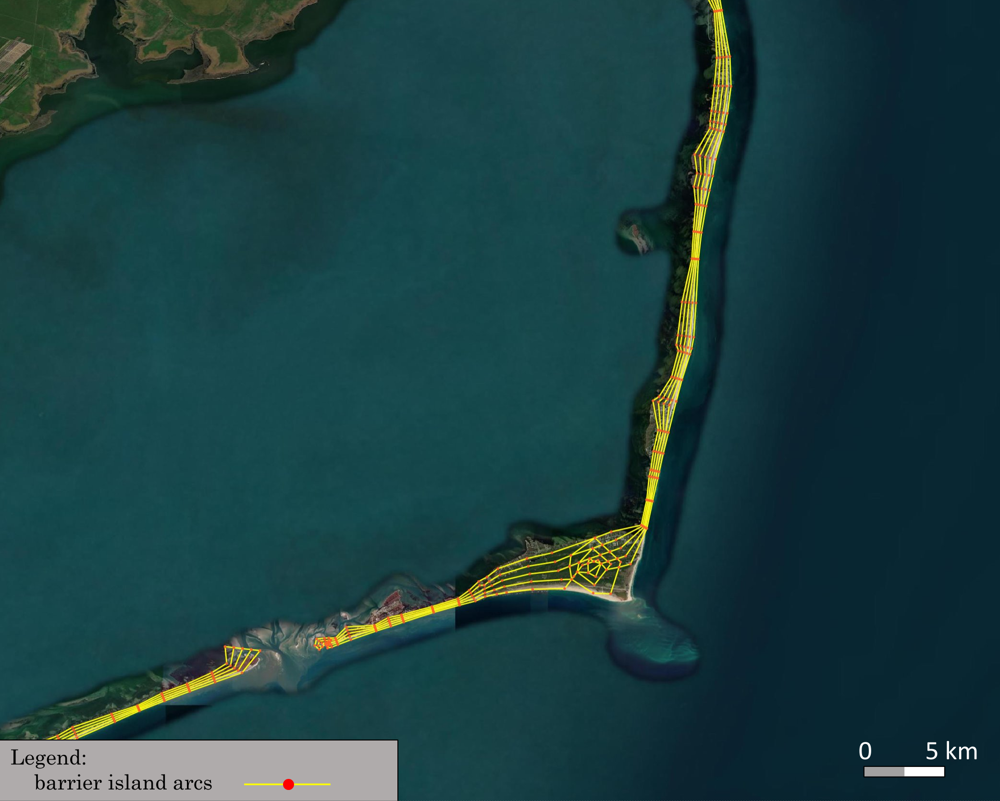
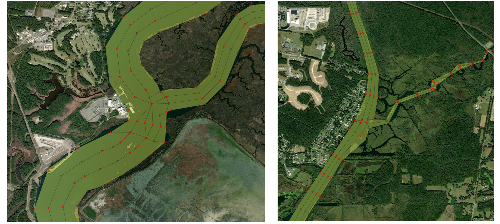

## RiverMapper source

[RiverMapper](https://github.com/schism-dev/RiverMeshTools/tree/main/RiverMapper) is maintained in the [RiverMeshTools repository](https://github.com/schism-dev/RiverMeshTools).

## Inputs and outputs

The core `make_river_map()` function requires three inputs:

1. One or more TIFF files in longitude/latitude coordinates. These are normally elevation DEMs, but they may instead be [rasterized NHD Area polygons](special-case-utilizing-nhd.md).
2. A polyline shapefile representing the thalwegs or channel centerlines.
3. An output directory.

The polyline network only needs to provide a reasonable approximation of the channel centerlines. It may be extracted from DEMs using the [previous workflow](extract-thalweg.md), obtained from a hydrologic dataset such as NHD, or drawn manually for local corrections.

RiverMapper writes `total_arcs.map` and `total_arcs.shp` for use in subsequent meshing. It can also write river polygons for OCSMesh and diagnostic maps or shapefiles when the corresponding options are enabled.



## Sample applications

Download and extract [RiverMapper_Samples.tar](https://ccrm.vims.edu/yinglong/feiye/Public/RiverMapper_Samples.tar). The `Serial` and `Parallel` subdirectories contain drivers and inputs for small and large domains, respectively. Their defaults target watershed rivers up to a few hundred meters wide, similar to those represented in [STOFS3D Atlantic](https://nauticalcharts.noaa.gov/updates/introducing-the-inland-coastal-flooding-operational-guidance-system-icogs/).

For wider channels and specialized features, see [More parameterization](#more-parameterization).

### Small domains: serial mode

For a small domain, such as one or two states, call `make_river_map()` directly. The serial sample is located at:

```text
RiverMapper_Samples/Serial/sample_serial.py
```

Its essential contents are:

```python
from RiverMapper.make_river_map import make_river_map


if __name__ == "__main__":
    make_river_map(
        tif_fnames=["./Inputs/DEMs/GA_dem_merged_ll.tif"],
        thalweg_shp_fname="./Inputs/Shapefiles/GA_local.shp",
        output_dir="./Outputs/",
    )
```

Run it from `RiverMapper_Samples/Serial/`:

```bash
./sample_serial.py
```

Multiple TIFFs may be used, and they may have different extents and shapes. List higher-quality or higher-resolution sources first because RiverMapper treats earlier entries as higher priority.

### Large domains: parallel mode

For a large domain, the MPI driver groups thalwegs by their required raster tiles and distributes the groups among processes. The parallel sample is located at:

```text
RiverMapper_Samples/Parallel/sample_parallel.py
```

A minimal driver is:

```python
import os

from mpi4py import MPI

from RiverMapper.config_river_map import ConfigRiverMap
from RiverMapper.river_map_mpi_driver import river_map_mpi_driver


if __name__ == "__main__":
    comm = MPI.COMM_WORLD
    dems_json_file = "./Inputs/DEMs/dems.json"
    thalweg_shp_fname = "./Inputs/Shapefiles/LA_local.shp"
    output_dir = (
        "./Outputs/"
        f"{os.path.basename(thalweg_shp_fname).split('.')[0]}_{comm.Get_size()}-core/"
    )

    river_map_mpi_driver(
        dems_json_file=dems_json_file,
        thalweg_shp_fname=thalweg_shp_fname,
        output_dir=output_dir,
        river_map_config=ConfigRiverMap(),
        comm=comm,
    )
```

The JSON file groups TIFFs by data source:

```json
{
    "CuDEM": {
        "name": "CuDEM",
        "glob_pattern": "./Inputs/DEMs/CuDEM/*.tif",
        "file_list": [],
        "boxes": []
    },
    "CRM": {
        "name": "CRM",
        "glob_pattern": "./Inputs/DEMs/CRM/*.tif",
        "file_list": [],
        "boxes": []
    }
}
```

For each source, provide a glob pattern, an explicit file list, or both. Leave `boxes` empty; RiverMapper populates it. Sources should be ordered from highest to lowest priority. Python 3.7 and later preserve the order of dictionary keys.

Run the driver from `RiverMapper_Samples/Parallel/`:

```bash
mpirun -n 20 ./sample_parallel.py
```

The exact MPI launcher and arguments depend on the local system.

## Parameters

### Required parameters

| Parameter | Type | Description |
|---|---|---|
| `tif_fnames` | list of paths | Raster tiles covering the area of interest, ordered from highest to lowest priority. Use elevation DEMs normally, or NHD Area surrogate TIFFs with `nhd_area_tif=True`. |
| `thalweg_shp_fname` | path | Polyline shapefile containing thalwegs or channel centerlines. |
| `output_dir` | path | Directory in which RiverMapper writes its products. |

The parallel driver replaces `tif_fnames` with `dems_json_file`, which describes and orders multiple raster sources.

### Optional parameters

The following table matches the current `make_river_map()` signature and defaults in `ConfigRiverMap`.

| Parameter | Type | Default | Description |
|---|---|---|---|
| `i_DEM_cache` | bool | `True` | Read cached raster metadata when available. |
| `selected_thalweg` | NumPy integer array or `None` | `None` | Process only the specified thalweg indices; mainly used by the parallel driver. |
| `river_threshold` | tuple of floats | `(5, 600)` | Minimum and maximum channel widths, in meters, that bank detection attempts to resolve. |
| `min_arcs` | int | `3` | Minimum number of cross-channel arcs, including bank, inner, and outer arcs. |
| `width2narcs_option` | str | `"regular"` | Width-to-arc rule: `"regular"`, `"sensitive"`, `"insensitive"`, or `"custom"`. |
| `custom_width2narcs` | callable or `None` | `None` | Function that accepts channel width and returns the number of cross-channel arcs. Specifying it selects custom behavior. |
| `elev_scale` | float | `1.0` | Scale applied to raster elevations. Use `-1.0` to invert elevations for ridge-like features such as barrier islands. |
| `outer_arcs_positions` | tuple of floats | `()` | Positions of additional arc pairs outside the banks, expressed as fractions of channel width. |
| `R_coef` | float | `0.4` | Controls along-channel resolution at bends; larger values produce coarser resolution for a given bend radius. |
| `length_width_ratio` | float | `6.0` | Target ratio of along-channel to cross-channel resolution. |
| `along_channel_reso_thres` | tuple of floats | `(5, 300)` | Minimum and maximum along-channel resolution, in meters. |
| `snap_point_reso_ratio` | float | `0.3` | Point-snapping threshold relative to local resolution; a negative value is interpreted as an absolute distance. |
| `snap_arc_reso_ratio` | float | `0.2` | Point-to-arc snapping threshold relative to local resolution; a negative value is interpreted as an absolute distance. |
| `n_clean_iter` | int | `5` | Number of cleaning iterations used to improve intersections and connectivity. |
| `i_close_poly` | bool | `True` | Add cross-channel arcs that close river arcs into polygons. |
| `i_nudge_banks` | bool | `True` | Nudge detected banks to keep channel width within the supported range. |
| `i_smooth_banks` | bool | `False` | Smooth banks where curvature changes abruptly. |
| `output_prefix` | str | `""` | Prefix added to output file names. |
| `mpi_print_prefix` | str | `""` | Prefix added to log messages, typically to identify an MPI rank. |
| `i_OCSMesh` | bool | `True` | Write polygon-based products for OCSMesh or other mesh generators. |
| `i_DiagnosticOutput` | bool | `False` | Write diagnostic maps and shapefiles. |
| `i_pseudo_channel` | int | `2` | Pseudo-channel mode: `0` disables it; `1` creates a fixed levee-style channel; `2` falls back to a pseudo-channel when DEM banks are poorly defined; `3` creates a general fixed-width channel. |
| `pseudo_channel_width` | float | `18` | Pseudo-channel width, in meters. |
| `pseudo_channel_dl` | float | `20` | Along-channel resolution of a pseudo-channel, in meters. |
| `nrow_pseudo_channel` | int | `4` | Number of cross-channel element rows in a pseudo-channel. |
| `dry_run_only` | bool | `False` | Stop after the preliminary bank search and diagnostic outputs. |
| `nhd_area_tif` | bool | `False` | Interpret the TIFFs as rasterized NHD Area polygons (`-1` water and `0` land) instead of elevation DEMs. |

For example, add two pairs of outer arcs at distances of 0.1 and 0.2 channel widths from each bank:

```python
make_river_map(
    tif_fnames=["./Inputs/DEMs/GA_dem_merged_ll.tif"],
    thalweg_shp_fname="./Inputs/Shapefiles/GA_local.shp",
    output_dir="./Outputs/",
    outer_arcs_positions=(0.1, 0.2),
)
```

## Parameter presets

[`ConfigRiverMap`](https://github.com/schism-dev/RiverMeshTools/blob/main/RiverMapper/RiverMapper/config_river_map.py) collects optional parameters and provides presets for common applications. Pass `config.optional` to `make_river_map()` with Python's `**` dictionary unpacking syntax:

```python
from RiverMapper.config_river_map import ConfigRiverMap
from RiverMapper.make_river_map import make_river_map


river_map_config = ConfigRiverMap.loosely_follow_rivers()
make_river_map(
    tif_fnames=["./Inputs/DEMs/GA_dem_merged_ll.tif"],
    thalweg_shp_fname="./Inputs/Shapefiles/GA_local.shp",
    output_dir="./Outputs/",
    **river_map_config.optional,
)
```

The same configuration object carries optional parameters through the parallel driver. Individual values can be adjusted before the call:

```python
river_map_config = ConfigRiverMap.loosely_follow_rivers()
river_map_config.optional["outer_arcs_positions"] = (0.1, 0.2)

river_map_mpi_driver(
    dems_json_file=dems_json_file,
    thalweg_shp_fname=thalweg_shp_fname,
    output_dir=output_dir,
    river_map_config=river_map_config,
    comm=comm,
)
```


## More parameterization

RiverMapper can also represent channels much wider than the default watershed range and other long, narrow features.

### Hudson River and tributaries
For a domain containing both kilometer-scale main channels and small tributaries, expand the bank-search range and along-channel resolution limits. A custom function can control the number of cross-channel arcs.

```python
from mpi4py import MPI

from RiverMapper.config_river_map import ConfigRiverMap
from RiverMapper.river_map_mpi_driver import river_map_mpi_driver

if __name__ == "__main__":
    comm = MPI.COMM_WORLD
    dems_json_file = "./Inputs/DEMs/dems.json"
    thalweg_shp_fname = "./Inputs/Shapefiles/hudson_and_tributaries.shp"
    output_dir = "./Outputs/hudson/"

    river_map_config = ConfigRiverMap()
    river_map_config.optional['river_threshold'] = (2, 5_000)
    river_map_config.optional['along_channel_reso_thres'] = (5, 1_200)
    river_map_config.optional['length_width_ratio'] = 4.0

    def width2narcs(width):
        return 5

    river_map_config.optional['custom_width2narcs'] = width2narcs

    river_map_mpi_driver(
        dems_json_file=dems_json_file,
        thalweg_shp_fname=thalweg_shp_fname,
        output_dir=output_dir,
        river_map_config=river_map_config,
        comm=comm,
    )
```

The custom function accepts channel width and returns the number of cross-channel arcs. This example always returns five.

!!! note
    `river_threshold` controls both the supported width range and the bank-search distance. Increasing its upper limit from the 600 m default to 5,000 m can substantially increase runtime.

The result is shown below:



More adaptive rules can be used, for example:

```python
narcs = int(min_arcs + np.ceil(width / 100))
```

or:

```python
narcs = int(min_arcs + np.floor(0.35 * width**0.25))
```

The width-to-arc relationship can also follow a predefined master plan.


### Levees

Levees may be explicitly represented with meter-scale elements instead of being parameterized as hydraulic structures. The `Levees()` preset creates a fixed-width feature with rows resolving the levee feet and crown:


```python
river_map_config = ConfigRiverMap.Levees()
```

Along-levee resolution adapts to bends in the same manner as along-channel resolution.

### Barrier islands

Barrier islands are long, narrow topographic features that can be processed like channels after the DEM elevations are inverted. Set `elev_scale=-1.0` directly or use the current preset:



```python
river_map_config = ConfigRiverMap.make_barrier_islands()
```

The levee and barrier-island examples are included in [RiverMapper_Samples.tar](https://ccrm.vims.edu/yinglong/feiye/Public/RiverMapper_Samples.tar).

## Additional behavior and outputs

### Arc cleaning

RiverMapper cleans intersections by snapping arc vertices that are too close to another vertex or arc segment. The threshold varies with local cross-channel resolution: a fixed large threshold could oversimplify small channels, while a fixed small threshold would not adequately clean larger channels.

Cleaning proceeds over several iterations, gradually increasing the threshold so the closest vertices are resolved first. This reduces overly aggressive snapping while maintaining channel connectivity. Near a confluence, the smallest branch largely determines the local resolution.



### OCSMesh products

`i_OCSMesh=True`, the default, writes polygon-based river products for [OCSMesh](https://github.com/noaa-ocs-modeling/OCSMesh). These polygons may also be useful with other mesh generators.

### River mesh elements

RiverMapper generates the constraining arcs and polygons, but it does not directly discretize those polygons into quadrilateral or triangular elements. That step belongs to the mesh generator, which can choose element types while honoring the RiverMapper features.
