# Overview
Here we provide three sample projects to illustrate the procedure of meshing for compound flood simulations.
These examples use SMS to merge the automatic arcs with existing manual arcs and generate the final mesh.
The projects are organized in order of increasing complexity.

!!!Note
    The main purpose is to illustrate the necessary steps to get a clean map coverage for meshing, and you're welcome to employ any tools or methods that suit your preference.
    The key is to organize different map features (such as coastal water bodies, watershed rivers, hydraulic structures) in individual SMS map coverages and merge them properly to avoid unwanted intersections.

<br>

# Calcasieu Lake
The first example illustrates how you may extend an existing coastal model mesh to include higher-grounds and small rivers in the watershed.

**Step 1. Start from an existing map coverage.**

Assume you have a manually made SMS map for a traditional coastal simulation like this:

<a href="../../assets/calcasieu_lake_coasal_map.jpg">
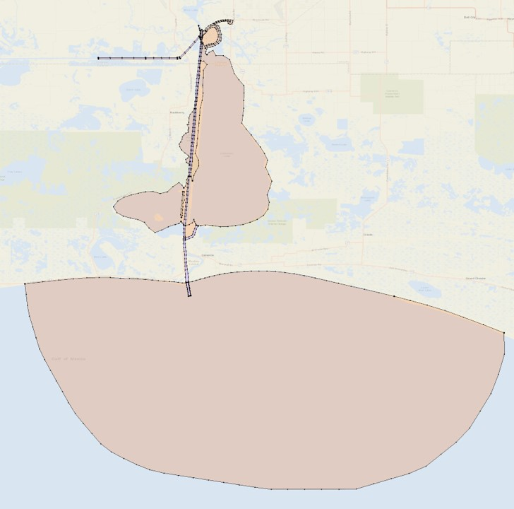
</a>

The spatial domain (orange color) covers everything below the sea level in the study area.

**Step 2. Include more upland areas of interest:**

Define a boundary that delineates the landward limit of the new domain of interest, for example:

<a href="../../assets/calcasieu_lake_lbnd.jpg">
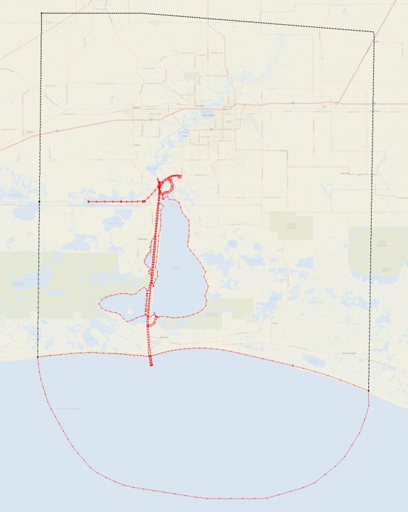
</a>

**Step 3. Clip the automatic arcs so that they are only present in the areas of interest.**

Typically, we want to put the automatic arcs (watershed rivers) only in the extended region.
This can be done in various ways, e.g., using GIS tools or scripts.

For this simple project, using SMS or GIS tools is straightforward,
and here is an example using the clipping tool (similar to that in ArcGIS or QGIS) inside SMS:

* Duplicate the full domain map coverage (from Step 2) and name it as "extended"

* Select the polygon that corresponds to the extended region, remove other polygons by invert selection and delete:
 
<a href="../../assets/calcasieu_lake_extende_region.jpg">
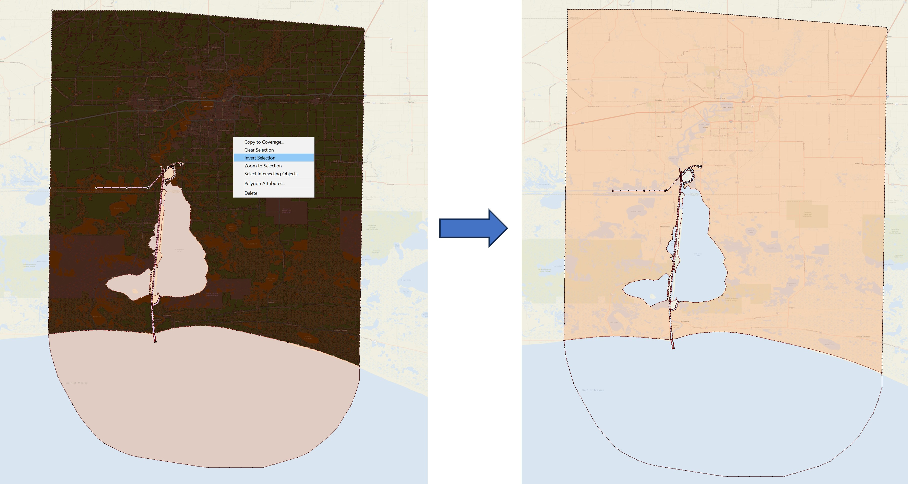
</a>

* Use the clipping tool in the toolbox, and clip the automatic arcs inside the extended region.

<a href="../../assets/calcasieu_lake_clip.jpg">
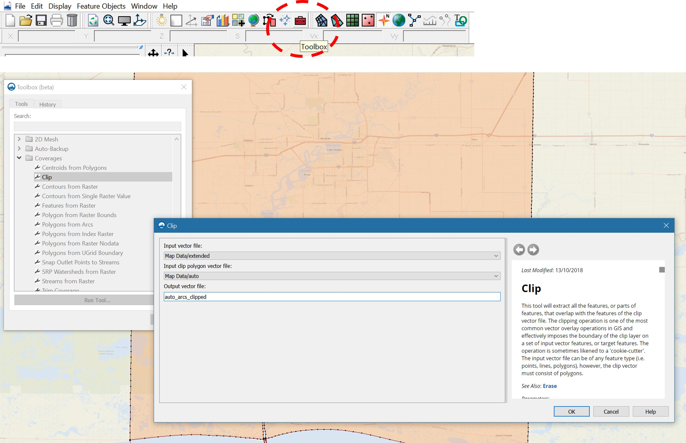
</a>


* The results look like:

<a href="../../assets/calcasieu_lake_clipped_arcs.jpg">
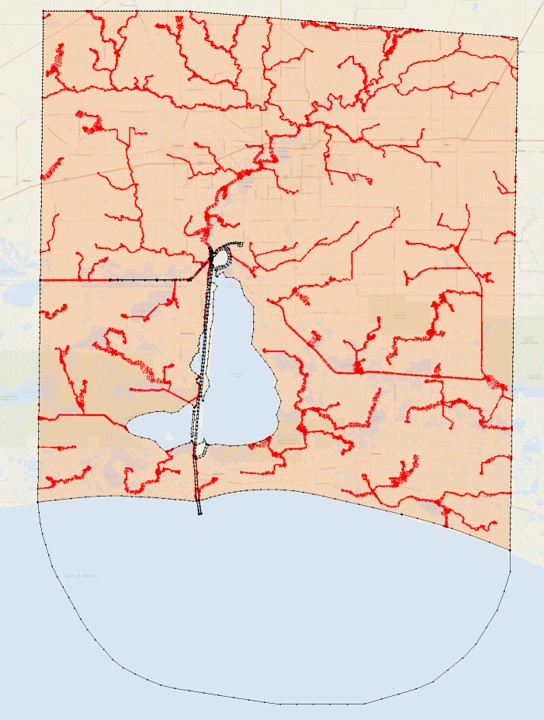
</a>


**Step 4. Merge the clipped automatic arcs and generate the mesh.**

!!!Note
    If you want to set a uniform mesh resolution in the extended region,
    you should do it before merging, because the polygon of the extended region will be split into many parts afterwards,
    making it labor intensive to set attributes for them manually.

Set the element size as:

<a href="../../assets/calcasieu_lake_set_size.jpg">
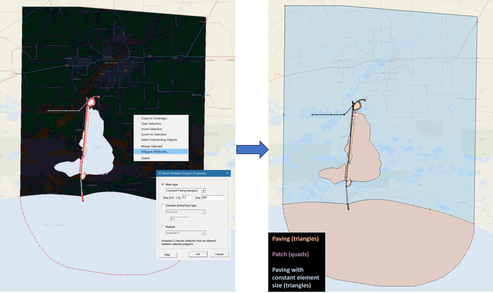
</a>

After merging, you should clean the final coverage and build polygons again.
The element size set in the extended region will be inherited (as of SMS 13.3.5)
even though it has been split into many parts by river arcs:

<a href="../../assets/calcasieu_lake_final_map.jpg">
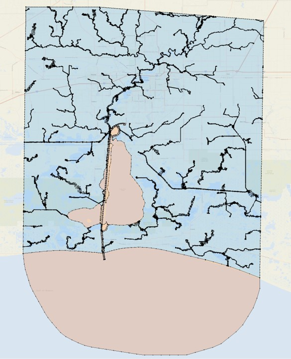
</a>

!!!Note
    Sometimes a few parts split from the original extended region may not inherit the polygon attributes
    and default to "paving", in this case you may need to manually set the polygon attributes or design another
    map coverage to facilitate the selection.
    This is elaborated [below](#set-watershed-resolution).

And here is the final mesh:

<a href="../../assets/calcasieu_lake_mesh.jpg">
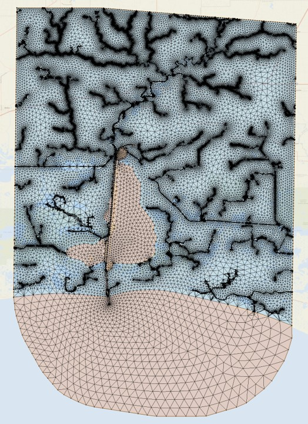
</a>

<br>
***
<br>

# Coastal areas in Texas
This example is similar to the first one, but the existing map is more complex.

**Step 1. Start from an existing map coverage.**

This manual map consists of many polygons and some of them are islands (empty polygons, not meshed).

<a href="../../assets/Texas.jpg">
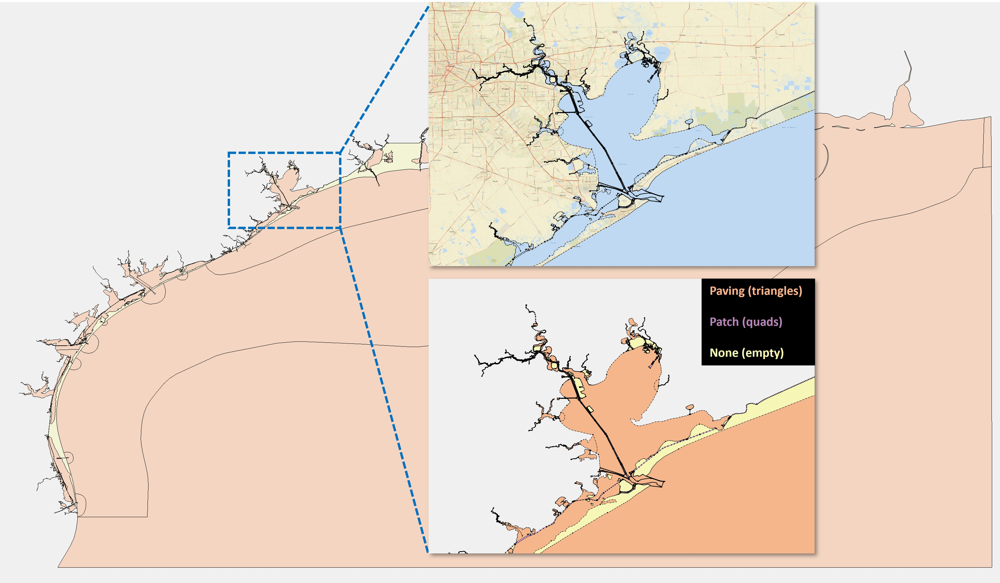
</a>

**Step 2. Include more upland areas of interest:**

* Include islands of interest.
For example, the yellow polygons in the figure above are islands, which have a mesh type of "None".
Set them to "Paving" so that they will be meshed.
If many islands need to be set to "paving" in the existing map coverage, you can directly edit the \*.map file and replace all occurrences of the string "NOMESH" to "PAVE 0.3".

* Define a boundary that delineates the landward limit of the new domain, for example:

<a href="../../assets/TX_land_boundary.jpg">
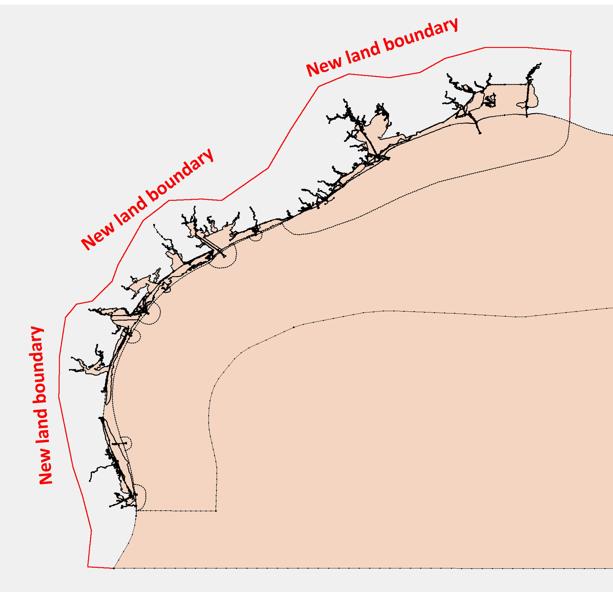
</a>


**Step 3. Clip the automatic arcs so that they are only present in the areas of interest.**

Similar to the first example, the extended region is the difference between the newly defined full domain
and the original domain (which also includes any islands of interest):

<a href="../../assets/TX_extended_region.jpg">
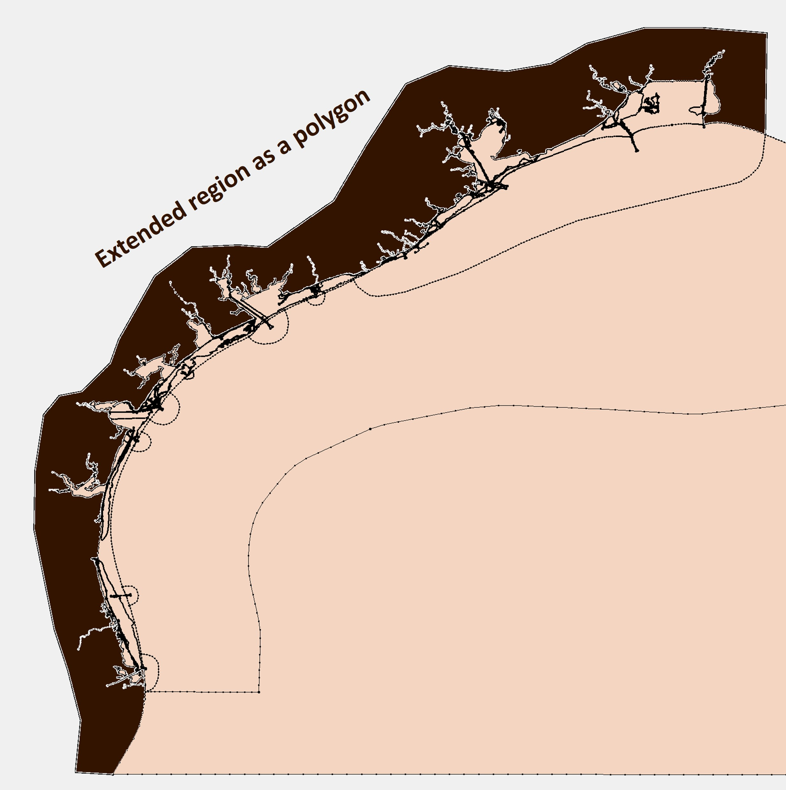
</a>

The clipped arcs look like:

<a href="../../assets/TX_clipped_arcs.jpg">
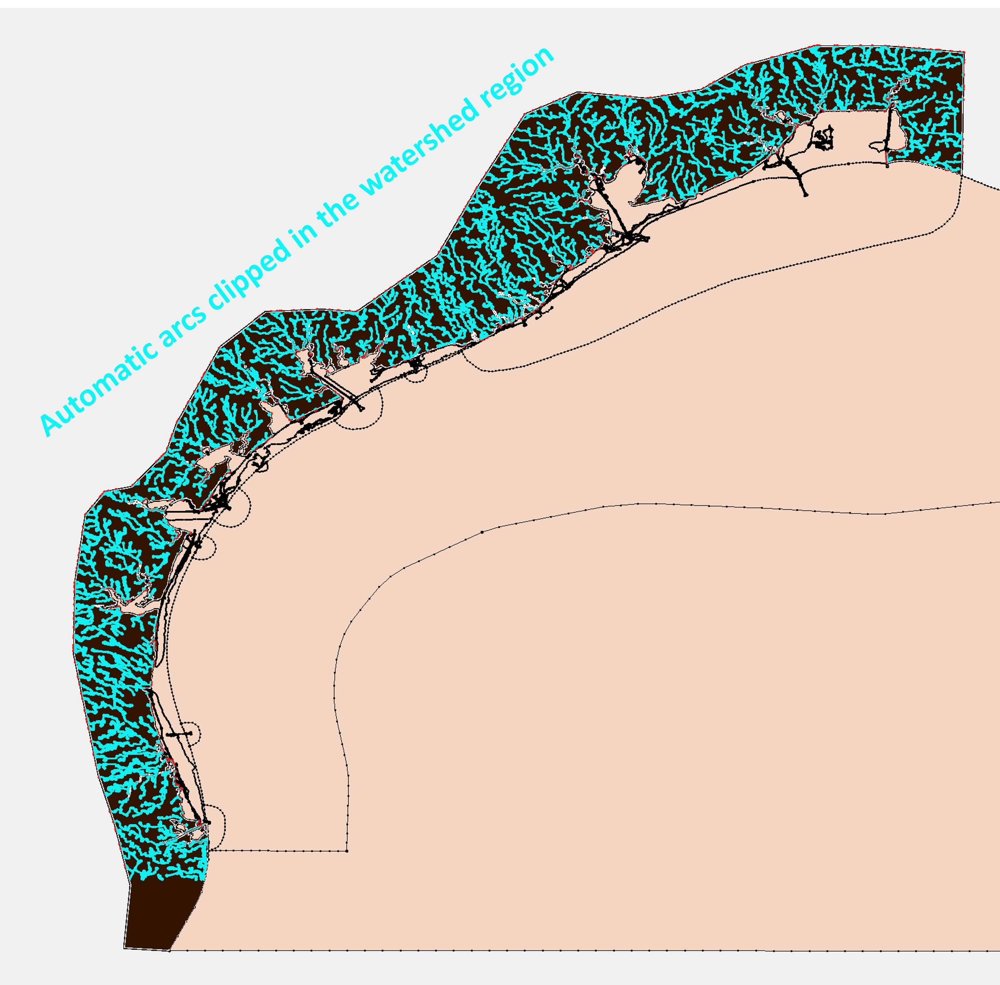
</a>

Depending on your needs, you may want the automatic arcs to intersect with the existing arcs (set buffer=0 in this case) or
leave a buffer distance between the two groups of arcs.
We typically don't let automatic arcs intersect with existing arcs, but this requires some further considerations (see [below](#strategy-for-editing-the-coastal-coverage)) to ensure channel connectivity.

Here, we provide an example using Python scripting:

* Merge the newly defined the land boundary with the existing coverage:

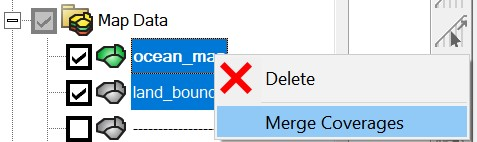

, clean the merged coverage and rebuild polygons in SMS.

* Save the original coverage and the merged coverage (full domain) as polygon shapefiles.

* Use the Python script below to clip the automatic arcs:

```Python

import geopandas as gpd

# ------------------------- inputs ---------------------------
wdir = '/sciclone/schism10/Hgrid_projects/GoM/'
original = gpd.read_file(f'{wdir}/original.shp')
full_domain = gpd.read_file(f'{wdir}/full.shp')
islands = gpd.read_file(f'{wdir}/islands.shp')
buffer_distance = 50e-5   # set to 0 if no buffer is needed
# ------------------------- end inputs ---------------------------

# buffer the original domain so that the clipped arcs don't intersect with the original domain
original_buf = gpd.GeoDataFrame(geometry=original.buffer(buffer_distance))
# the extended region is the "watershed" region where the auto arcs are placed
extended_region = full_domain.overlay(original_buf, how='difference').dissolve()

# add any islands back
islands_buf = gpd.GeoDataFrame(geometry=islands.buffer(-buffer_distance))  # "minus" because we want the river arcs contained in the islands
extended_region = extended_region.append(islands_buf)

# clip the auto arcs to the extended region
total_arcs = gpd.read_file(f'{wdir}/total_arcs.shp')
total_arcs_clipped = total_arcs.clip(extended_region)
total_arcs_clipped.to_file(f'{wdir}/total_arcs_clipped.shp')

```

The usage of this simple script is self-evident and you can use it as a starting point for your own project.
Scripting is recommended for more complex projects with many individual map coverages.

**Step 4. Merge the clipped automatic arcs and generate the mesh.**

See details in the SECOFS example.

<br>
***
<br>

# SECOFS (South-east Coastal Forecast System)
This example is based on the SECOFS domain.

<a href="../../assets/SECOFS_domain.jpg">
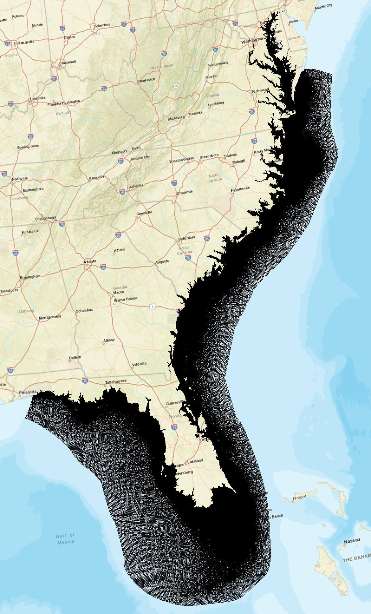
</a>

This project has an additional component in the map module, i.e., the levee and dam system from the National Levee Database.
In a more complex project like this one,
it is recommended to use a script to clip the automatic arcs inside the extended (watershed) region.
The SCHISM Git repo provides a clipping script for SECOFS:

```bash
$your_schism_dir/src/Utility/Pre-Processing/SECOFS/Grid/clip_autoarcs.py
```

This script is similar to the one shown in the Texas example above, but it has more steps.

The rest of the procedures of automatic arcs preperation is similar to what have been shown in the previous examples and not repeated here.


## **Preparation**
The SECOFS SMS project has the following components:

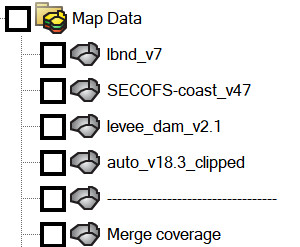 

For a complex meshing project, it is imperative to keep different features in seperate maps.
Merging individual maps should be done as the last step.

In this project, the purpose of each SMS map coverage is as follows:

- lbnd: land boundary roughly along the 10-m contour.

- levee\*: Levees from National Levee Database.

- auto\*arcs: Automatically generated river arcs, clipped inside the watershed region (see [clipping the river
  arcs](https://vims0-my.sharepoint.com/personal/feiye_vims_edu/_layouts/OneNote.aspx?id=%2Fpersonal%2Ffeiye_vims_edu%2FDocuments%2FNotebooks%2FNOAA%20TWL%20project%E2%80%8B&wd=target%28Highlights.one%7C9F3230A1-12F7-4F9A-8890-CE493995252A%2FSMS%20notes%7C95E15132-42B8-4581-A263-4F4576C9A5FE%2F%29onenote:https://vims0-my.sharepoint.com/personal/feiye_vims_edu/Documents/Notebooks/NOAA%20TWL%20project​/Highlights.one#SMS%20notes&section-id={9F3230A1-12F7-4F9A-8890-CE493995252A}&page-id={95E15132-42B8-4581-A263-4F4576C9A5FE}&end))

- coast: This map includes all manually made polygons (including quad patches) and the coastline.

- merge coverge: Merged map of all individual maps above.


!!! Attention
    Never edit the merged map directly, unless you are willing to take the time to exactly reproduce the changes in all individual maps (which is more time consuming in most cases, so don't do it).

    For a complex project, breaking the consistency between the merged map and the individual maps makes it practically impossible for any significant changes in the future.


## **Clean the merged map**

Since SMS 13.3, the cleaning is very efficient even for a map with tens of thousands of arcs. However, you may need to clean the merged map multiple times until there is no more warning messages.
For STOFS3D or SECOFS, use with the following parameters: 

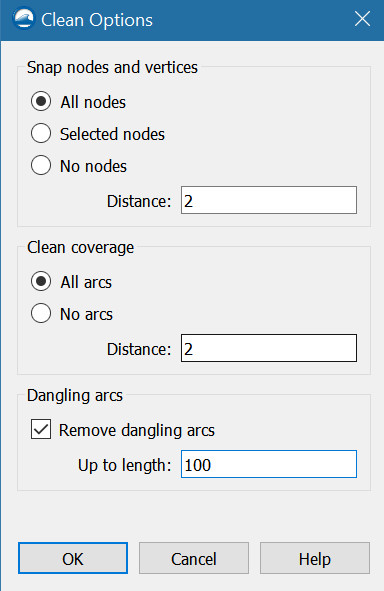


## **Build polygons**


Make sure there is no warning message after the polygons are built; otherwise, go back to the cleaning step and try again.


## **Finalize the mesh**
Delete the disjoint nodes:


Renumber nodes:


Save the mesh as \*.2dm:


## ** Mesh quality and skew elements **
Although the script tries to optimize the convergence of river arcs at river intersections
, skew elements may occasionally occur.
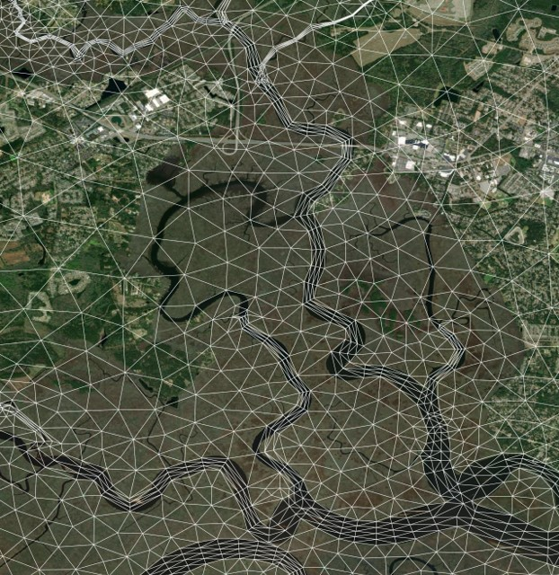

Normally these small 'bad' elements do not affect the efficiency or stability of SCHISM simulations. 
However, it's advisable to edit out extremely small/skew elements.
You may remedy them using the following script provided in [RiverMapper](https://github.com/schism-dev/RiverMeshTools/tree/main/RiverMapper):
```
RiverMeshTools/RiverMapper/RiverMapper/improve_hgrid.py
```
The script automatically checks for small and skew elements,
then improve the mesh by merging, removing, or relaxing the problematic elements.
As a general rule of thumb, SCHISM can comfortably handle elements >= $1m^2$ ($10^{-10}$ in lon/lat), and skewness<=60. 
You can specify these parameters in the script; see the "__main__" section of the script for usage.

Alternatively, you can use `ACE/xmgredit5` or SMS to check and fix mesh quality manually.

!!! Attention
    Avoid overly depending on mesh adjustments in the final stage, as the underlying issue often originates from the SMS coverages or the merging process.
    In these instances, it is best to address the problems directly within the SMS coverages.


# **Additional notes for STOFS/SECOFS developers**
These notes are primarily intended as a reference for developers, although other users might also find parts of the content beneficial.


## Strategy for editing the coastal coverage
Edit the coastal coverage when local refinements are needed in an area of interest.

Rules to follow (for consistency among STOFS3D/SECOFS developers):

- The manual arcs should at least be better than the auto arcs; use the shapefile of the auto arcs as a background in SMS to help you decide.
  In particular, this means you need to accommodate for tributaries when placing a manual polygon for a main channel, lake, or estuary:

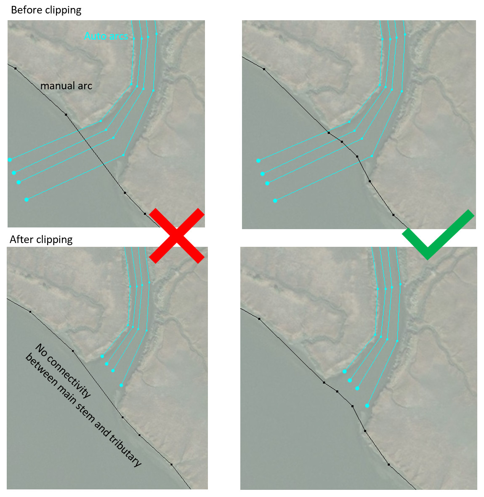

- No need to create buffers for manual polygons; the [clipping procedure](https://vims0-my.sharepoint.com/personal/feiye_vims_edu/_layouts/OneNote.aspx?id=%2Fpersonal%2Ffeiye_vims_edu%2FDocuments%2FNotebooks%2FNOAA%20TWL%20project%E2%80%8B&wd=target%28Highlights.one%7C9F3230A1-12F7-4F9A-8890-CE493995252A%2FSMS%20notes%7C95E15132-42B8-4581-A263-4F4576C9A5FE%2F%29onenote:https://vims0-my.sharepoint.com/personal/feiye_vims_edu/Documents/Notebooks/NOAA%20TWL%20project​/Highlights.one#SMS%20notes&section-id={9F3230A1-12F7-4F9A-8890-CE493995252A}&page-id={95E15132-42B8-4581-A263-4F4576C9A5FE}&end) automatically creates a 50-meter buffer zone around all manual polygons.
!!! Attention
    Arcs not included in a polygon do not have a buffer; this setting is intentional.
  
- Unless you have a clear plan, don't mix features from other coverages (e.g., levees and auto arcs) in the coastal coverage, which is reserved for manual editing.
Doing so means that you assume the responsiblity of keeping the manual edits up-to-date with external changes that may be more easily done in other coverages.
For example, the National Levee Database add/remove features from time to time; the requirements on the auto arcs may change or there may be improvements in the RiverMapper tool itself.
In addition, putting auto arcs in this coverage means that you will spend extra time trying to satisfy the first rule of explicitly accommodating for the connectivity with tributaries.


## Set watershed resolution
To avoid over-refinement, most watershed polygons should have a specified mesh resolution, which can be set via the "constant paving" or "scalar paving density" option in each polygon's attributes.

Selecting the watershed polygons may involve much labor because many small polygons are generated after the river arcs are merged into the final map.
Instead of manual selection, use the ["select\*" map coverage](#select) to select all polygons more efficiently.

Activate the "select\*" coverage:


Select the big polygon, right click on it, and click "Select intersecting objects":


Intersect it with "merge coverage" with the following parameters:


It will take about 10 minutes to do the selection for the STOFS3D domain.

- For STOFS3D, right click on the selected polygons and set "mesh type" in "polygon attributes" to scalar paving density: 


Set scalar options using the [watershed_resolution](#watershed_resolution) scatter dataset from the [preparation](#preparation) step:


In addition, set the polygon attribute of the "island" between Chesapeake Bay and Delaware Bay as "None":


- For SECOFS, "Constant paving" with the following parameters is used:

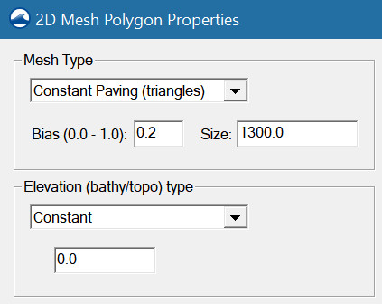


