## Preparation
Typically, you should have the following items in an SMS project:

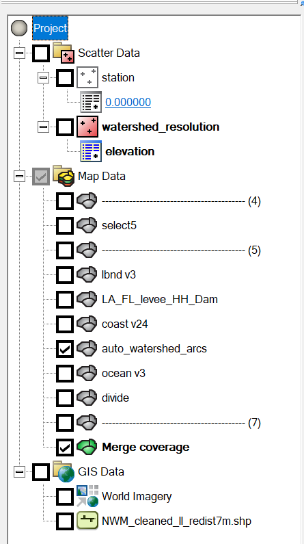 

For a complex meshing project, it is imperative to keep different features in seperate maps.
Merging individual maps should be done as the last step.

The purpose of each SMS project component is as follows:

- Scatter Data:

    - station: Mark locations where mesh quality is important; at least make sure none of the observational stations is in land cells.

    - <a name="watershed_resolution">watershed resolution</a>: Used for setting "scalar density paving" on some polygons, see details [here]().

- Map Data:

    - select\*: A map containing a polygon that intersects with all polygons where the "scalar density paving" attribute is needed, see details [here]().
                This is useful when the number of watershed polygons is too large to select manually.
                The polygon can be made in Qgis by first extracting the grid boundary then simplifying its geometry (otherwise the polygon is too complex for efficient selection of intersecting features).

    - lbnd: land boundary roughly along the 10-m contour, see [caveats of making the land boundary]().

    - \*levee\*: Levees from National Levee Database.

    - auto\*arcs: Automatically generated river arcs, which have been cleaned in Qgis (see details in [cleaning river arcs]()) .

    - coast: This map includes all manually made polygons (including quad patches) and the coastline.

    - ocean: This map includes everything beyond the coastline and in the ocean.

    - <a name="divide">divide</a>: A few manually drawn arcs that divide the coastal regions into subregions.
              This makes the mesh generation of complex maps more robust in SMS.
              This is also useful for locating SMS issues because you can mesh different subregions in seperate SMS sessions simultaneously, which speeds up the diagnosis of SMS exceptions (crashing or hanging) that may occur for a complex map, see details [below](#find-and-fix-sms-issues).

    - merge coverge: Merged map of all individual maps above.

- Gis Data:

    - World imagery and NWM segments: These provide a guidance on watershed and river topography, which helps avoid meshing errors during the desgin phase (e.g., when editing the [land boundary]())  

!!! Attention
    Never edit the merged map directly, unless you are willing to take the time to exactly reproduce the changes in all individual maps (which is more time consuming in most cases, so don't do it).
    Unsyncing the merged map with the individual maps make it practically impossible for any significant changes in the future.
    The only case in which editing the merged map may be beneficial is when you work on a huge map (with tens of thousands of arcs) and cleaning the merged map take much time (e.g. hours).
    In this case, make sure the changes are also reproduced in individual maps.


## Clean the merged map

Clean the merged map twice with the following parameters: 

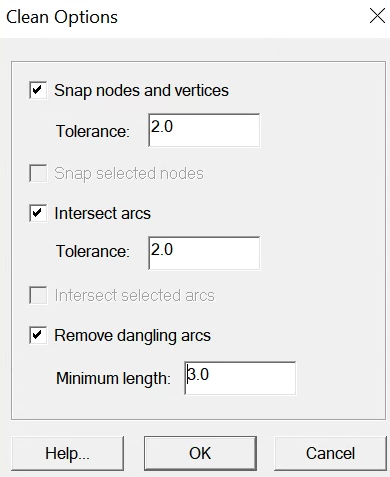

The second clean will snap some of the newly created points in the first clean.


## Build polygons

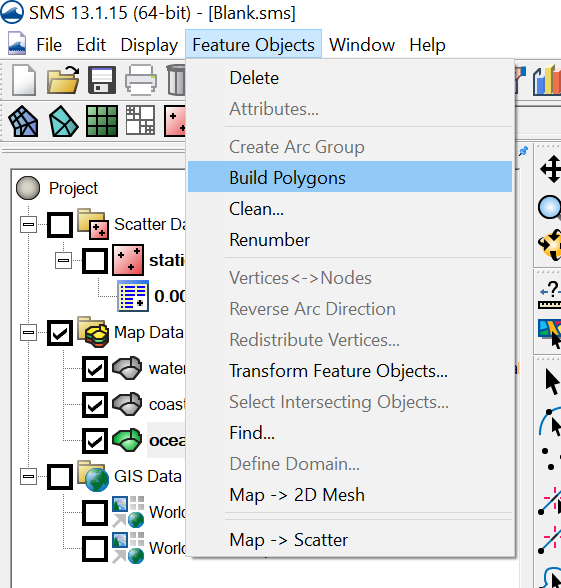


## Set watershed resolution
With the automatically-generated arcs merged into the final map (especially when there are intersections between river arcs and the land boundary), there may be many watershed polygons.
Instead of manual selection, use the "select\*" map coverage to select all polygons that need "scalar paving density".

Activate the "select\*" coverage:

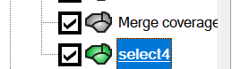

Select the big polygon, right click on it, and intersect it with the "merge map":

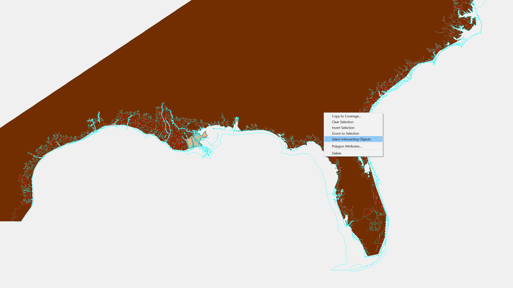

Set the intersecting parameters as follows:

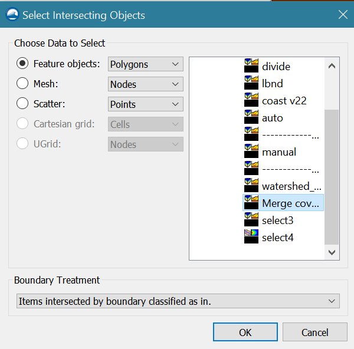

It will take about 10 minutes to do the selection for the STOFS3D domain.
Right click on the selected polygons and set the "polygon attributes" to scalar paving density: 

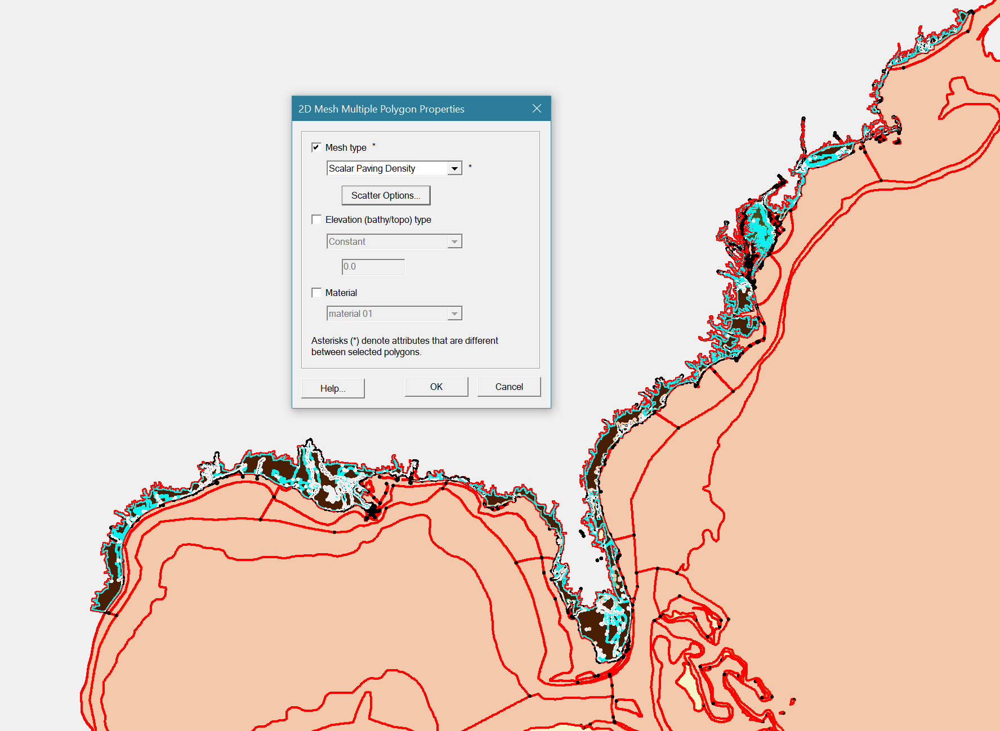

Set scalar options using the [watershed_resolution](#watershed_resolution) scatter dataset from the [preparation](#preparation) step:

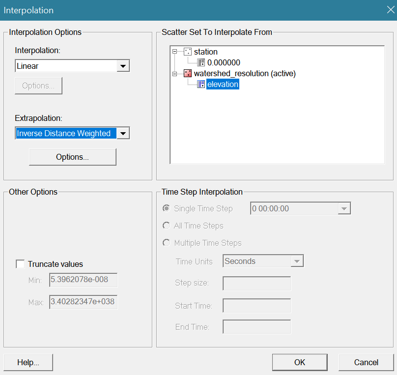

In addition, set the polygon attribute of the "island" between Chesapeake Bay and Delaware Bay as "None":

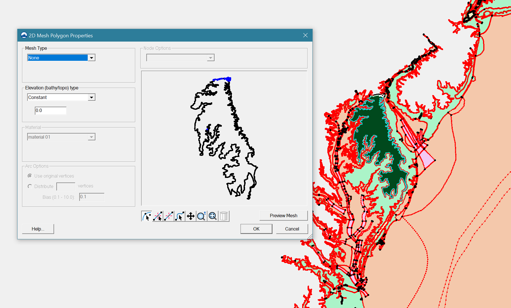


## Known SMS issues 
There are some known issues in SMS that may hang or crash SMS:

- SMS may hang while generating mesh for a complex polygon.
Breaking the large polygon into smaller and simpler polygons can help fix the issue.

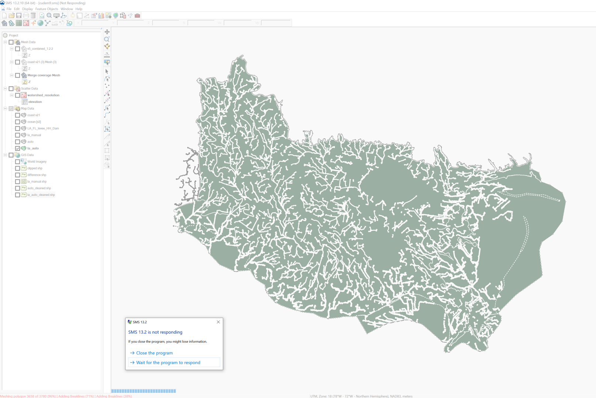


- "Void in breakline" in some polygons. Slightly moving some vertices may fix the problem.


##Find and fix SMS issues
We have reported the above issues to the SMS team.
Before these issues are fixed, you can use the following methods to find and fix them before the final meshing.

Using STOFS3D Atlantic as an example, launch about 5 - 6 SMS sessions to mesh in sub-regions simultaneously.

Here you have two options.

### Option 1. More manual work but takes less time
Break the merged map into sub-maps along the [division lines](#divide).
Make sure there are no overlaps among the sub-maps except for the interface line:

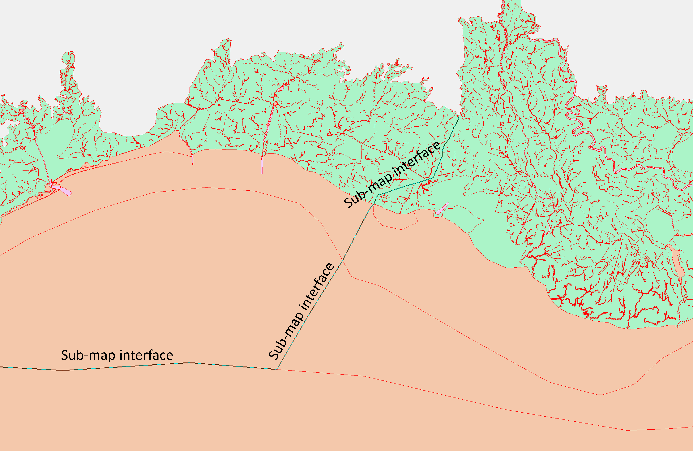

Mesh each sub-map in a seperate SMS session and fix issues that crash SMS where necessary.

Combine the sub-meshes using the following script in [SCHISM Git]():
```
/sciclone/data10/feiye/SCHISM_REPOSITORY/schism/src/Utility/
```


### Option 2. Less manual work but takes more time

In each session, select the polygons within a sub-domain and try to generate a sub-domain mesh.
Normally, there won't be any "hanging" issues, but there can be 5 - 8 "breakline" issues in total and SMS will prompt for the IDs of the problematic polygons.

Open another SMS session and fix all issues in the merged map.
Here, editing the merged map is unavoidable because the issues originates from the merging step.

Finally, generate the mesh for the full domain.
This takes about 3-5 hours, depending on how fast your desktop is.


## Relax crowded elements (at river intersections) 
Import and activate the "intersection joints" map coverage (which is one of the products from the [last step](generate-river-map.md)):  
 
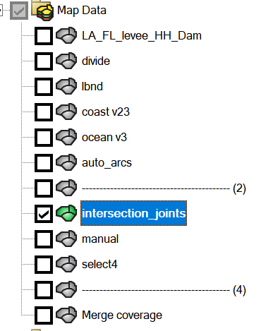

Make a copy of the generated mesh and select the copy:  
 
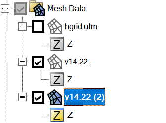

Press the select element button:

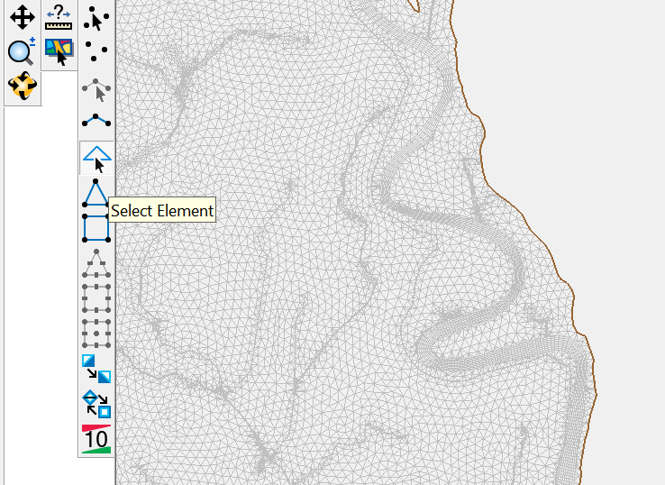

Select the elements within a specified distance of the intersecting coverage: 

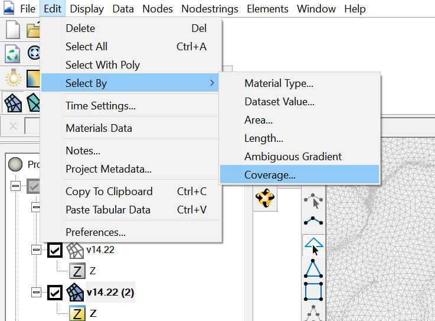


Set relax options: 


 
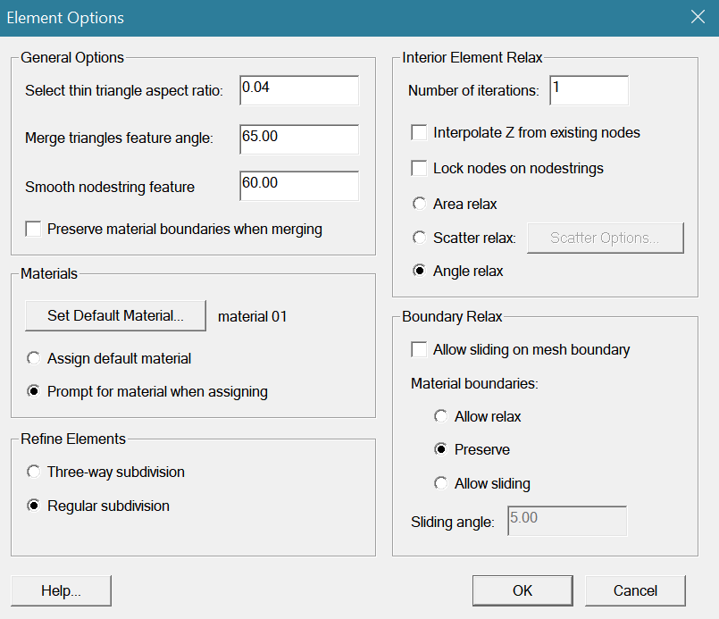

Relax the selected elements: 


## Finalize the mesh
Delete the disjoint nodes:

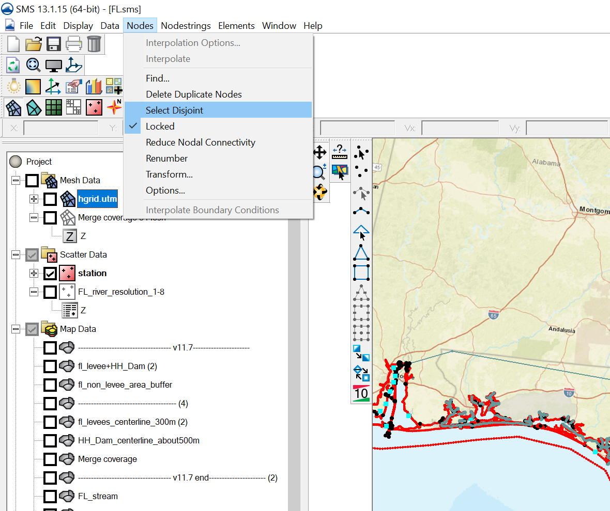

Renumber nodes:

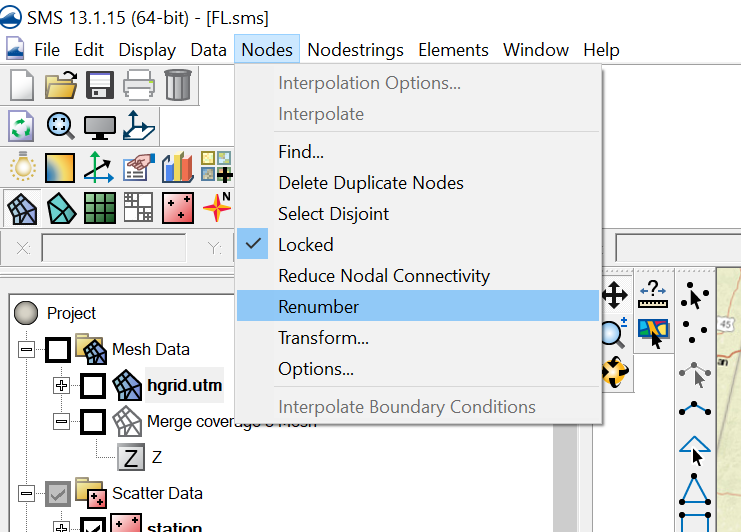

Save the mesh as \*.2dm:

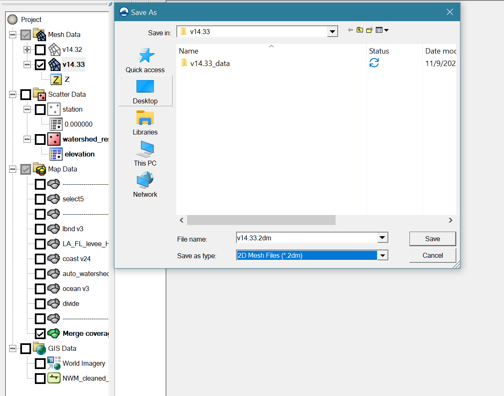

Quality check using a script:
```bash
STOFS3D_scripts/Pre_processing/Grid/proc_hgrid.py
```
from the [STOFS3D scripts](https://github.com/feiye-vims/STOFS3D-scripts) repository
, which identifies small elements, skew elements, and bad quads,
then generate hgrid.\* in different projections.


