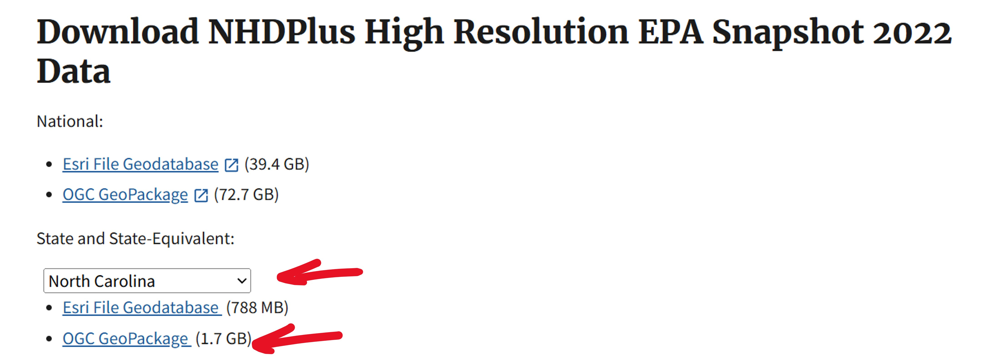
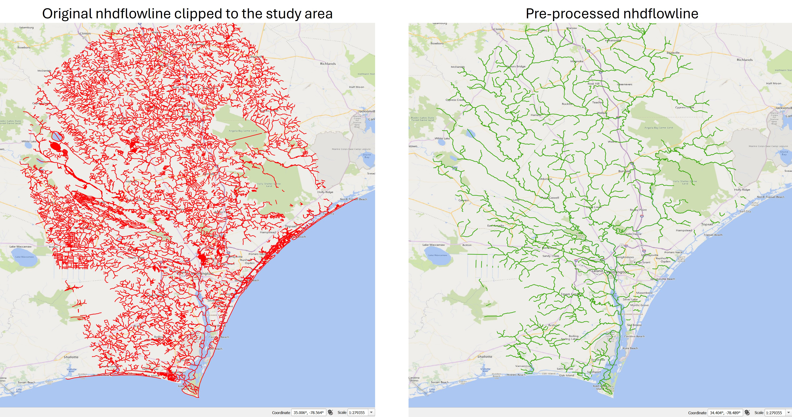
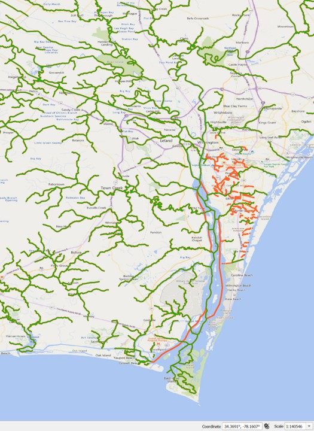
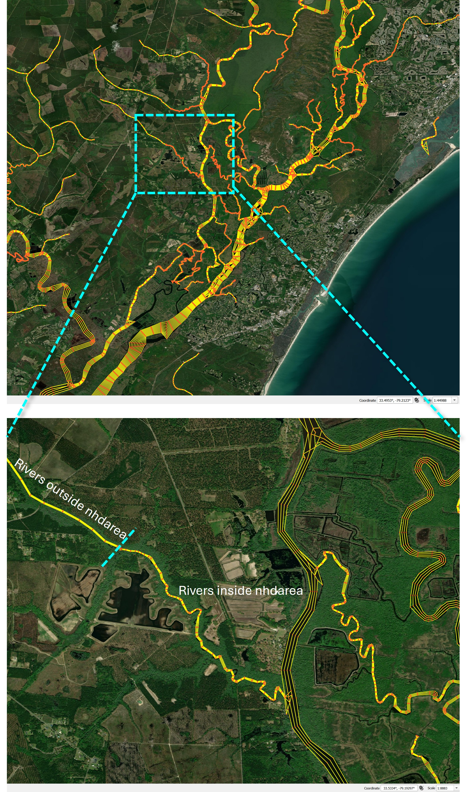

## Introduction
Previously, we discussed how to extract thalwegs from a Digital Elevation Model (DEM) for use as input to RiverMapper.
We also mentioned other 1D river network datasets can be used intead of the extracted thalwegs, provided they reasonably represent the true thalwegs or channel centerlines.
In this section, we illustrate the usage of an alternative data sources, National Hydrography Dataset (NHD), and outline the workflow for pre-processing NHD products as RiverMapper inputs.

NHD is a comprehensive set of digital spatial data that represents the surface water features of the United States, including rivers, streams, lakes, and ponds.
Developed by the U.S. Geological Survey (USGS), NHD provides detailed vector representations of flowlines, water bodies, and associated attributes.

 

It is widely used for hydrologic analysis, watershed modeling, and mapping, and can serve as an alternative source of 1D river networks for RiverMapper inputs.

## Download
The NHD products can be downloaded from the [EPA website](https://www.epa.gov/waterdata/get-nhdplus-national-hydrography-dataset-plus-data).
Notably, NHDPlus v2 is used in the National Water Model.
Here, we will use NHDPlus High Resolution EPA Snapshot 2022, which provides finer detail suitable for accurate river network extraction and modeling.

Scroll to the bottom of the page, select state(s), and download the GeoPackage data:



## Pre-processing flowlines
The `nhdflowline` layer in the GeoPackage typically contains many more rivers than are needed for a compound flood simulation. 
To reduce processing time, select only the flowlines within your region of interest and export them to a shapefile.

Then, apply the following pre-processing steps to the shapefile:

- Subset flowlines based on specific criteria (e.g., valid `gnis_id`).
- Dissolve flowlines sharing the same `gnis_id` to minimize segmentation.
- For segments that are partially inside (outside) nhdarea polygons, split them into parts that are inside and outside the nhdarea.
- Split long flowlines into shorter segments based on a maximum length threshold.
- Densify vertices along each flowline to enhance accuracy for use in RiverMapper.
- Add an integer attribute to all linestrings "keep" = 1, which invokes optinal processing steps (taliored for NHD) inside RiverMapper.

These steps can be performed manually using GIS tools such as QGIS.
Alternatively, the following [script](https://github.com/schism-dev/RiverMeshTools/blob/main/RiverMapper/Scripts/pre_proc_nhd_flowline.py) is provided to automate the process:

```
RiverMeshTools/RiverMapper/Scripts/pre_proc_nhd_flowline.py
```

The usage of the script is self-explanatory in the main() function.
An example of the processed nhdflowline around Wilmington, NC, USA is shown below:



## Pre-processing NHD Area (Optional)
The `nhdarea` layer from the downloaded GeoPackage can serve as a surrogate for a DEM after the following post-processing steps:

- (Optional) Split the entire domain into tiles if the domain is large.
- Rasterize each tile into a `.tif` file, assigning -1 to areas inside the polygons (water) and 0 to areas outside (land).
- Generate a dummy tile covering the full domain with only 0 values. This is used as the lowest-priority tile to ensure all rivers are within *.tif coverage.

Tiling facilitates parallel processing with MPI. 
Rasterization simplifies and accelerates geometric queries, at the cost of increased memory usage — a trade-off that is manageable with MPI.
These post-processing steps make the tiles directly usable as inputs to RiverMapper.

The following scripts are provided to automate the process:

```
RiverMeshTools/RiverMapper/RiverMapper/river_map_tif_preproc.py
```

The usage of the script is self-explanatory in the main() function.

## Sample applications
Two sample applications — one for the Pee Dee River, SC, and one for Wilmington, NC — are provided [here](https://ccrm.vims.edu/yinglong/feiye/Public/RiverMapper_samples_NHD.zip).

Each application includes:

- A shapefile containing pre-processed NHD layer `nhdflowline`;
- A shapefile containing `nhdarea` clipped to the regions of interest, but it still needs to be processed as described [above](#pre-processing-nhd-area-optional);
- A sample script demonstrating how to call RiverMapper;
- Example outputs generated by RiverMapper.

In these two examples, the rivers selected for feature extraction are those with a valid `gnis_id`. 
Different strategies can be used to choose the rivers as needed. 
Additional rivers can also be added as needed.
In the Pee Dee River case, a stretch of the Intracoastal Waterway was added to the initial selection.
In the Wilmington case, additional rivers (orange lines) in the urban area are copied from the original nhdflowline:



!!!Note
    In the Wilmington example (above figure), a few lines are also added in the main stem of the Cape Fear River.
    This is to improve the arcs around the islands.
    However, it is recommended to draw major rivers and estuaries manually without using RiverMapper.

An example of the final product is shown below,
where rivers inside the `nhdarea` polygons are resolved with higher resolution,
while small creeks outside the polygons are represented by uniform-width channels.



