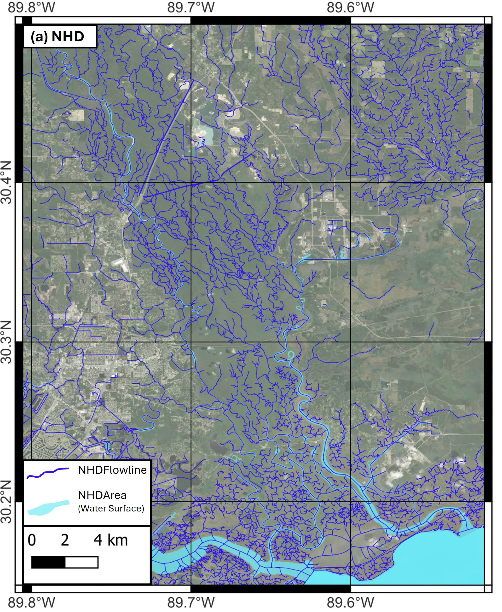
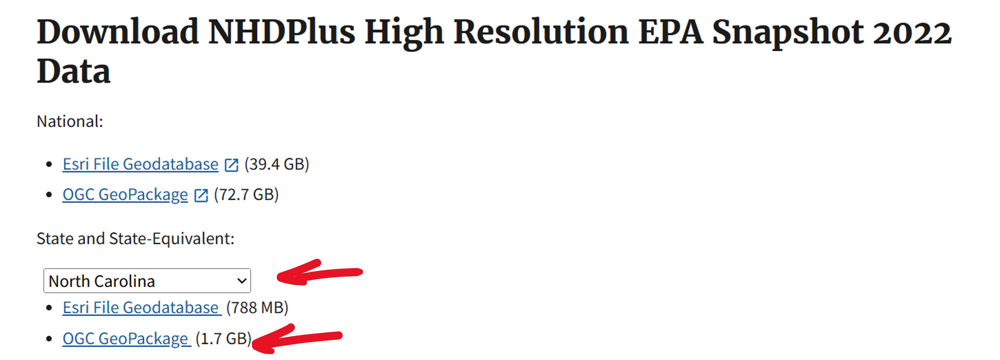
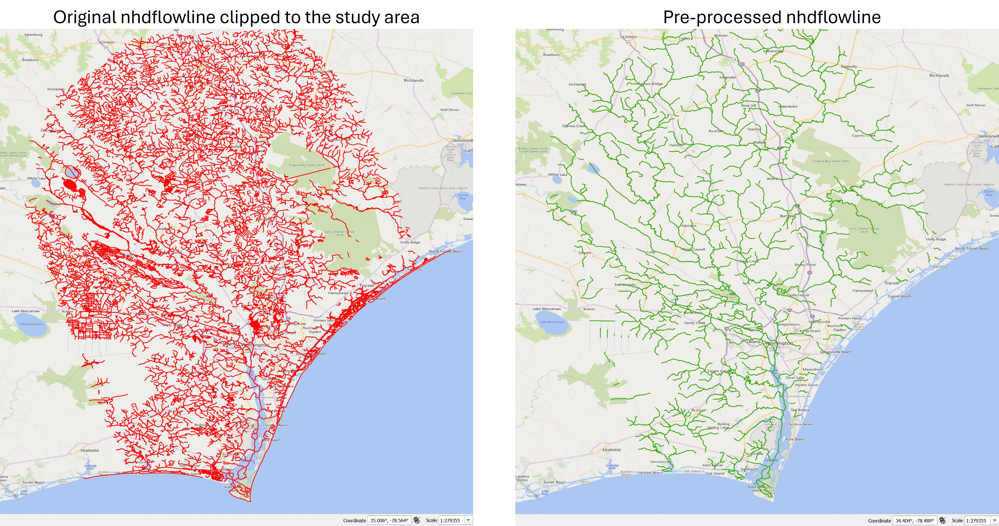
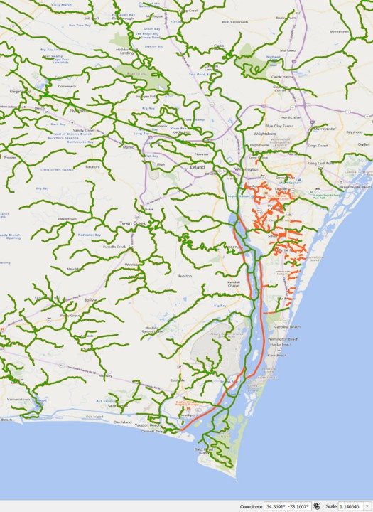
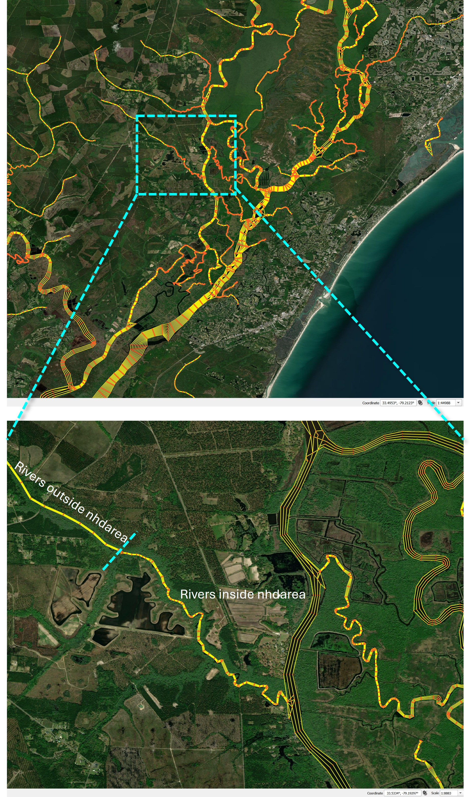

## Introduction

RiverMapper can use an existing one-dimensional river network instead of thalwegs extracted from a digital elevation model (DEM). This section uses the National Hydrography Dataset (NHD) as an example and explains how to prepare its flowlines and area polygons for RiverMapper.

NHD is a collection of digital surface-water data for the United States. It includes vector representations of rivers, streams, lakes, ponds, and related attributes.



## Download the data

NHD products can be downloaded from the [EPA NHDPlus website](https://www.epa.gov/waterdata/get-nhdplus-national-hydrography-dataset-plus-data). This tutorial uses the NHDPlus High Resolution EPA Snapshot 2022. On the download page, select the required state or states and download the GeoPackage data.



Before preprocessing, clip the `nhdflowline` and `nhdarea` layers to the region of interest and export them as shapefiles. This substantially reduces processing time.

## Choose the raster source

NHD flowlines can be paired with either a real elevation DEM or rasterized NHD Area polygons. The source of the flowlines does not determine how RiverMapper interprets the raster values.

| Flowline input | Raster input | `input_nhdarea` in flowline preprocessing | `nhd_area_tif` in RiverMapper |
|---|---|---|---|
| NHD flowlines | Real elevation DEM | `None` | `False` or omitted |
| NHD flowlines | Rasterized NHD Area polygons | NHD Area shapefile | `True` |

Use `input_nhdarea=None` with a real DEM to preserve continuous flowlines and bypass unnecessary inside/outside splitting. When NHD Area provides the surrogate raster, pass the area shapefile so a flowline crossing a polygon boundary is divided into separate inside and outside portions.

The `nhd_area_tif` option describes the TIFF values, not the source of the thalwegs. Do not set it to `True` merely because the flowlines came from NHD.

Because `nhd_area_tif` applies to the entire TIFF list, use one raster interpretation per RiverMapper call. Do not mix real elevation DEMs with `-1/0` NHD Area surrogate tiles in the same list.

## Preprocess the flowlines

The preprocessing workflow:

- Optionally selects flowlines using an attribute such as `gnis_id`.
- Dissolves flowlines with the same identifier to reduce unnecessary segmentation.
- Optionally splits flowlines at NHD Area boundaries.
- Divides long flowlines into shorter segments.
- Densifies vertices along each segment.
- Adds an integer `keep=1` attribute.

The `keep` attribute only controls retention. A positive value tells RiverMapper to process the flowline even when other criteria, such as the minimum detected width, would normally cause it to be discarded. In that case, RiverMapper can fall back to a pseudo-channel. The `keep` value does not select NHD raster processing or change how elevation is interpreted.

These operations can be performed in a GIS or with the standalone [pre_proc_nhd_flowline.py](https://github.com/schism-dev/RiverMeshTools/blob/main/RiverMapper/Scripts/pre_proc_nhd_flowline.py) script. Copy the script into the project directory, or import it from wherever RiverMeshTools was cloned. For example, after copying it beside the input shapefile:

```python
from pathlib import Path

from pre_proc_nhd_flowline import pre_process_nhdflowlines


pre_process_nhdflowlines(
    input_flowline=Path("nhdflowline_ll.shp"),
    input_nhdarea=None,  # use Path("nhdarea_ll.shp") with NHD Area surrogate TIFFs
    line_identifier="gnis_id",
    max_segment_length=15_000,
    along_segment_resolution=20,
)
```

Set `line_identifier=None` to retain all input flowlines. Additional examples and diagnostic-output options are available in the script's `sample()` function.

An example of preprocessed NHD flowlines near Wilmington, North Carolina, is shown below.



## Preprocess NHD Area polygons (optional)

Skip this section when using a real elevation DEM. To use NHD Area as a surrogate raster, RiverMapper expects `-1` for water and `0` for land. The preprocessing script:

- Splits the polygons into overlapping tiles.
- Rasterizes each nonempty tile, burning water as `-1` and background land as `0`.
- Creates a coarse, zero-valued `global_dummy.tif` that supplies coverage outside the detailed tiles.

The input shapefile should be in longitude/latitude coordinates (EPSG:4326) when using the default tile and pixel sizes. If polygon overlaps, gaps, or slivers need repair, `build_clean_polygon_mask()` in the same script provides an optional cleanup step. Its `target_crs` must be a projected CRS with meter units; reproject the cleaned result to EPSG:4326 before rasterization.

The [pre_proc_nhd_area.py](https://github.com/schism-dev/RiverMeshTools/blob/main/RiverMapper/Scripts/pre_proc_nhd_area.py) script is standalone. Copy it into the project directory, or run it from wherever RiverMeshTools was cloned. For example, after copying it beside the input shapefile:

```bash
python pre_proc_nhd_area.py nhdarea_ll.shp
```

By default, the outputs are written to `nhdarea_ll_split_rasterized/`. Use `--outdir` to choose another location:

```bash
python pre_proc_nhd_area.py nhdarea_ll.shp \
    --outdir nhdarea_tifs
```

Run the command with `--help` to see options for tile size, tile overlap, raster resolution, burn value, and dummy-TIFF generation.

## Run RiverMapper

### NHD flowlines with a real DEM

Use the DEM normally and leave `nhd_area_tif` at its default value of `False`:

```python
from RiverMapper.make_river_map import make_river_map


make_river_map(
    tif_fnames=["./dem/domain_dem_ll.tif"],
    thalweg_shp_fname="./nhdflowline_ll_processed/nhdflowline_ll_processed.shp",
    output_dir="./Outputs/",
)
```

### NHD flowlines with NHD Area surrogate TIFFs

List all detailed NHD Area tiles before the global dummy TIFF. RiverMapper uses the first available raster at a location, so `global_dummy.tif` must have the lowest priority and appear last.

```python
from pathlib import Path

from RiverMapper.make_river_map import make_river_map


nhd_tif_dir = Path("./nhdarea_ll_split_rasterized")
nhd_area_tifs = sorted(str(path) for path in nhd_tif_dir.glob("nhdarea_ll_*.tif"))
nhd_area_tifs.append(str(nhd_tif_dir / "global_dummy.tif"))

make_river_map(
    tif_fnames=nhd_area_tifs,
    thalweg_shp_fname="./nhdflowline_ll_processed/nhdflowline_ll_processed.shp",
    output_dir="./Outputs/",
    nhd_area_tif=True,
)
```

## Sample applications

Sample applications for the Pee Dee River, South Carolina, and Wilmington, North Carolina, are available [here](https://ccrm.vims.edu/yinglong/feiye/Public/RiverMapper_samples_NHD.zip). Each application includes:

- Preprocessed NHD flowlines.
- An NHD Area shapefile clipped to the region of interest.
- A sample RiverMapper driver.
- Example RiverMapper outputs.

The samples select rivers with a valid `gnis_id`, but other selection strategies can be used. Additional flowlines may also be added manually. For example, the Pee Dee application includes part of the Intracoastal Waterway, and the Wilmington application adds several urban flowlines shown in orange below.



!!! note
    Several flowlines were also added along the main stem of the Cape Fear River to improve the generated arcs around islands. Major rivers and estuaries are generally better drawn manually instead of being processed with RiverMapper.

The resulting map resolves rivers inside the NHD Area polygons at higher resolution, while small creeks outside the polygons fall back to uniform-width pseudo-channels.



## RiverMapper source

[RiverMapper](https://github.com/schism-dev/RiverMeshTools/tree/main/RiverMapper) is maintained in the [RiverMeshTools repository](https://github.com/schism-dev/RiverMeshTools).
