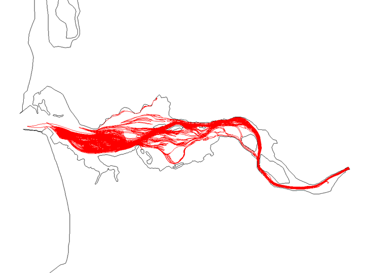

SCHISM supports a 3D particle tracking code in `Utility/Particle_Tracking/ptrack3.f90`, which can also be used for simple oil spill simulation. The code can do forward/backward tracking and has simple dispersion and beach retention processes for oil spill.

The inputs to this code are: `hgrid.gr3`, `vgrid.in`, `particle.bp`, and `schout*.nc`. The main parameters are set in `particle.bp`. Below is a sample:

```
1 !screen outputs
0 !mod_part (0: passive; 1: oil spill)
1 !ibf (forward (=1) or backward (=-1) tracking)
1 !istiff (1: fixed distance from free surface)
1 -124 46.25 !ics slam0 sfea0 (see param.nml)
0.1 8. 90. 10 960 9 ! h0, rnday, dt, nspool, ihfskip, ndeltp (same as param.nml except for the last one, which is # of sub-divisions within each step)
16 !# number of particles
1 84600. 385000 510000 -5. !particle id, start time (s), starting x,y, and z relative to the instant surface (<=0)
2 84610. 300000 450000 0.
...

```

The main output is particle.pth, which uses the drogue format that can be visualized with ACE/xmvis6. Figure [1](#figure01) shows an example.

<figure markdown id='figure01'>
{width=600}
<figcaption>Particle tracking with SCHISM.</figcaption>
</figure>
