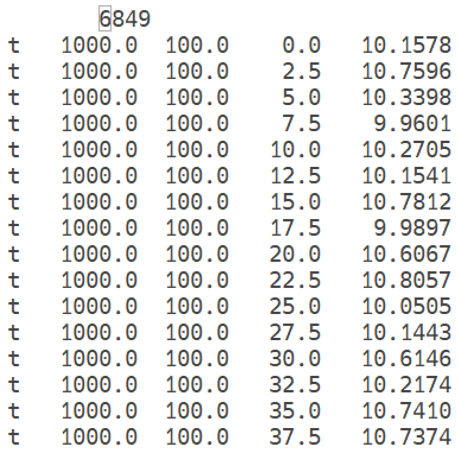

#Theory
Refer to this [paper](https://ccrm.vims.edu/yinglong/SVN_large_files/Yu_etal_OM_2025-SCHISM-Data-Assimilation.pdf).

#Compilation

Pre-requirements: ESMF, PDAF, SCHISM as libraries; the following sections show how to build for each. 

## Build ESMF 

ESMF version must be newer than version 8.1, users can download from https://earthsystemmodeling.org/download/ 

Specify macros depending on your platform resources, the following use intel with intelmpi as example, more options can be found from https://earthsystemmodeling.org/docs/release/latest/ESMF_usrdoc/node10.html#SECTION000106000000000000000 : 

```
export ESMF_DIR= where you untar ESMF 
export ESMF_COMPILER=intel 
export ESMF_OPENMP=OFF 
export ESMF_PTHREADS=OFF 
export ESMF_COMM=intelmpi 
export ESMF_NETCDF=split 
export ESMF_NETCDF_INCLUDE="$NetCDF_FORTRAN_DIR/include -I$NetCDF_FORTRAN_DIR/include $NetCDF_C_DIR/include -I$NetCDF_C_DIR/include" 
export ESMF_NETCDF_LIBPATH="$NetCDF_FORTRAN_DIR/lib -L$NetCDF_FORTRAN_DIR/lib $NetCDF_C_DIR/lib -L$NetCDF_C_DIR/lib" 
export ESMF_NETCDF_LIBS="-lnetcdff -lnetcdf" 
export ESMF_PIO=OFF 
export ESMF_ABI=x86_64_medium  #(optional) 
```
 
Then do the following: 

```
cd $ESMF_DIR 
make info >& tmp #(inspect config info) 
make clobber 
make 
```
 

This may take some time depending on your system. If successful, the library & esmf.mk will be located in `$ESMF_DIR/lib/libO/Linux`.intel.x86_64_medium.intelmpi.default/;  the actual path depends on compile option. 

If this is a fresh install, and you intend to build schism_pdaf after, remember to unset the macro to avoid conflict when building schism_pdaf, like the following: 

```
unset ESMF_DIR 
unset ESMF_COMPILER 
unset ESMF_OPENMP 
unset ESMF_PTHREADS 
unset ESMF_COMM 
unset ESMF_NETCDF 
unset ESMF_PIO 
unset ESMF_ABI 
```
 

##Build PDAF 

PDAF version 3.0 is not compatible with previous version (2.3.1 and older), so if you have previous version, please update it to the latest one. 

Get PDAF 3.0 from github 
```
git clone https://github.com/PDAF/PDAF.git 
```

Choose build option from folder make.arch or make one and put into it. 

Common choices are linux_ifort_impi.h, linux_ifort_mvapich2.h, linux_mpiifort_impi.h.  

Change compiling option if necessary. PDAF requires BLAS and LAPACK library. If your platform provides compiler optimized math library like Intel-MKL, OpenBLAS, AOCL (AMD), these can also be used and you need to config corresponding options in the *.h file. 

Here we use linux_ifort_impi.h as example, define marco as following then build the lib 

```
export ARCH=linux_ifort_impi 
export PDAF_ARCH=$ARCH 
make 
```

If successful, libraries & module files are located in lib and include respectively. 
 

##Build SCHISM 

Follow [cmake instructions on this web](../getting-started/typical-workflow.md) to build schism libs. 

!!!Note
  1. schism_pdaf only support scribe-IO under fully parallel mode (all ensembles run concurrently), and OLDIO (schout output nc files) under flexible mode (ensembles members run in batches, for under-resourced platform).  
  2. If users wish to use scribe-IO, build schism with OLDIO=OFF. If OLDIO is preferred, set OLDIO=ON.  
  3. schism_pdaf also supports static domain decomposition without ParMetis (requires partition.prop as input). If this feature is used, set NO_PARMETIS=ON. 
 

##Build final executable: schism_pdaf 

Get schism_pdaf code with the following: 

```
git clone https://github.com/schism-dev/schism-esmf.git   
```

Define macros for the following: 

```
export ESMFMKFILE= where ESMF lib is located 
export SCHISM_BUILD_DIR= where schism build is located 
export PDAF_LIB_DIR=where PDAF lib is located 
export SCHISM_NO_PARMETIS=off  (If you wish to use static decomposition, then set it on) 
```

If any library like Intel-MKL, OpenBLAS, AOCL (AMD)… is used when compiling PDAF, remember to check LDFLAGS within corresponding compiler section in the beginning of Makefile, make sure linking path & compile options are correct. 

Then we can build schism_pdaf with the following: 

```
make distclean 
make pdaf  
```

If successful, an executable schism_pdaf will be there. 
 

#Prepare the inputs  

The input files include: 

1. standard schism inputs, these files depend on user case setups 
2. schism_pdaf control files 
  - schism_pdaf.cfg: control ensemble size, # of concurrent members, scribe cores (if used), ics_set (same as ics in param.nml: coordinate system) 
```
# This ESMF resource file is read by the program `multi_schism`.  Its only
# configuration label is the number of schism instances to launch.


# count: integer(ESMF_KIND_I4), must be in the range 1..999
schism_count: 8
concurrent_count: 4
# scribe counter for fully parallel mode
scribe_count: 6
# ics_set for scribe cores
ics_set: 2
```
  - global.nml: control parameters for ESMF & PDAF coupling info, set starting date and run hours and DA steps. Note that the time origin info, duration and SCHISM time step need to be consistent with param.nml (under any ihot setting). Specify the DA interval with `num_schism_dt_in_couple` (# of SCHISM steps when calling PDAF), and this value should always be identical as delt_obs in `pdaf.nml`. 
```
&sim_time
  start_year=2000
  start_month=1
  start_day=1
  start_hour=0
  runhours=24 !total run time in hours
  schism_dt=120 !SCHISM dt in sec (must be int)
  num_schism_dt_in_couple=1 !# of SCHISM steps used in the ESMF main stepping
/
```

 - pdaf.nml: control pdaf parameters such as filter type, localization range…etc. 
```
!Namelist file for PDAF configuration
&pdaf_nml
 screen = 3,      ! 0 is default, use 3 to debug 
 filtertype = 7,  ! only accept 4(ETKF),5(LETKF),6(ESTKF),7(LESTKF)
 subtype = 0,     ! subtype of filter, check details in http://pdaf.awi.de/trac/wiki/AvailableOptionsforInitPDAF
 delt_obs = 36,   ! how many steps to do DA
 rms_obs = 0.5,   ! observation error, will be vector later
 forget = 1.0,    ! forgetting factor
 locweight = 4,   ! localization weight type, 0:uniform, 1:Exponential, 2/3/4:5th-order polynomial, check details in init_pdaf
 local_range = 500.0,  ! localization range, use lat/lon if ics=2
 varscale = 1.00, ! Init Ensemble Variance
 ihfskip_PDAF  = 108,  ! ihfskip for DA output, has to be multiple of delt_obs
 nspool_PDAF  =  36,  ! nspool for DA output, has to be multiple of delt_obs
 outf = 1,  ! output handle, 0: no output, 1: ens-mean, 2: members (in schism_001...), 3: both ens-mean & members (has netcdf issues, don't use currently)
 nhot_PDAF = 0,   ! switch to output analysis hotstart rank files
 nhot_write_PDAF = 36, ! nhot_write for DA hotstart output, must be a multiple of ihfskip_PDAF if nhot_PDAF=1
 rms_type  = 1,  ! obs error handle, 1: uniform error from rms_obs; 2: specify error from rms_obs2; 3: specify error from obs files with extra column
 rms_obs2  = 0.02, 0.1, 0.1, 0.2, 0.2, ! specified error with different type obs, z/t/s/u/v
 ens_init  = 1,  ! ens state init option, 1: use eofs & hotstart.nc, 2: same as 1 but use meanstate, 3: restart from ens.bin
 use_global_obs = 0, ! Option to turn on global observation searching, 0=local, 1=global
 Zdepth_limit = 200., ! Control SSH/SSH-A data depth limiter, default: 200m
 min_MSL_acDay = 10., ! Control minimum accumalation MSL day to derived SSH-A, unit: Days
/
``` 

 

3. schism_pdaf ensemble inputs  

We follow suggestions from PDAF and use Pham’s method (2001) to generate ensemble information. More details can be found [here](https://pdaf.awi.de/trac/wiki/EnsembleGeneration).  

In summary, users can do a freerun (no DA) and extract its snapshots for EOFs analysis. Snapshots can be extracted with ncl scripts (extract2bin.ncl or extract2bin_scrio.ncl), and use generate_covar.F90 to generate required inputs as follows: 
```
eofs.dat: number of EOFs 
eofs.bin: EOFs matrix 
svd.bin: svd values from analysis 
meanstate.bin (optional): usually only used for twin experiments.  
```

!!!Note
 generate_covar.F90 is serial program. If any large case needs to be analyzed, large memory is required for analysis and long execution time should be expected. These utility scripts are located at src/PDAF_bindings/utility/gen_cov/  


4. DA_data: observation inputs, file naming is `data_????????.dat` (`?`s with i8.8 format with padding 0s, representing the SCHISM time steps). If the file does not exist, the code still runs with no DA done at that DA step. 

Currently, we support 6 types of observation including: elevation(z), sea-level anomaly(a), temperature (t), salinity(s), u-velocity(u), and v-velocity(v). 

These are ascii files and their format are as follows:  
<figure markdown id='pdaf_data_format'>

<figcaption>Data format for obs in PDAF</figcaption>
</figure>


First row is total number of observations, then followed by obs-type, X, Y, Z, obs-values.  

If rms_type=3, one extra column is needed for observation errors. Users can also specify uniform observation error with rms_type=1,2 in pdaf.nml. 

[Working folder structures](../assets/pdaf_folder_structures.png)

#How to run it 

When inputs are ready, users need to create each ensemble folder with naming schism_??? (i3.3 format), and link schism input file inside. makedir.pl (under src/PDAF_bindings/utility) can be used to create each member outputs dir and link input files in each dir.  

Users also need to create folder DA_output with two subfolder a and f for storing DA outputs after/before the DA step, respectively. 
```
    DA_output/a : Analysis (After DA) 
    DA_output/f : Forecast (Before DA) 
```

To launch the run, users may need to add esmf lib path into `LD_LIBRARY_PATH` in the job script or environment, like the following: 

```
export LD_LIBRARY_PATH=$LD_LIBRARY_PATH: /where_esmf_installed/lib/libO/Linux.intel.64.openmpi.default/  
```

  The following configs are mandatory! 


```
  For scribe-IO: set nc_out=1 in param.nml 
  For OLDIO: set nc_out=0 in param.nml 
```

#Check the outputs 

During the run, users can check job screen output which will show PDAF config information and DA status, as well as timing information. 

If users choose scribe-IO, scribe output will be located in each `schism_???/outputs`. 

DA_output/ will store ensemble-mean files in OLDIO format, and users need to combine them, and link `local_to_global*` from `schism_001/outputs/` to perform the combine task. 

DA effects in `schism_???/output/*.nc` (either scribe or schout format) only can be seen after 2nd DA (if DA frequency = output frequency), since model state update always happens at the beginning of next DA cycle. If users need to check instantaneous DA result, it will be only under `DA_output/a`.

If DA frequency > output frequency, DA effects will be seen after 1st DA + 1 output step.  
