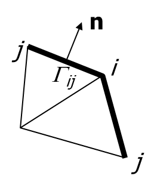
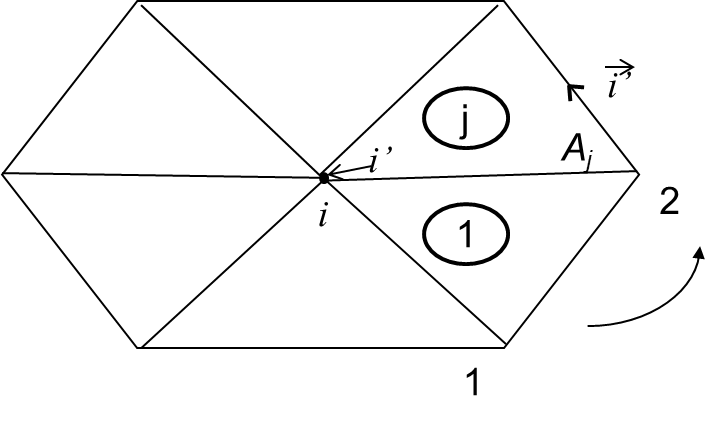
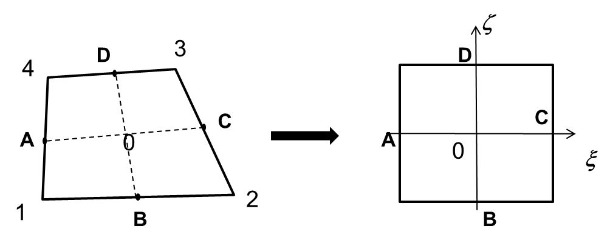
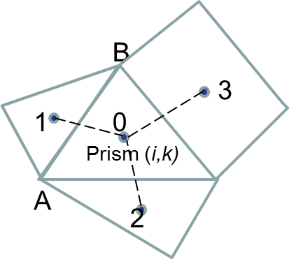
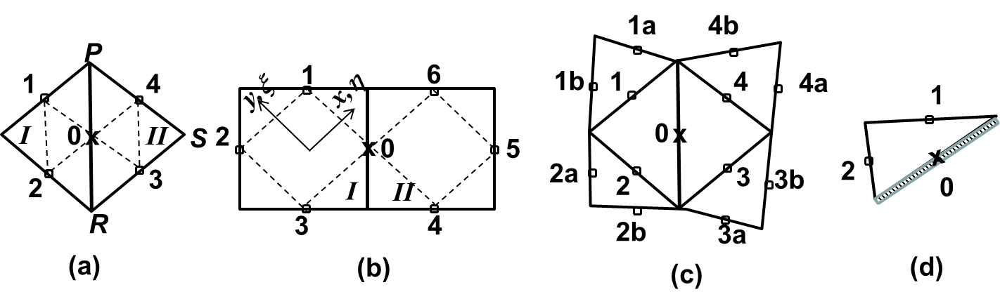

## General formulation
SCHISM solves the barotropic equations first ([Eqs 1-3](physical-formulation.md)) first, as the transport and turbulent closure equations lag one time step behind (in other words, the baroclinic pressure gradient term in the momentum equation is treated explicitly in SCHISM). The transport and turbulent closure equations will be discussed later. Due to the hydrostatic approximation, the vertical velocity $w$ is solved from the 3D continuity equation after the horizontal velocity is found. To solve the coupled [Eqs. 1 and 3](physical-formulation.md), we first discretize them and the vertical boundary conditions semi-implicitly in time as - 

\begin{equation}
\label{eq01}
\frac{\eta^{n+1} - \eta^{n}}{\Delta t} + \theta \nabla \cdot \int_{-h}^{\eta} \pmb{u}^{n+1} dz + (1-\theta) \nabla \cdot \int_{-h}^{\eta} \pmb{u}^{n} dz = 0
\end{equation}

\begin{equation}
\label{eq02}
\frac{\pmb{u}^{n+1} - \pmb{u}^*}{\Delta t} = \pmb{f} - g \theta \nabla \eta^{n+1} - g(1-\theta)\nabla\eta^n + \pmb{m}_z^{n+1} - \alpha\left|\pmb{u}\right|\pmb{u}^{n+1} L(x, y, z)
\end{equation}

\begin{equation}
\label{eq03}
\begin{aligned}
\text{for 3D cells: }
    \begin{cases}
    \nu^n \frac{\partial \pmb{u}^{n+1}}{\partial z} = \pmb{\tau}_{w}^{n+1}, \text{ at } z=\eta^n\\
    \nu^n \frac{\partial \pmb{u}^{n+1}}{\partial z} = \chi^n \pmb{u}_{b}^{n+1}, \text{ at } z=-h
    \end{cases}
\end{aligned}
\end{equation}

where superscripts denote the time step, $0 \leq \theta \leq 1$ is the implicitness factor, $\pmb{u}^*(x, y, z, t^n)$ is the back-tracked value calculated with Eulerian-Lagrangian Method (ELM; [see here](eulerian-lagrangian-method.md)), and $\chi^n = C_D \left| \pmb{u}_{b}^{n} \right|$. The elevations in the 2nd and 3rd terms of Eq. $\ref{eq01}$ are treated explicitly, which effectively amounts to a linearization procedure.

A Galerkin weighted residual statement in the weak form for Eq. $\ref{eq01}$ reads: 

\begin{equation}
\label{eq04}
\int_\Omega \phi_i \frac{\eta^{n+1} - \eta^{n}}{\Delta t} d\Omega + \theta \left[ -\int_\Omega \nabla \phi_i \cdot \pmb{U}^{n+1} d\Omega + \int_\Gamma \phi_i U_n^{n+1} d\Gamma \right] + (1-\theta) \left[ -\int_\Omega \nabla \phi_i \cdot \pmb{U}^{n} d\Omega + \int_\Gamma \phi_i U_n^n d\Gamma \right] = 0, (i = 1, ... , N_p)
\end{equation}

Where $N_p$ is the total number of nodes, $\Gamma \equiv \Gamma_\nu + \overline{\Gamma}_\nu$ is the boundary of the entire domain $\Omega$, with $\Gamma_\nu$ corresponding to the boundary sagments where natural boundary conditions are specified, $\pmb{U} = \int_{-h}^{\eta} \pmb{u}dz$ is the depth-integrated velocity, $U_n$ is its normal component along the boundary, and $\hat{U}_n$ is the boundary condition. In SCHISM, linear shape functions are used (area coordinates for triangles and bi-linear function for quads); thus, $\phi_i$ are familier "hat" functions.

## Locally 2D case
Since there is only one degree of freedom in the vertical dimention in this case, a straightforward integration of Eq. $\ref{eq02}$ gives - 

\begin{equation}
\label{eq05}
\pmb{U}^{n+1} = \check{\pmb{G}} - g\theta\Delta t \frac{H^2}{\tilde{H}} \nabla \eta^{n+1}
\end{equation}

Where $\check{\pmb{G}}$ incorporates explicit term - 

\begin{equation}
\label{eq06}
\check{\pmb{G}} = \frac{H}{\tilde{H}}\left[ \pmb{U}^* + \Delta t \left( \pmb{F} + \pmb{\tau}_w - g(1-\theta)H\nabla\eta^n \right) \right]
\end{equation}

and $\pmb{F}$ is the depth integrated term of $\pmb{f}$, and $\tilde{H}$ is the depth enhanced by the bottom friction and form drag - 

\begin{equation}
\label{eq07}
\tilde{H} = H + \left( \chi + \alpha \left| \pmb{u} \right| H\right)\Delta t
\end{equation}

The net effect of the vegetation is therefore equivalent to increase in the bottom drag, since the 3D structure of the flow/vegetation is not accounted for. Substituting Eq. $\ref{eq05}$ into Eq. $\ref{eq04}$ results in an integral equation for the unknown $\eta^{n+1}$ alone.

## Locally 3D case
We first integrate Eq. $\ref{eq02}$ from bottom to surface - 

\begin{equation}
\label{eq08}
\frac{\pmb{U}^{n+1}-\pmb{U}^*}{\Delta t} = \pmb{F} - gH\theta\nabla\eta^{n+1} - gH(1-\theta)\nabla\eta^n + \pmb{\tau}_w - \chi\pmb{u}_b^{n+1} - \alpha\overline{\left| \pmb{u} \right|} \pmb{U}^{\alpha}
\end{equation}

where we have performed linearization of the vegetation term - 

\begin{equation}
\label{eq09}
\int_{-h}^{z_v} \left|\pmb{u}\right|\pmb{u}dz \approx \overline{\left| \pmb{u} \right|} \equiv \overline{\left| \pmb{u} \right|} \pmb{U}^{\alpha} , (\text{where, }\pmb{U}^{\alpha} = \int_{-h}^{z_v}\pmb{u}dz)
\end{equation}

\begin{equation}
\label{eq10}
\overline{\left| \pmb{u} \right|} = \frac{1}{H^\alpha} \int_{-h}{z_v} \left| \pmb{u}^n \right| dz
\end{equation}

and $H^\alpha = z_v +h$ is the height of vegetation. Note that similar procedures have been used for other nonlinear terms (e.g. the quadratic bottom drag).

To eliminate $\pmb{u}_b^{n+1}$ in Eq $\ref{eq08}$, we invoke the discretized momentum equation at the bottom cell and utilize the fact that the Reynolds stress is constant within the boundary layer, as shown in [Zhang and Baptista (2008)](#zhang-baptista2008) - 

\begin{equation}
\label{eq11}
\frac{\pmb{u}_b^{n+1} - \pmb{u}_b^*}{\Delta t} = \pmb{f}_b - g\theta\nabla\eta^{n+1} - g(1-\theta)\nabla\eta^n - \alpha\left|\pmb{u}_b\right|\pmb{u}_b^{n+1}
\end{equation}

from which $\pmb{u}_b^{n+1}$ can be formally solved as - 

\begin{equation}
\label{eq12}
\pmb{u}_b^{n+1} = \frac{1}{1+\alpha\left|\pmb{u}_b\right|\Delta t} \left[\pmb{u}_b^* +\pmb{f}_b\Delta t - g(1-\theta)\Delta t \nabla \eta^n \right] - \frac{g\theta\Delta t}{1+\alpha\left|\pmb{u}_b\right|\Delta t}\nabla\eta^{n+1}
\end{equation}

The subscript $b$ denotes the top of the bottom cell. Note that the main difference from the original formulation of [Zhang and Baptista (2008)](#zhang-baptista2008) is the appearance of the vegetation term.

The remaining task is to find $\pmb{U}^\alpha$. We’ll discuss two scenarios of submerged and emergent vegetation.

### Emergent vegetation
When the vegetation is locally emergent, i.e., $H^\alpha \geq H$, we have $\pmb{U}^\alpha = \pmb{U}^{n+1}$, and therefore $\pmb{U}^{n+1}$ can be found from Eq. $\ref{eq08}$ and $\ref{eq12}$ as - 

\begin{equation}
\label{eq13}
\pmb{U}^{n+1} = \pmb{G}_1 - \frac{g\theta\hat{H}\Delta t}{1+\alpha\overline{\left| \pmb{u} \right|} \Delta t} \nabla\eta^{n+1}
\end{equation}

where $\pmb{G}_1$ contains explicit terms - 

\begin{equation}
\label{eq14}
\pmb{G}_1 = \frac{\pmb{U}^* + (\pmb{F}+\pmb{\tau}_w)\Delta t - g(1-\theta)\hat{H}\Delta t \nabla\eta^n-\tilde{\chi}\Delta t (\pmb{u}_b^*+\pmb{f}_b\Delta t)}{1+\alpha\overline{\left| \pmb{u} \right|} \Delta t}
\end{equation}

\begin{equation}
\label{eq15}
\tilde{\chi} = \frac{\chi}{1+\alpha \left| \pmb{u}_b \right| \Delta t}
\end{equation}

and $\hat{H}$ is a friction modified depth - 

\begin{equation}
\label{eq16}
\hat{H} = H - \tilde{\chi}\Delta t
\end{equation}

Compared to the original formulation in [Zhang and Baptista (2008)](#zhang-baptista2008), the only change in this depth is the vegetation term in $\tilde{\chi}$.

### Submerged vegetation
When the vegetation is submerged, i.e., $H^\alpha < H$, strong shear and turbulence develop between the vegetation and the overlying flow above it ([ST94](#)). [Nepf and Vivoni (2000)](#) demonstrated that there are two zones for submerged aquatic vegetation (SAV). In the upper canopy (called the ‘vertical exchange zone’), mean shear at the top of the canopy produces vertical turbulent exchange with the overlying water, which plays a significant role in the momentum balance. The lower canopy (‘longitudinal change zone’ as in [Nepf and Vivoni, 2000](#)) communicates with surrounding water predominantly through longitudinal advection. The extent of the vertical exchange of momentum between the vegetation zone and overlying water is dependent on the submergence.

We first integrate the momentum equation (Eq. $\ref{eq02}$) from the bottom to the top of canopy - 

\begin{equation}
\label{eq17}
\pmb{U}^\alpha = \pmb{U}^{*\alpha} + \pmb{F}^\alpha\Delta t - g\theta H^\alpha \Delta t \nabla\eta^{n+1} - g(1-\theta)H^\alpha\Delta t \nabla \eta^n - \alpha \Delta t \overline{\left| \pmb{u} \right|} \pmb{U}^\alpha + \Delta t\nu \Bigr\rvert_{-h}^{z_v}
\end{equation}

where

\begin{equation}
\label{eq18}
\begin{aligned}
\pmb{U}^{*\alpha} = \int_{-h}^{z_v}\pmb{u}^* dz\\
\pmb{F}^\alpha = \int_{-h}^{z_v}\pmb{f}dz
\end{aligned}
\end{equation}

The Reynolds stress at the top of canopy can be calculated from theory proposed by ST94. These authors found through lab experiments that the stress variation inside the vegetation layer approximately follows an exponential law

\begin{equation}
\label{eq19}
\nu\frac{\partial\pmb{u}}{\partial z} \equiv \overline{u'w'} = \pmb{R}_0 e^{\beta_2 (z-z_v)} \text{ for } z \leq z_v
\end{equation}

where $\pmb{R}_0$ is the stress at $z=z_v$, and $\beta_2$ is determined by an empirical formula - 

\begin{equation}
\label{eq20}
\beta_2 = \sqrt{\frac{\sqrt{N_v}}{H^\alpha}} \left[ -0.32 - 0.85 \log_{10} \left( \frac{H - H^\alpha}{H^\alpha} I\right) \right]
\end{equation}

where $I$ is an energy gradient - 

\begin{equation}
\label{eq21}
I = \frac{\chi \left| \pmb{u}_b \right|}{gH}
\end{equation}

which is estimated from the previous time step in the model.

The stress term in Eq. $\ref{eq19}$ therefore becomes

\begin{equation}
\label{eq22}
\nu\frac{\partial\pmb{u}}{\partial z}\Bigr\rvert_{-h}^{z_v} = \beta \chi \pmb{u}_b^{n+1}
\end{equation}

where $\beta = e^{\beta_2(z_v - z_b)}-1$, and $z_b$ is the location of the top of the bottom grid cell. Substituting Eq. $\ref{eq22}$ and Eq. $\ref{eq12}$ into Eq. $\ref{eq17}$ we can solve for $\pmb{U}^\alpha$ as - 

\begin{equation}
\label{eq23}
\pmb{U}^\alpha = \pmb{G}_3 - \frac{g\theta\hat{H}^\alpha\Delta t}{1+\alpha\overline{\left| \pmb{u}\right|}\Delta t}\nabla \eta^{n+1}
\end{equation}

\begin{equation}
\label{eq24}
\pmb{G}_3 = \frac{\pmb{U}^{*\alpha}+\pmb{F}^\alpha\Delta t + \beta\tilde{\chi}\Delta t(\pmb{u}_b^* + \pmb{f}_b\Delta t) - g(1-\theta)\hat{H}^\alpha\Delta t \nabla \eta^n}{1+\alpha\overline{\left| \pmb{u} \right|}\Delta t}
\end{equation}

\begin{equation}
\label{eq25}
\hat{H}^\alpha = H^\alpha + \beta\tilde{\chi}\Delta t
\end{equation}

Finally, substituting Eq. $\ref{eq23}$ and Eq. $\ref{eq12}$ into Eq. $\ref{eq08}$ results in a relationship between $\pmb{U}^{n+1}$ and $\eta^{n+1}$ - 

\begin{equation}
\label{eq26}
\pmb{U}^{n+1} = \pmb{G}_2 - g\theta\overline{\overline{H}}\Delta t \nabla \eta^{n+1}
\end{equation}

\begin{equation}
\label{eq27}
\overline{\overline{H}} = H - \tilde{\chi}\Delta t - c\hat{H}^\alpha
\end{equation}

\begin{equation}
\label{eq28}
c = \frac{\alpha\overline{\left| \pmb{u} \right|}\Delta t}{1 + \alpha\overline{\left| \pmb{u} \right|}\Delta t}
\end{equation}

\begin{equation}
\label{eq29}
\pmb{G}_2 = \pmb{U}^* - c\pmb{U}^{*\alpha} + (\pmb{F} + \pmb{\tau_w})\Delta t - c\pmb{F}^\alpha\Delta t - \tilde{\chi}\Delta t(1+\beta c)(\pmb{u}_b^*+\pmb{f}_b\Delta t) - g(1-\theta)\overline{\overline{H}}\Delta t \nabla\eta^n
\end{equation}

## General case
In summary, the depth-integrated velocity can be expressed in compact form as - 

\begin{equation}
\label{eq30}
\pmb{U}^{n+1} = \pmb{E} - g\theta\breve{H}\Delta t\nabla\eta^{n+1}
\end{equation}

where, 

\begin{equation}
\label{eq31}
\begin{aligned}
\breve{H} = \begin{cases}
\frac{H^2}{\breve{H}}, \text{ 2D }\\
\frac{\hat{H}}{1+\alpha\overline{\left| \pmb{u} \right|}\Delta t}, \text{ 3D emergent }\\
\overline{\overline{H}}, \text{ 3D submerged }
\end{cases}
\end{aligned}
\end{equation}

\begin{equation}
\label{eq32}
\begin{aligned}
\pmb{E} = \begin{cases}
\breve{\pmb{G}}, \text{ 2D }\\
\pmb{G}_1, \text{ 3D emergent }\\
\pmb{G}_2, \text{ 3D submerged }
\end{cases}
\end{aligned}
\end{equation}

Substituting Eq. $\ref{eq30}$ back into Eq. $\ref{eq04}$ gives an equation for the unknown elevations alone - 

\begin{equation}
\label{eq33}
I_1 = I_4 - \theta\Delta t I_3 - (1-\theta)\Delta t I_5 - \theta\Delta t I_6 \text{, for } i=1, \cdots, N_p
\end{equation}

where,

\begin{equation}
\label{eq34}
I_1 = \int_\Omega \left[ \phi_i \eta^{n+1} + g\theta^2\Delta t^2\ \check{H}\nabla\phi_i\cdot\nabla\eta^{n+1}\right]d\Omega
\end{equation}

\begin{equation}
\label{eq35}
I_4 = \int_\Omega \left[ \phi_i\eta^n + \theta\Delta t \nabla\phi_i\cdot\pmb{E} + (1-\theta)\Delta t \nabla\phi_i \cdot\pmb{U}^n \right]d\Omega
\end{equation}

\begin{equation}
\label{eq36}
I_3 = \int_{\Gamma_\nu} \phi_i\hat{U}_n^{n+1}d\Gamma_\nu
\end{equation}

\begin{equation}
\label{eq37}
I_5 = \int_\Gamma \phi_i U_n^n d\Gamma
\end{equation}

\begin{equation}
\label{eq38}
I_6 = \int_{\overline{\Gamma}_\nu} \phi_i U_n^{n+1} d\overline{\Gamma}_\nu
\end{equation}

Following standard finite-element procedures, and using appropriate essential and natural boundary conditions, SCHISM solves Eq. $\ref{eq33}$ to determine the elevations at all nodes. Note that the RHS terms $I_{3-6}$ are known; in the case of $I_6$, the integrals on $\overline{\Gamma}_\nu$ need not be evaluated since the essential boundary conditions are imposed by eliminating corresponding rows and columns of the matrix.

The matrix resulting from Eq. $\ref{eq33}$ is sparse and symmetric. It is also positive-definite as long as the depth $\breve{H}$ is non-negative (`ihhat=1`); numerical experiments indicated that even this restriction can be relaxed for many practical applications that include shallow areas. We show that the addition of vegetation does not introduce additional stability constraint. The effects of the vegetation on $\breve{H}$ are generally similar to the bottom friction. For the 2D case, $\breve{H}$ is always positive. For the 3D emergent case, the vegetation term in the denominator is positive and so does not change the sign. For the 3D submerged case, as $\alpha \rightarrow 0$, previous results of [Zhang and Baptista (2008)](#zhang-baptista2008) are recovered. As $\alpha \rightarrow \infty$ (i.e., very dense vegetation), the friction term (the second term in Eq. $\ref{eq27}$) dwarfs in comparison with the vegetation term (the third term in Eq. $\ref{eq27}$), and therefore the friction is negligible under dense vegetation. Since $c \rightarrow 1$ as $\alpha \rightarrow \infty$, $\breve{H}$ approaches the submergence $H-H^\alpha$, which is positive. When the submergence is very small (i.e. almost emergent vegetation), $\breve{H} \rightarrow 0$ and the conditioning of the matrix would somewhat deteriorate but the model remains stable. Physically, this means that very strong shear will develop near the canopy.

It’s important to notice that the friction-modified depth is different between 2D and 3D cases, which has implications in shallow depths. We show more details of the evaluation of the integrals $I_i$ below. The corresponding constant for 2D prisms is always positive (see below) and therefore the 2D mode is inherently more stable than 3D mode; consequently, judiciously leveraging SCHISM’s polyphorphism enhances stability near the wetting and drying interface. The matrix can be efficiently solved using a pre-conditioned Conjugate Gradient method ([Casulli and Cattani 1994](#casulli1994)). This simple matrix solver is implemented in SCHISM; alternatively, the efficient parallel matrix solver PETSc can be used for large matrices.

In the model, the decision on 2D/3D emergent/3D submerged scenarios is made at each side (where the velocity is defined) based on the total depths from the previous time step and the transition of regimes is handled in the model.

### Integral $I_3$
This is a boundary integral that only need to be evaluated when the node $i$ is located on an open boundary segment where Neuman-type B.C. is prescribed. Since the unknowns vary linearly along any side, we have (cf. Figure [1](#figure01)) -

\begin{equation}
\label{eq39}
I_3 = \sum_j \frac{L_{ij}}{2} \sum_{k=kbs}^{N_z-1} \Delta z_{j,k+1} \frac{\hat{u}_{j,k+1}^{n+1} + \hat{u}_{j,k}^{n+1}}{2}
\end{equation}

where the outer sum is carried out along the 2 adjacent open side $j$, $L_{ij}$ is the side length, $\Delta z_{j,k+1}$ is the layer thickness along side $j$, and $kbs$ is the local bottom index.

<figure markdown id="figure01">

<figcaption>Boundary node i with adjacent sides.</figcaption>
</figure>

If a Flather-type radiation condition ([Flather 1987](#flather1987)) needs to be applied, it can be done in the following fashion - 

\begin{equation}
\label{eq40}
\hat{U}_n^{n+1} - \overline{U}_n = \sqrt{\frac{g}{H}} (\eta^{n+1} - \overline{\eta})
\end{equation}

where $\overline{U}_n$ and $\overline{\eta}$ are specified mean incoming current and mean elevation. Then - 

\begin{equation}
\label{eq41}
I_3 = \sum_j \frac{L_{ij}(\overline{U}_n)_{ij}}{2} + \frac{L_{ij}\sqrt{gH_{ij}}}{6} \left[ 2(\eta_i^{n+1} - \overline{\eta}_i) + (\eta_j^{n+1} - \overline{\eta}_j) \right]
\end{equation}

In this case, the unknown $\eta^{n+1}$ need to be moved to the LHS, and the diagonal (associated with $\eta_i^{n+1}$) is enhanced as a result and matrix symmetry is preserved.

### Integral $I_5$
Similar to $I_3$, we have - 

\begin{equation}
\label{eq42}
I_5 = \sum_j \frac{L_{ij}}{2} \sum_{k=kbs}^{N_z-1} \Delta z_{j, k+1} \frac{u_{j, k+1}^{n} + u_{j,k}^{n}}{2}
\end{equation}

### Integral $I_1$
This is the only implicit term. Referring to Figure [2](#figure02), we have - 

\begin{equation}
\label{eq43}
I_1 = \sum_{j=1}^{Nb(i)} \sum_{l=1}^{i34(j)} \eta_{j,l}^{n+1} \int_{A_j} \hat{\phi_{i'}} \hat{\phi_l} dA_j + g\theta^2 \Delta t^2 \sum_{j=1}^{Nb(i)} \overline{\check{H}_j} \sum_{l=1}^{i34(j)} \eta_{j,l}^{n+1} \int_{A_j} \nabla\hat{\phi_{i'}}\cdot\nabla\hat{\phi_l} dA_j
\end{equation}

Where $j$ is a neighbouring element of $i$, $i'$ is the local index of node $i$ inside element $j$, overbar in $\overline{\check{H}}$ denotes element averating, and $\hat{\phi}$ is the local linear shape function. We discuss the case of a triangle and quad element.

<figure markdown id="figure02">
{width=500px}
<figcaption>Node ball used in calculating integral I 1.</figcaption>
</figure>

#### Case I: triangle
The 2 integrals can be evaluated analytically as - 

\begin{equation}
\label{eq44}
\int_{A_j} \hat{\phi_{i'}} \hat{\phi_l} dA_j = \frac{1+\delta_{i',l}}{12}A_j
\end{equation}

\begin{equation}
\label{eq45}
\int_{A_j} \nabla\hat{\phi_{i'}} \cdot \nabla\hat{\phi_l} dA_j = \frac{\vec{i'}\cdot\vec{l}}{4A_j}
\end{equation}

where $\vec{i'}$ and $\vec{l}$ are two vectors along side $i'$ and $l$ respectively, and $\delta_{i',l}$ is the Kronecker delta - 

\begin{equation*}
\delta_{i',l} = \begin{cases}
1, i' = l \\
0, i' \neq l
\end{cases}
\end{equation*}

#### Case II: Quad
We can analytically evaluate integral Eq. $\ref{eq44}$ as - 

\begin{equation}
\label{eq46}
\int_{A_j} \hat{\phi_{i'}}\hat{\phi_l}dA_j = \frac{A_j}{16}\left(1+\frac{1}{3}\xi_{i'}\xi_l\right)\left(1+\frac{1}{3}\varsigma_{i'}\varsigma_l\right) + \frac{B_1}{96}\left(1+\frac{1}{3}\varsigma_{i'}\varsigma_l\right)\left(\xi_{i'}+\xi_l\right) + \frac{B_2}{96}\left(1+\frac{1}{3}\xi_{i'}\xi_l\right)\left(\varsigma_{i'}+\varsigma_l\right)
\end{equation}

Where $(\xi, \varsigma)$ are local coordinates, and $B_1$ and $B_2$ are 2 geometric constants (Figure [3](#figure03)) - 

\begin{equation}
\label{eq47}
\begin{aligned}
B_1 = \left(\vec{12}\times\vec{43}\right)_k = \left(x_2-x_1\right)\left(y_3-y_4\right) - \left(x_3-x_4\right)\left(y_2-y_1\right)\\
B_2 = \left(\vec{23}\times\vec{14}\right)_k
\end{aligned}
\end{equation}

<figure markdown id="figure03">

<figcaption>Quad element and local transformation.</figcaption>
</figure>

The other integral Eq. $\ref{eq45}$ cannot be evaluated analytically and so we use the 4-point Gauss quadrature.

### Integral $I_4$
This integral contains most of the explicit terms. Most terms are straightforward to evaluate, e.g., using element averaging or analytical integration (in the case of volume sources/sinks); the integrals involving the shape function or its derivative can be calculated using the similar method as in $I_1$. Therefore we will only discuss the a few terms below given their importance in SCHISM.

#### Baroclinicity
Since a FVM is used to solve the tracers (including T,S) at the prism center, we evaluate the density gradient at prism center via a reconstruction method. Referring to Figure [4](#figure04), given a prism center '0', we first project the gradient onto vectors connecting adjacent prism centers - 

\begin{equation}
\label{eq48}
\frac{\partial\rho}{\partial x}\left(x_1-x_0\right) + \frac{\partial\rho}{\partial y}\left(y_1-y_0\right) = \rho_1-\rho_0
\end{equation}

\begin{equation}
\label{eq49}
\frac{\partial\rho}{\partial x}\left(x_2-x_0\right) + \frac{\partial\rho}{\partial y}\left(y_2-y_0\right) = \rho_2-\rho_0
\end{equation}

\begin{equation}
\label{eq50}
\frac{\partial\rho}{\partial x}\left(x_3-x_0\right) + \frac{\partial\rho}{\partial y}\left(y_3-y_0\right) = \rho_3-\rho_0
\end{equation}

after a cubic spline interpolation has been performed to calculate the density at prism '1' at the same vertical location as ‘0’ (i.e. ($i$,$k$)). Note that if the element $i$ is a quad, we will have 4 equations. We then solve pairs of equations to find for $\nabla\rho$, i.e., Eq. $\ref{eq48}$ with Eq. $\ref{eq49}$, Eq. $\ref{eq49}$ with Eq. $\ref{eq50}$, and Eq. $\ref{eq50}$ with Eq. $\ref{eq48}$. If the 3 centers happen to be co-linear, the equations have no solution and are discarded; however, at least 1 pair has a valid solution. 

<figure markdown id="figure04">

<figcaption>Reconstruction method. i is the element index and k is the vertical index.</figcaption>
</figure>

If a neighbor does not exist (boundary) or is dry, we replace the corresponding equation with the no-flux B.C.; e.g., if AB is such a side, then -

\begin{equation}
\label{eq51}
\frac{\partial\rho}{\partial y}\left(x_A-x_B\right) + \frac{\partial\rho}{\partial x}\left(y_B-y_A\right) = 0
\end{equation}

After the density gradients are found at prism centers, a simple linear interpolation in the vertical is used to calculate the gradients at side centers (and half levels). Then the trapezoidal rule is used to compute the baroclinic term: $-\frac{g}{\rho_0}\int_z^\eta\nabla\rho dz$. This will also be utilized in the solution of the momentum equation.

#### Horizontal viscosity
Momentum stabilization is an important consideration in designing advection and viscosity schemes. [Zhang et al. (2016)](#zhang2016) demonstrated that the standard Laplacian viscosity is equivalent to the 5-point Shapiro filter (see below) on uniform grids; however, on non-uniform grids, it may behave like an ‘amplifier’ and therefore the filter form should be used instead (Figure [5a,b](#figure05)) - 

\begin{equation}
\label{eq52}
\nabla\cdot\left(\mu\nabla u\right)\Biggr|_0 = \frac{\mu_0}{\sqrt{3}A_I}\left(u_1+u_2+u_3+u_4-4u_0\right)
\end{equation}

where all velocities have been interpolated onto a horizontal plane using linear interpolation in the vertical. 

<figure markdown id='figure05'>

<figcaption>Shapiro filters and viscosity stencil for (a) triangular and (b) quadrangular elements. 'I' and 'II' are 2 adjacent elements of side of interest ('0'). The extended stencil used in constructing bi-harmonic viscosity is shown in (c). The special case of a boundary side is shown in (d).</figcaption>
</figure>

The bi-harmonic viscosity is often superior to the Laplacian viscosity as it is more discriminating in removing sub-grid instabilities without adversely affecting the resolved scales of flow (Griffies and Hallberg 2000). The bi-harmonic viscosity can be implemented by applying the Laplacian operator twice. Referring to Figure [5c](#figure05), we have - 

\begin{equation}
\label{eq53}
\begin{aligned}
-\lambda\nabla^4u\Biggr|_0 
&= -\lambda\gamma_3\left( \nabla^2 u_1 + \nabla^2 u_2 + \nabla^2 u_3 + \nabla^2 u_4 - 4\nabla^2 u_0 \right)\\
&= \frac{\gamma_2}{\Delta t}\left[ 7\left( u_1 + u_2 + u_3 + u_4\right) - u_{1a} - u_{1b} - u_{2a} - u_{2b} - u_{3a} - u_{3b} - u_{4a} - u_{4b} - 20u_0 \right]
\end{aligned}
\end{equation}

where $\lambda$  is a hyper viscosity in $m^4/s$, $\gamma_3 = \frac{1}{\sqrt{3}A_I}$ and $\gamma_2 = \lambda\gamma_3^2\Delta t$ is a diffusion-number-like dimensionless constant. We found that in practice $\gamma_2 \leq 0.025$  is sufficient to suppress inertial spurious modes.

**References**

Casulli, V. and E. Cattani (1994) Stability, accuracy and efficiency of a semi-implicit method for 3D shallow water flow. Computers & Mathematics with Applications, 27, pp. 99-112.

Flather, R.A. (1987) A tidal model of Northeast Pacific. Atmosphere-Ocean, 25, pp. 22-45.

Zhang, Y. and Baptista, A.M. (2008) "SELFE: A semi-implicit Eulerian-Lagrangian finite-element model for cross-scale ocean circulation", Ocean Modelling, 21(3-4), 71-96

Zhang, Y., Ye, F., Stanev, E.V., Grashorn, S. (2016). Seamless cross-scale modeling with SCHISM, Ocean Modelling, 102, 64-81. doi:10.1016/j.ocemod.2016.05.002