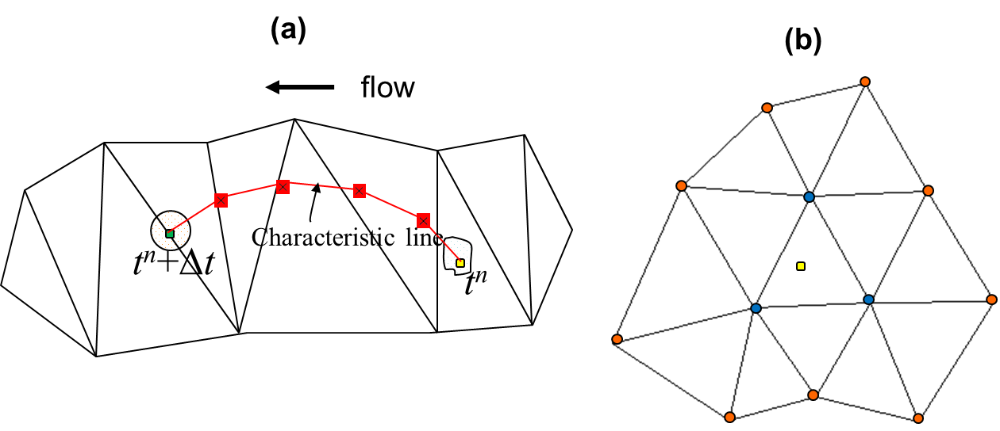
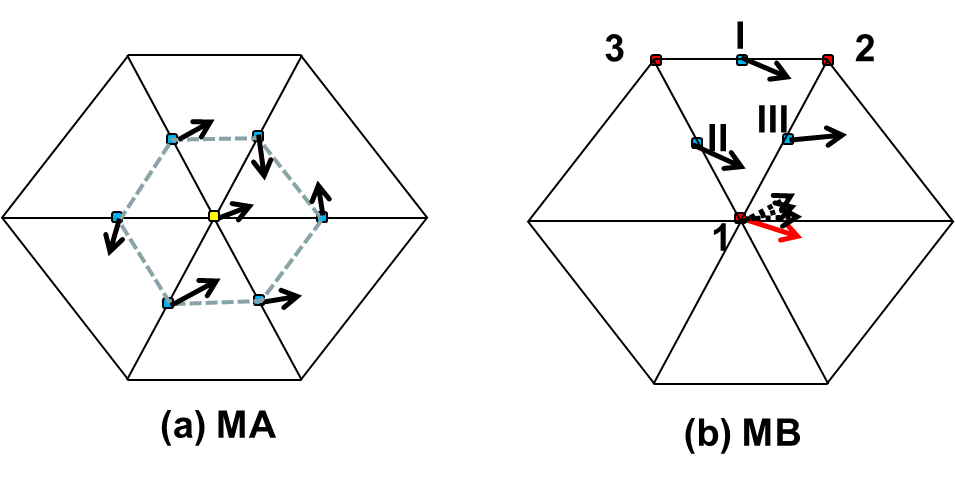

The default option for the momentum advection in SCHISM is ELM, which is one of few explicit methods that are unconditionally stable. Under this method, the momentum advection is approximated as -

\begin{equation}
\label{eq01}
\frac{D\pmb{u}}{Dt}\cong\frac{\pmb{u}(\pmb{x}, t^{n+1}) - \pmb{u}(\pmb{x}^*, t^n)}{\Delta t}
\end{equation}

where $\pmb{x}$ is a shorthand for $(x, y, z)$, and $\pmb{x}^*$ is the location of the foot of characteristic line (FOCL), calculated from the characteristic equation - 

\begin{equation}
\label{eq02}
\frac{D\pmb{x}}{Dt} = \pmb{u}
\end{equation}

The location $\pmb{x}^*$ is found via a backtracking step, standard in an ELM, via backward integration of Eq. $\ref{eq02}$ starting from a given location ($\pmb{x}$), which is in our case a side center at whole level where the horizontal velocity $\pmb{u}$ is defined. The fixed starting location (Eulerian framework) followed by a Lagrangian tracking step gives the name Eulerian-Lagrangian method. Therefore the ELM consists of two major steps: a backtracking step (Figure [1](#figure01)a) and an interpolation step at FOCL (Figure [1](#figure01)b). We further sub-divide the tracking step into smaller intervals (based on local flow gradients), and use a 2nd-order Runge-Kutta method (mid-point method) within each interval, in order to accurately track the trajectory. Although exact integration methods have been proposed (Ham et al. 2006), their implementation is complicated for a 3D (triangular and quadrangular) prism and in the exceptional cases of wetting and drying interfaces. The interpolation step serves as an important control for numerical diffusion/dispersion in the ELM, and we therefore experimented with several options as shown below. However, before we get to this, we first explain how SCHISM converts the velocities at sides to the velocities at nodes, as the latter are required in the interpolation of the velocities along the characteristic line and at the FOCL (Figure [1](#figure01)).

<figure markdown id='figure01'>
{width=800}
<figcaption>Two steps in Eulerian–Lagrangian method. (a) The characteristic equation is integrated backward in space and time, starting from a side center (the green dot). The characteristic line is further subdivided into smaller intervals (bounded by the red dots), based on local flow gradients, and a 2nd-order Runge–Kutta method is used within each interval. The foot of characteristic line is marked as a yellow dot. Note that the vertical position of the trajectory is also changing and so the tracking is in 3D space. (b) Interpolation is carried out at FOCL (yellow dot), based on either the nodes of the containing elements (blue dots), or the 2-tier neighborhood (blue plus red dots; the latter are the neighbors of the blue dots) using a dual kriging method. Proper linear vertical interpolation has been carried out first to bring the values at each node onto a horizontal plane before the horizontal interpolation is done.</figcaption>
</figure>

As explained by Danilov (2012), the conversion method used bears important ramifications: judicious averaging (e.g., from side to elements or to node etc.) may greatly reduce the need later on for filters to remove the inertial spurious modes while still keeping the inherent numerical dissipation low. In fact, one could have used the discontinuous velocity calculated within each element to carry out the backtracking, but this would introduce insufficient amount of dissipation to suppress the inertial modes.

In the first approach (‘MA’ hereafter; `indvel=1`), we use inverse distance weights to interpolate from velocities at surrounding sides onto a node (Figure [2a](#figure02)). This introduces diffusion which may be excessive in our experience, and therefore no further stabilization (via filters or viscosity) is required for this approach (see the discussion of stabilization in Danilov 2012). This approach works well in shallow waters especially for the inundation process, as numerical stability often trumps the order of accuracy there. 

<figure markdown id='figure02'>
{width=800}
<figcaption>Two methods of converting side velocities to a node velocity. (a) Inverse distance interpolation from sides (blue dots) to node (yellow dot); (b) use of FEM shape function to find the node velocity within each element first (the red arrow), i.e. u1 = uII + uIII –uI , followed by a simple averaging method to calculate the final value from all of its surrounding elements (dashed arrows)</figcaption>
</figure>

The 2nd approach (‘MB’ hereafter; `indvel=0`) is more elegant and utilizes the (linear) shape function in FEM within each element to calculate the node velocities. This is equivalent to using the $P^{NC}$ non-conformal shape function (Le Roux et al. 2005) as one essentially interpolates based on information at sides (Figure [2b](#figure02)). Because each element produces a velocity vector at each of its nodes, the final node velocity is the simple average of the values calculated from all of the surrounding elements (Figure [2a](#figure02)). This approach introduces much less dissipation, but does exhibit inertial spurious modes. As a result, further stabilization is required. To this end, SCHISM uses a 5-point Shapiro filter (Shapiro 1970) as illustrated in Figure [5ab](./barotropic-solver.md#figure05); the velocity at a side ‘0’ is filtered as -

\begin{equation}
\label{eq03}
\tilde{\pmb{u}_0} = \pmb{u}_0 + \frac{\gamma}{4}\left( \pmb{u}_1 + \pmb{u}_2 + \pmb{u}_3 + \pmb{u}_4 -4\pmb{u}_0 \right)
\end{equation}

with the strength usually set as $\gamma = 0.5$.  It’s obvious that the filter is analogous to the Laplacian viscosity implementation in the previous section. It proves to be very effective in removing the sub-grid scale inertial spurious modes; however, it tends introduces too much dissipation in the eddying regime, and therefore should be used only in the non-eddying regime, i.e. shallow waters. Since it’s equivalent to the Laplacian viscosity, we may remove this filter in the future options and ask users to use `ihorcon=1` instead.

Once the node velocities are found via MA or MB, the interpolation at the FOCL is carried out in 3D space. A simple linear interpolation is used in the vertical dimension as the results from the cubic-spline interpolation turned out to be similar, due to more confined spatial scales and smaller grid sizes in the vertical. The horizontal interpolation can be done using either a simple linear shape function based on all of the nodes of the containing element (‘LI’ hereafter), or a higher-order dual kriging method (‘KR’ hereafter) suggested by Le Roux et al. (1997) Figure [5b](./barotropic-solver.md#figure05) The latter requires larger stencil around the FOCL, and for best parallel efficiency we use a 2-tier neighborhood as shown in Figure [5b](./barotropic-solver.md#figure05). Given a total of N nodes available in the 2-tier neighborhood, the interpolation function is constructed as (Le Roux 1997) - 

\begin{equation}
\label{eq04}
f^h(x,y) = (\alpha_1 + \alpha_2 x + \alpha_3 y) + \sum_{i=1}^N \beta_i K(r_i)
\end{equation}

where the first 3 RHS terms inside the parentheses represent a mean drift (modeled as a linear function), and the 2nd term is the fluctuation part, $\alpha_j$, $\beta_i$ are unknown coefficients, and $r_i$ is the distance between ($x$,$y$) and ($x_i$,$y_i$), with $i$ being a node. The following forms of the generalized covariance function are commonly used (Le Roux et al. 1997) - 

\begin{equation}
\label{eq05}
K(r) = -r, r^2\log(r), r^3, -r^5, r^7
\end{equation}

with increasing dispersion for the higher-degree functions; therefore in practice, the last two functions are seldom used. In the following we will refer to the first 3 functions as ‘KR1’, ‘KR2’ and ‘KR3’ respectively.

The equations to solve for the unknown coefficients are - 

\begin{equation}
\label{eq06}
\begin{aligned}
f^h(x_i, y_i) = d_i, 1 \leq i \leq N\\
\sum_{i=1}^{N} \beta_i = 0\\
\sum_{i=1}^{N} x_i\beta_i = 0\\
\sum_{i=1}^{N} y_i\beta_i = 0
\end{aligned}
\end{equation}

where $d_i$ are given data at each node. The 1st equation in Eqs. $\ref{eq06}$  indicates that the dual kriging is an exact interpolator, and the other 3 equations are derived from minimization of the variance of estimation error (Le Roux et al. 1997). Note that the matrix of Eqs. $\ref{eq06}$ is dependent only on geometry and therefore can be inverted and stored before the time stepping loop to achieve greater efficiency. After the coefficients are found, the interpolation at FOCL is done via Eqs. $\ref{eq04}$.

The smaller stencil used here compared to that used by Le Roux et al. (1997) leads to larger numerical dispersion. Therefore an effective method must be found to control the dispersion, and we use the ELAD scheme of Shchepetkin and McWilliams (1998) for this purpose. The essence of ELAD is to iteratively diffuse the _excess_ field, instead of the original signal, using a diffusion operator/smoother. The viscosity scheme presented in the previous sub-section is used as the diffusion operator. The procedure is summarized as follows - 

1. Find the local max/min at FOCL. Assuming that the prism at FOCL starting from a side $j$ and level $k$ is ($kf$,$nf$), where $nf$ is the element index and $kf$ is the vertical index, the max/min are found in the prism ($kf$,$nf$) as -

    \begin{equation}
    \label{eq07}
    \begin{aligned}
    u_{k, j}^{max} = \max_{l=1:i34, k=-1,0} u_{kf+k, im(l, nf)}\\
    u_{k, j}^{min} = \min_{l=1:i34, k=-1,0} u_{kf+k, im(l, nf)}
    \end{aligned}
    \end{equation}

    where $im()$ enumerates all nodes of an element.

2. The excess field associated with (k,j) is - 

    \begin{equation}
    \label{eq08}
    \varepsilon_{k, j}^{(1)} = \max\left[ 0, u_{k,j}^{n+1, 1} - u_{k,j}^{\max} \right] + \min\left[ 0, u_{k,j}^{n+1, 1} - u_{k,j}^{\min} \right]
    \end{equation}

    where $u_{k,j}^{n+1, 1}$ is the interpolated value at FOCL.

3. Apply a global diffusion operator to $\varepsilon$ to obtain estimated velocity at the next iteration - 

    \begin{equation}
    \label{eq09}
    u_{k,j}^{n+1, 2} = u_{k, j}^{n+1, 1} + \mu'\Delta t \nabla^2 \varepsilon_{k, j}^{(1)}, \forall j, k
    \end{equation}

    and we use 5-point filter with maximum strength - 

    \begin{equation}
    \label{eq10}
    u_{k,j}^{n+1, 2} = u_{k, j}^{n+1, 1} + \frac{1}{8} \left[ \varepsilon_{k, 1}^{(1)} + \varepsilon_{k, 2}^{(1)} + \varepsilon_{k, 3}^{(1)} + \varepsilon_{k, 4}^{(1)} - 4 \varepsilon_{k, j}^{(1)} \right]
    \end{equation}

    where subscripts 1-4 are the 4 adjacent sides of $j$ (Figure [5ab](./barotropic-solver.md#figure05));

4. Calculate the new excess field using $u_{k, j}^{n+1, 2}$ in (2) and apply the filter (3) again to find the velocity at the next iteration $u_{k,j}^{n+1, 3}$. Iterate until the excess field falls below a prescribed threshold. In practice, 10 iterations are usually sufficient to bring the excess field below an acceptable level ($10^{-4} m/s$); the remaining excess field is then further smoothed with the viscosity.

The filter in Eqs. $\ref{eq10}$ is conservative in the sense that it only redistributes excess mass and does not introduce any additional mass. This is similar in spirit to the conservative scheme of Gravel and Staniforth (1994) but appears simpler in implementation. At a boundary side $j$, Eqs. $\ref{eq10}$ is modified in order to maintain the conservation - 

\begin{equation}
\label{eq11}
u_{k,j}^{n+1, 2} = u_{k, j}^{n+1, 1} + \frac{1}{8} \left[ \varepsilon_{k, 1}^{(1)} + \varepsilon_{k, 2}^{(1)} - 2 \varepsilon_{k, j}^{(1)} \right]
\end{equation} 

where subscripts '1' and '2' are the 2 adjacent sides of $j$ (Figure [5d](./barotropic-solver.md#figure05)). Note that since the linear interpolation scheme (LI) does not introduce local extrema, ELAD is not applied there.

The various schemes presented above can be freely combined, resulting in schemes like ‘MA-LI’, ‘MB-KR2’ etc. Experiments indicate that overall the best scheme is MB-LI for both eddying and non-eddying regimes (Zhang et al. 2016).

**References**

- Ham, D.A., Pietrzak, J., and G.S. Stelling (2006), A streamline tracking algorithm for semi-Lagrangian advection schemes based on the analytic integration of the velocity field, Journal of Computational and Applied Mathematics 192, 168–174.
- Danilov, D. (2013) Ocean modeling on unstructured meshes, Ocean Mod., 69, 195-210.
- Gravel, S. and A. Staniforth (1994), A mass-conserving semi-Lagrangian scheme for the shallow-water equations, Mon. Wea. Rev., 122, 243-248.
- Le Roux, D.Y., Lin, C.A., Staniforth, A. (1997), An accurate interpolating scheme for semi-Lagrangian advection on an unstructured mesh for ocean modelling, Tellus, 49A, 119–138.
- Le Roux, D.Y., Sène, A., Rostand, V., and E. Hanert (2005), On some spurious mode issues in shallow-water models using a linear algebra approach. Ocean Modelling 10, 83–94.
- Shapiro, R. (1970), Smoothing, filtering and boundary effects, Rev. Geophys. Space Phys. 8 (2), 359–387.
- Shchepetkin, A.F. and J.C. Mcwilliams (1998), Quasi-Monotone Advection Schemes Based on Explicit Locally Adaptive Dissipation , Monthly Weather Review, 126, 1541-80.
- Zhang, Y., Ye, F., Stanev, E.V., Grashorn, S. (2016). Seamless cross-scale modeling with SCHISM, Ocean Modelling, 102, 64-81. doi:10.1016/j.ocemod.2016.05.002
