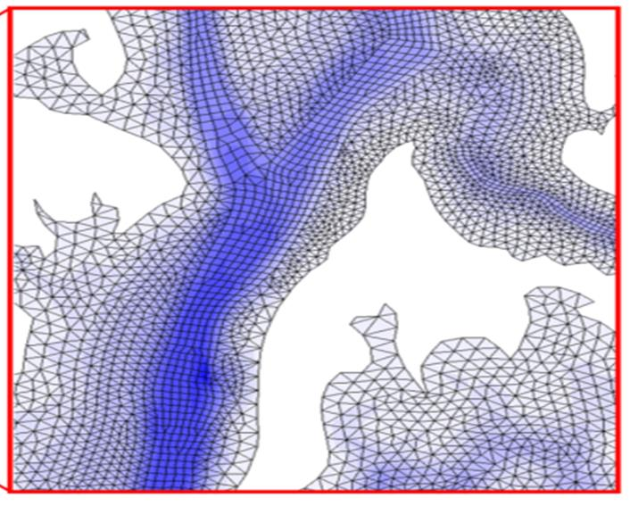
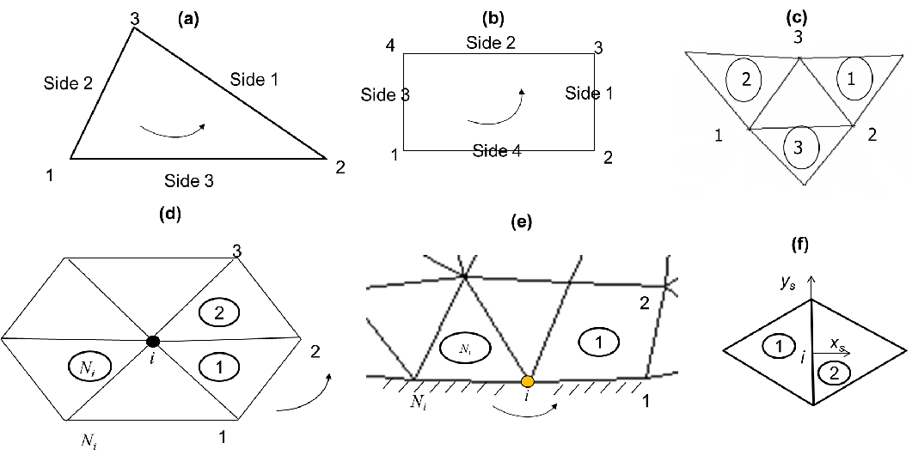
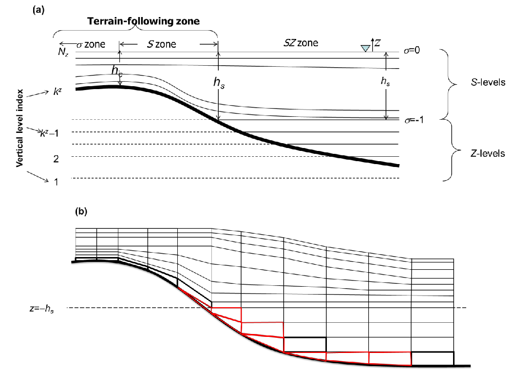
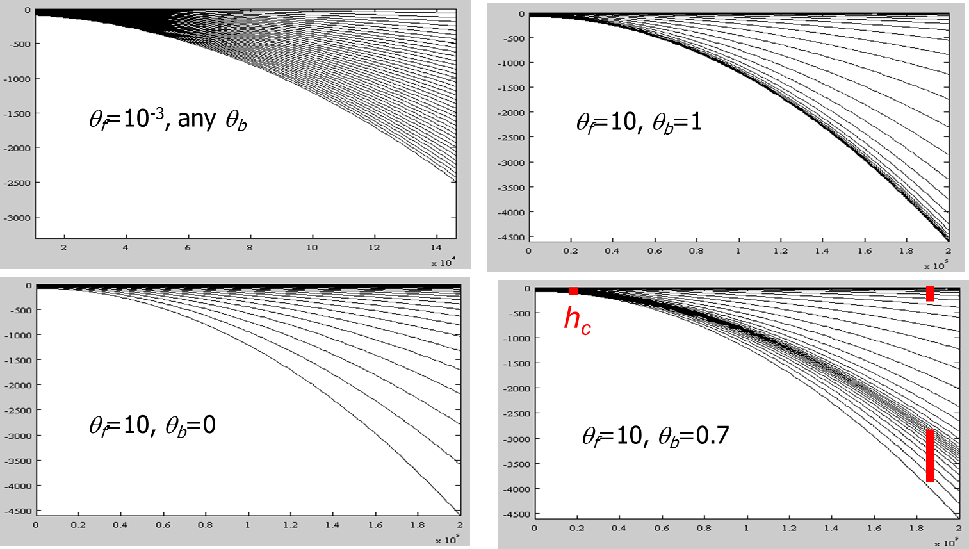
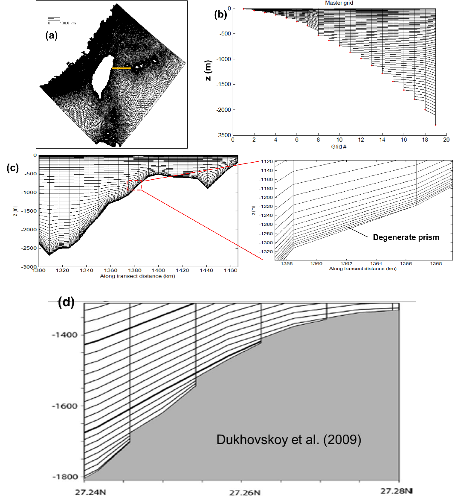
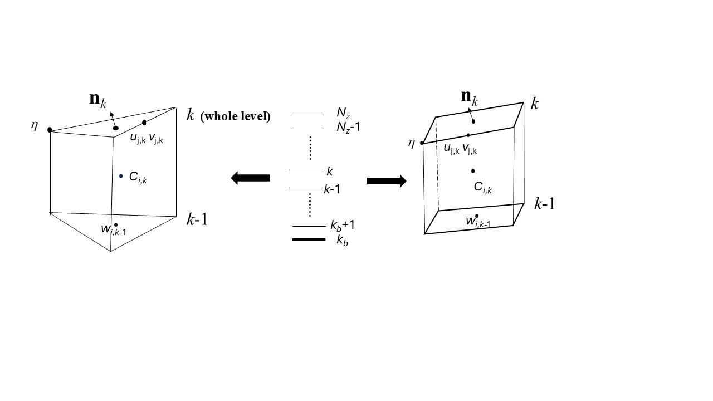
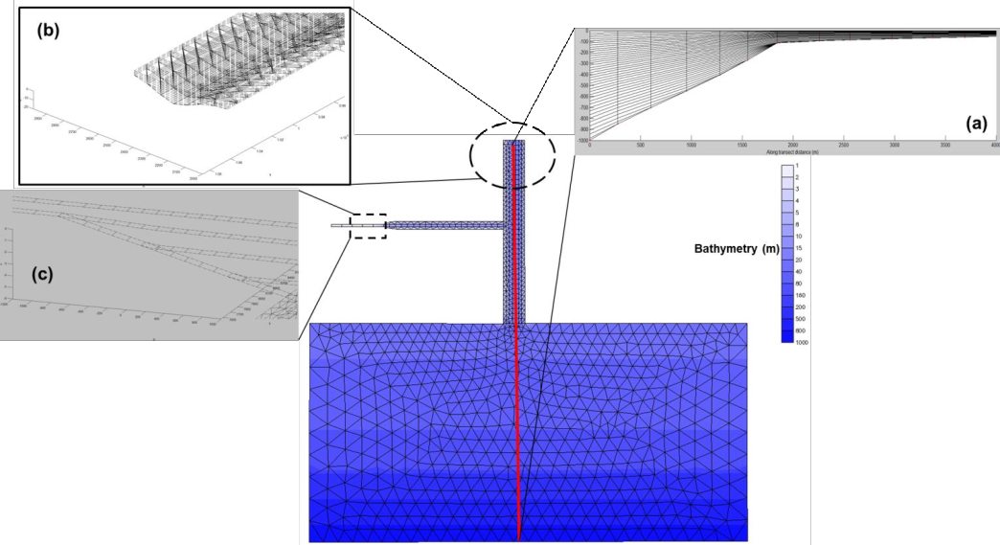

As a FE model, SCHISM uses flexible UG in the horizontal and flexible vertical coordinate systems in the vertical dimension. 

## Horizontal grid
Hybrid triangular-quad elements are used in the horizontal, to take advantage of the superior boundary-fitting capability of triangles and efficiency/accuracy of quads in representing certain features like channels. Figure [1](#figure01) shows an example of horizontal grid.

<figure markdown id="figure01">
{width=400}
<figcaption>Example horizontal grid (hgrid.gr3) of SCHISM.</figcaption>
</figure>

Figure [2](#figure02) shows our convention of numbering local nodes/sides etc.

<figure markdown id="figure02">

<figcaption>Horizontal element convention. Local indices of nodes/sides for (a) triangular element, and (b) quad element. (c) Adjacent elements of an element (following side convention). (d,e): Local ball info (surrounding elements/nodes of node i) for (d) internal and (e) boundary node i. (f) shows a local side center-based frame used to calculate the normal fluxes; the (global) element number of “1” is smaller than “2”, and xs axis always points out of “1”. We follow counter-clockwise convention/right-hand rule.</figcaption>
</figure>

## Vertical grid
### Hybrid SZ grid
The 1st type uses a hybrid S (terrain-following generalized s-coordinates; Song and Haidvogel 1994) and _shaved z_ coordinates, with the latter always being placed underneath the former at a prescribed demarcation depth $h_s$. Note that the use of shaved z layers is optional and the users can use a pure $S$ grid with a choice of $h_s$ greater than the maximum depths in the grid. Figure [3](#figure03) shows a $SZ$ grid.

<figure markdown id="figure03">
{width=700}
<figcaption> Example of SZ grid. (a) Vertical coordinate systems (thick line is the bottom); (b) side view of a vertical transect resulted from SZ grid; the red cells are irregular/shaved cells.</figcaption>
</figure>

The transformation from $S$ to $Z$ is given by - 

\begin{equation}
\begin{aligned}
z=\eta(1+\sigma) + h_x \sigma + (\tilde{h} - h_c)C(\sigma), \text{where} (-1 \leq \sigma \leq 0)\\
\\
C(\sigma) = (1-\theta_b) \frac{sinh(\theta_f \sigma)}{sinh \theta_f} + \theta_b \frac{tanh \left[ \theta_f (\sigma + 1/2) \right] - tanh(\theta_f/2)}{2 tanh (\theta_f /2)}, \text{given} ( 0 \leq \theta_b \leq 1; 0 \lt \theta_f \leq 20)
\end{aligned}
\end{equation}

where $\tilde{h} = min(h, h_s)$ is a “restricted” depth, $h_c$ is a positive constant dictating the thickness of the bottom or surface layer that needs to be resolved, and $\theta_b$ and $\theta_f$ are constants that control the vertical resolution near the bottom and surface. As $\theta_f \rightarrow 0$, the $S$ coordinates reduce to the traditional $\sigma$-coordinates:

\begin{equation}
z=\tilde{H} \sigma + \eta
\end{equation}

Where $\tilde{H} = \tilde{h} + \eta$ is the restricted total water depth. For $\theta_f \gg 1$, more resolution is skewed towards the boundaries, and the transformation becomes more nonlinear. If $\theta_b \rightarrow 0$, only the surface is resolved, not the bottom, while if $\theta_b \rightarrow 1$, both are resolved (Figure [4](#figure04)).

<figure markdown id="figure04">
{width=700}
<figcaption> Examples of S transformation.</figcaption>
</figure>

For typical coastal applications, we suggest $\theta_b = 0$. Unfortunately, the $S$ coordinate becomes invalid in shallow depth $\tilde{h} \lt h_c$; under such circumstance, the traditional $\sigma$ coordinates (Equation 2) are used.

### $LSC^2$ grid
The 2nd type of vertical coordinate uses localized $\sigma$ Each grid node has its own vertical grid with a set of $\sigma$ coordinates for maximum flexibility; the mismatch of # of vertical levels between adjacent nodes is treated with shaved cells near the bottom, thus the name Localized Sigma Coordinates with Shaved Cells ($LSC^2$).

Although there are many ways of generating a $LSC^2$ grid, a convenient start is the Vanishing Quasi Sigma (VQS) suggested by Dukhovskoy et al. (2009). The essence of VQS is to first design a master (vertical) grid at selected reference depths, and then use this master grid to interpolate the local z coordinates at a grid node based on the local depth and 2 references depths that contains the depth (Figure [5](#figure05)). The original VQS also requires masking of thin layers near the bottom, and is not free of Z-like staircases near the bottom (Figure [5d](#figure05)). Since SCHISM is an implicit model, we do not need such special treatment, and furthermore, ‘fill in’ unmatched levels with shaved cells to get $LSC^2$. As can be seen from Figure [5](#figure05), a major advantage of $LSC^2$, besides being very economical (as fewer/more # of levels are used in shallow/deep), is that it resembles a Z grid near the surface and interior of the water column while behaving like terrain-following grid near the bottom. As demonstrated in Zhang et al. (2015, 2016ab), $LSC^2$ is instrumental in reducing unphysical diapycnal mixing and pressure-gradient errors (PGE). A well-designed $LSC^2$ grid completely removes the need for bathymetry manipulation (e.g. smoothing/clipping), thus enabling a faithful representation of the bathymetry/topography, as demonstrated in those papers. However, some experience is required in designing a good $LSC^2$ grid, and so beginners may want to start with the $SZ$ grid.

<figure markdown id="figure05">

<figcaption>$LSC^2$ grid. (a) Horizontal grid showing the location of the transect (yellow line); (b) master grid at 19 reference depths; (c) corresponding vertical grid of the transect in (a), with degenerate prisms/shaved cells located near the bottom. (d) shows a typical VQS grid that contains staircases near the bottom.</figcaption>
</figure>

## Prisms
Regardless which type of vgrid is chosen, the basic 3D computational unit in SCHISM is a triangular or quad prism, with 3 or 4 vertical faces and uneven top and bottom faces (Figure [6](#figure06)). SCHISM solves all equations in the original Z space for consistency; even with spherical coordinates (lon/lat), the equations are not transformed but instead multiple coordinate frames are used (see below). A staggering scheme _a la_ Arakawa-CD grid is used to define variables. The surface elevations are defined at the nodes. The horizontal velocities are defined at the side centers and whole levels. The vertical velocities are defined at the element centers and whole levels, and the tracer concentration is defined at prism center, as they are solved with a finite-volume method. The linear shape functions are used for elevations and velocities (the latter has a vertical linear shape function as well). For quad elements, the bi-linear shape function is used.

<figure markdown id="figure06">

<figcaption>Basic 3D computational unit in SCHISM where variables are staggered.</figcaption>
</figure>

At the end of each time step, the vertical levels are updated to account for free-surface movement. Although method like Arbitrary Lagrangian Eulerian (ALE) can be used to march the vertical levels in time, this is not done at the moment. Therefore, the state variables are simply moved to the new vertical location without re-interpolation.

In the model sometimes vertical interpolation is required (e.g., calculation of baroclinc force). We use cubic spline interpolation in the vertical to minimize diffusion.

## Polymorphism
The combination of $LSC^2$ vertical grid (Zhang et al. 2015) and horizontal mixed-element grids results in an extremely flexible grid system that has great practical applications. We demonstrate this with a toy problem for coastal ocean-estuary-river system depicted in Figure [7](#figure07). Since the tracer concentrations are defined at the prism centers, a row of quads and 1 vertical layer resembles a 1D model (Figure [7c](#figure07)). Similarly, a row of quads with multiple vertical layers leads to 2DV configuration (Figure [7c](#figure07)). Some parts of the shoals that are sufficiently shallow are discretized using 1 vertical layer (Figure [7b](#figure07)), which is a 2DH configuration. The deeper part of the domain is discretized using full 3D prisms, but with a larger number of layers in the deeper depths than in the shallow depths, in a typical $LSC^2$ fashion (Figure [7a](#figure07); Zhang et al. 2015). Different types of grids are seamlessly welded into a single SCHISM grid, resulting in greatest efficiency. With some care taken of the consistent bottom friction formulations across 1D, 2D and 3D, the model results show no discontinuity across different types of grids. The use of 1D or 2D cells in shallow areas also enhances numerical stability, as they are well suited and more stable for inundation process than 3D cells; e.g., the crowding of multiple 3D layers in the shallow depths is not conducive to stability.

<figure markdown id="figure07">

<figcaption>Model polymorphism illustrated with a toy problem. The mixed triangular-quadrangular grid and the bathymetry are shown in the foreground. The vertical transect grid along the redline going from deep ocean into estuary (‘shipping channel’) is shown in insert (a). The 3D view of the grid near the head of estuary is shown in insert (b), with few layers on the shallow shoals. The grid near the upstream river is shown in insert (c), where transition from 2DV to 1D grid can be seen. In the test, a M2 tide is applied at the ocean boundary, and fresh water discharges are imposed at the heads of the river and estuary.</figcaption>
</figure>