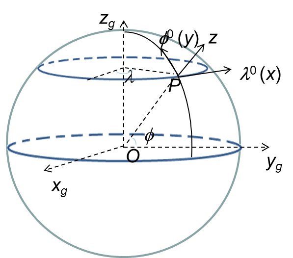

We used the approach of [Comblen et al. (2009)](#comblen2009) and transform the coordinates instead of the equations. Since the unstructured grids work naturally on a sphere, the polar singularity is avoided. Most of the work is done inside local frames. There are 2 frames used (Figure [1](#figure01)); note that all frames rotate with the earth.

<figure markdown id='figure01'>
{width=400}
<figcaption>Coordinate frames on a sphere.</figcaption>
</figure>

__Global frame__ $(x_g, y_g, z_g)$ (Figure [1](#figure01)). The origin is located at center of the earth (assumed to be a sphere) of radius $R_0$, $x_g$ axis pointing to prime meridian, $z_g$ to the north pole. The coordinates are related to the longitude and latitude of a point on the spherical surface as:

\begin{equation}
\label{eq01}
\begin{cases}
x_g = R_0 \cos\phi\cos\lambda\\
y_g = R_o \cos\phi\sin\lambda\\
z_g = R_0 \sin\phi
\end{cases}
\end{equation}

__Local frame__, located at a point on sphere (e.g., node/side center/element centroid): The 3 axes of this frame are: $\pmb\lambda^0$ (zonal), $\pmb\phi^0$ (meridional North), and $\pmb r^0 = \pmb\lambda^0 \times \pmb\phi^0$ (radial). The relationship between this frame and global frame is: 

\begin{equation}
\label{eq02}
\begin{aligned}
\pmb\lambda^0 = -\sin\lambda\pmb i + \cos\lambda\pmb j\\
\pmb\phi^0 = -\cos\lambda\sin\phi\pmb i - \sin\lambda\sin\phi j + \cos \phi \pmb k
\end{aligned}
\end{equation}

The frame $(\pmb\lambda^0, \pmb\phi^0, \pmb r^0)$ is then the local $(x, y, z)$ frame.

Here, $\pmb i, \pmb j, \pmb k$ are unit vectors of the global frame. Strictly speaking this frame is undefined at the 2 poles, but we can still use it there as long as the axes are unique.

Further assumption is made that when the origins are close to each other, the z-axes also coincide with each other, e.g. in the back-tracking part etc. This is reasonable as the relevant distances are much smaller than $R_0$.

With the aid from all these frames, the equations can be solved in a very similar way as in Cartesian frame. The main difference is in the evaluation of the vectors in the local frame. The changes to the code are therefore minimal.

Below are some important info about arrays used in the code that are affected by lon/lat frames:

- `(xnd,ynd,znd)`, `(xcj,ycj,zcj)`, `(xctr,yctr,zctr)` are global coordinates of node, side center and element centroid for `ics=1` or `2`. If `ics=1` (Cartesian), `znd=zcj=zctr= 0`;
- `(znl, zs, ze)` are local z-coordinates measured vertically upward from the undisturbed surface (i.e. local frame when `ics=2`), at node, side, and element;
- `eframe(1:3,1:3,1:nea)` is the tensor for the element frame (w.r.t. global frame). The 2nd index indicates axid id `(1=x; 2=y; 3=z)` and the 1st index indicates tensor components. `sframe` and `pframe` are similar.

**References**

Comblen, R., Legrand, S., Deleersnijder, E., and Legat, V. (2009) A finite element method for solving the shallow water equations on the sphere. Ocean Mod., 28, 12-23.