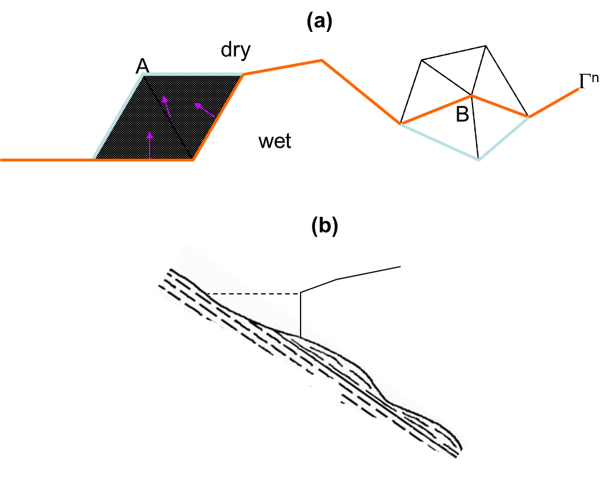

After all variables are solved at the new step, the vertical grid is updated to reflect the newly solved elevations. An important aspect of this update is the treatment of inundation (wetting/drying). SCHISM supports 2 options for inundation. Note that the elevations are solved at _all_ nodes including dry nodes at the previous time step; in other words, the elevations at the dry nodes – they are simply below the local bottom and can be thought as inactive ground water.

The 1st option (`inunfl=0`) is the default one that should be used in most applications. It uses a simple book-keeping algorithm to mark node/side/element as wet/dry based on a threshold depth (`h0`). SCHISM does not support partial wetting and drying, and so the rule inside the code is: an element is wet if all of its nodes and sides are wet, and is dry if any of its nodes or sides becomes dry. A node/side is wet iff (if and only if) at least 1 of its surrounding element is wet. For newly rewetted element/node/side, some state variables may be re-initialized based wet neighbors.

The 2nd option (`inunfl=1`) uses a shoreline tracking algorithm which requires finer resolution to be effective; otherwise the extrapolation procedure below may over-predict the inundation. In realistic cases, <5m resolution is usually sufficient for this purpose. Starting from the shoreline position at step $n$, each node on this line is checked for wetting and drying, and the local portion of the line is updated accordingly (Figure [1](#figure01)). The process is iterative and multi-layer wetting and drying is possible. After the new shoreline position is found at step $n+1$,a constant extrapolation of surface elevation is used from this position projected onto the nearest ‘dry’ node, in order to enhance the stability of the wetting and drying front (a technique advocated by the tsunami MOST model).

<figure markdown id='figure01'>
{width=700}
<figcaption>Shoreline tracking algorithm. (a) The orange line is the shoreline from step n, and the light blue line is the updated portion since A is wetted and B becomes dry at step n+1. (b) At the end of the tracking, constant extrapolation of elevation is used at the new shoreline position, which may flood the next dry node.</figcaption>
</figure>